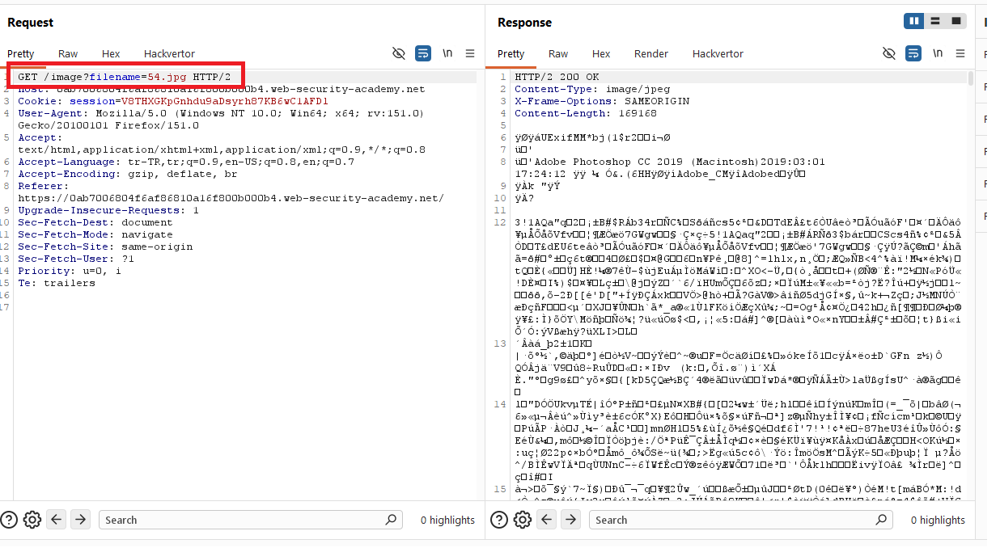
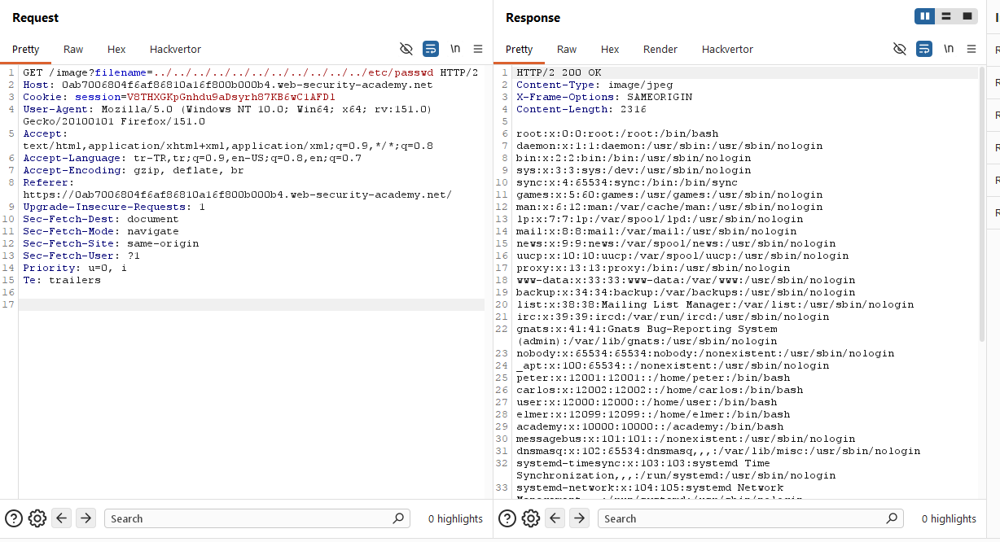
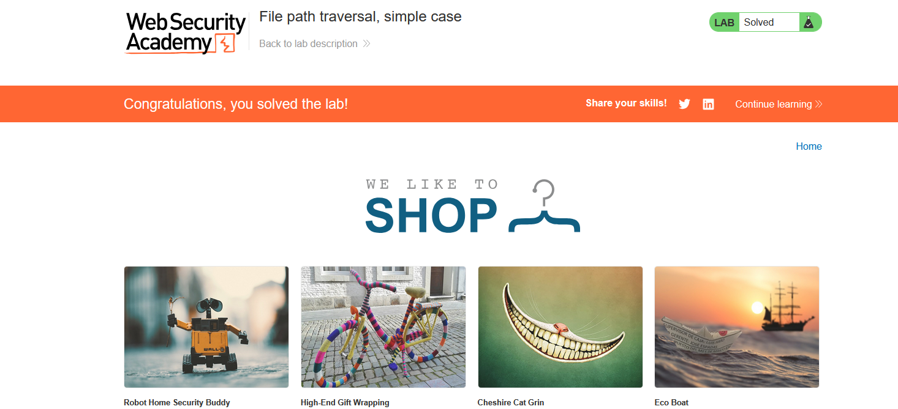

# File path traversal, simple case

## 1. Lab Bilgisi

**Difficulty:** Apprentice

## 2. Vulnerability Özeti

Bu labda ürün görsellerinin `filename` parametresiyle getirildiğini gördüm. Uygulama bu parametreyi güvenli şekilde sınırlamadığı için dosya yolunu manipüle ederek uygulama dizininin dışına çıkabildim ve `/etc/passwd` dosyasını okuyabildim.

## 3. Exploitation Steps

1. İlk olarak ana sayfadaki ürün görsellerinden birini yeni sekmede açtım.


2. Görsel isteğinde dosya adının `filename` parametresiyle verildiğini fark ettim.

```http
GET /image?filename=54.jpg HTTP/2
```



3. Parametrenin dosya sistemi üzerinden bir dosya okuduğunu düşünerek path traversal payload'ı denedim:

```http
GET /image?filename=../../../../../../etc/passwd HTTP/2
```

4. Sunucu bu isteğe `200 OK` döndü ve response body içinde `/etc/passwd` içeriği göründü.



5. `/etc/passwd` dosyası okunduğu için lab başarıyla çözüldü.



## 4. Impact

Saldırgan, dosya yolu parametresini manipüle ederek uygulamanın erişmemesi gereken sistem dosyalarını okuyabilir. Bu durum hassas konfigürasyon dosyalarının, kaynak kodun, credential bilgilerinin veya işletim sistemi dosyalarının sızmasına yol açabilir.

## 5. Remediation

Dosya adları kullanıcıdan geldiği haliyle dosya sistemine aktarılmamalıdır. Uygulama, sadece izin verilen dosya adlarını kullanmalı, path traversal karakterlerini engellemeli ve dosya yolunu normalize ettikten sonra hedef dosyanın beklenen base directory içinde kaldığını doğrulamalıdır.
