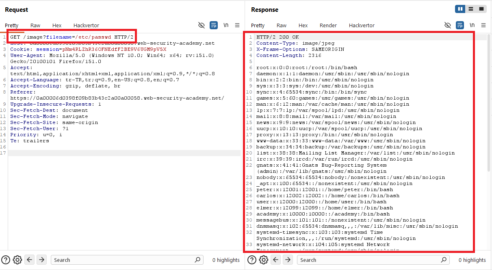
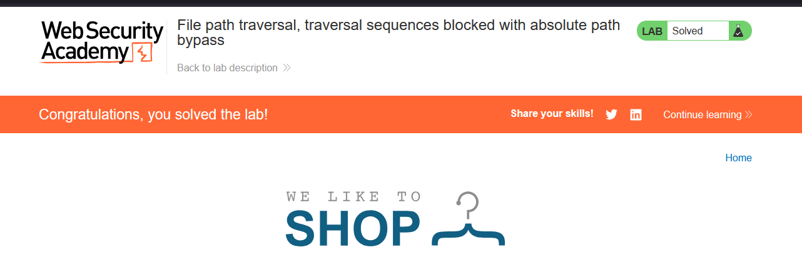

# File path traversal, traversal sequences blocked with absolute path bypass

## 1. Lab Bilgisi

**Difficulty:** Practitioner

## 2. Vulnerability Özeti

Bu labda uygulama ürün görsellerini yine `filename` parametresi üzerinden getiriyordu. Normal `../` traversal dizileri engellenmiş olsa da uygulama mutlak dosya yolunu yeterince doğrulamadığı için `filename=/etc/passwd` değeriyle doğrudan sistem dosyasını okuyabildim.

## 3. Exploitation Steps

1. İlk olarak ana sayfadaki ürün görsellerinden birini yeni sekmede açtım.


2. Görsel isteğinde dosya adının `filename` parametresiyle gönderildiğini gördüm.

```http
GET /image?filename=54.jpg HTTP/2
```


3. Bu labda traversal sequence'ler engellendiği için `../../../../../../etc/passwd` yerine doğrudan absolute path denedim:

```http
GET /image?filename=/etc/passwd HTTP/2
```

4. Sunucu isteğe `200 OK` döndü ve response body içinde `/etc/passwd` dosyasının içeriği görüntülendi.



5. `/etc/passwd` dosyası okunduğu için lab başarıyla çözüldü.



## 4. Impact

Saldırgan, traversal dizileri engellense bile absolute path kullanarak uygulamanın dosya sistemi üzerinde erişebildiği hassas dosyaları okuyabilir. Bu durum sistem kullanıcılarının, konfigürasyon dosyalarının, kaynak kodun veya credential bilgilerinin sızmasına yol açabilir.

## 5. Remediation

Uygulama sadece `../` gibi traversal dizilerini filtrelemekle yetinmemelidir. Kullanıcıdan gelen dosya adı allowlist ile kontrol edilmeli, absolute path kullanımı engellenmeli ve normalize edilen dosya yolunun beklenen base directory dışına çıkmadığı doğrulanmalıdır.
