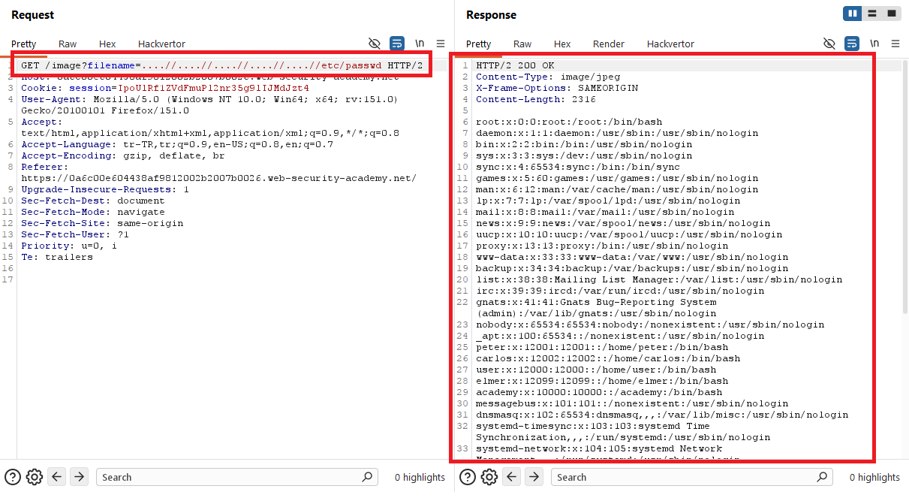
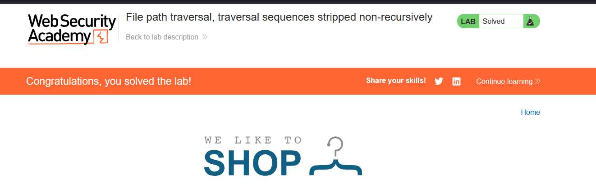

# File path traversal, traversal sequences stripped non-recursively

## 1. Lab Bilgisi

**Difficulty:** Practitioner

## 2. Vulnerability Özeti

Bu labda uygulama ürün görsellerini `filename` parametresiyle getiriyordu. Uygulama `../` traversal dizilerini filtreliyordu fakat bunu non-recursive şekilde yaptığı için iç içe yazılmış traversal dizileriyle filtreyi atlatabildim. `....//` ifadesi filtre sonrası tekrar `../` haline geldi ve `/etc/passwd` dosyasını okuyabildim.

## 3. Exploitation Steps

1. İlk olarak ana sayfadaki ürün görsellerinden birini yeni sekmede açtım.


2. Görsel isteğinde dosya adının `filename` parametresiyle gönderildiğini gördüm.

```http
GET /image?filename=54.jpg HTTP/2
```


3. Normal `../` dizilerinin temizlenebileceğini düşünerek traversal dizisini iç içe verdim:

```http
GET /image?filename=....//....//....//....//etc/passwd HTTP/2
```

4. Uygulama bu değeri non-recursive şekilde temizlediği için `....//` parçaları etkili biçimde `../` olarak çalıştı. Sunucu isteğe `200 OK` döndü ve response body içinde `/etc/passwd` içeriği görüntülendi.



5. `/etc/passwd` dosyası okunduğu için lab başarıyla çözüldü.



## 4. Impact

Saldırgan, basit string temizleme kontrollerini iç içe traversal dizileriyle atlatabilir. Bu sayede uygulamanın dosya sistemi üzerinde erişebildiği hassas dosyalar okunabilir ve sistem bilgileri, konfigürasyonlar veya credential verileri sızabilir.

## 5. Remediation

Path traversal koruması yalnızca `../` string'ini bir kez silmeye dayanmamalıdır. Dosya yolu normalize edilmeli, temizleme işlemi güvenilir parser veya standart dosya yolu API'leriyle yapılmalı ve normalize edilen hedef yolun beklenen base directory içinde kaldığı doğrulanmalıdır. Ek olarak dosya adları mümkünse allowlist üzerinden seçilmelidir.
