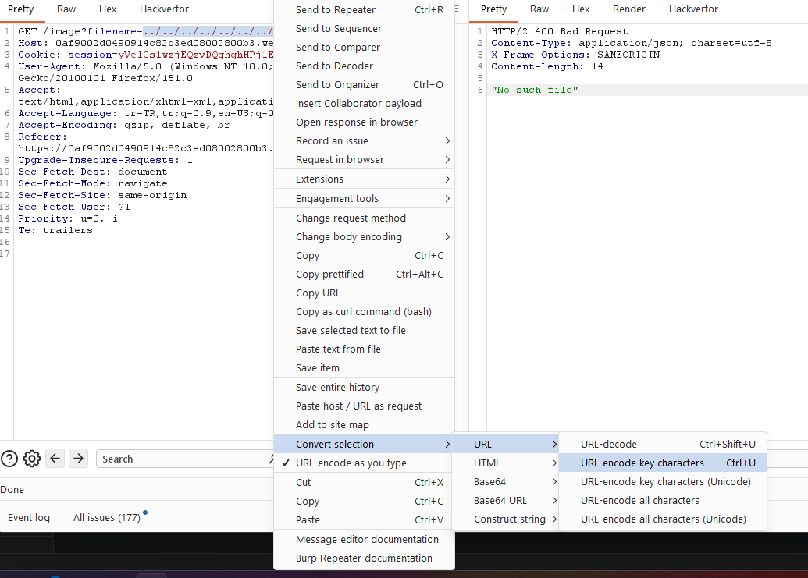
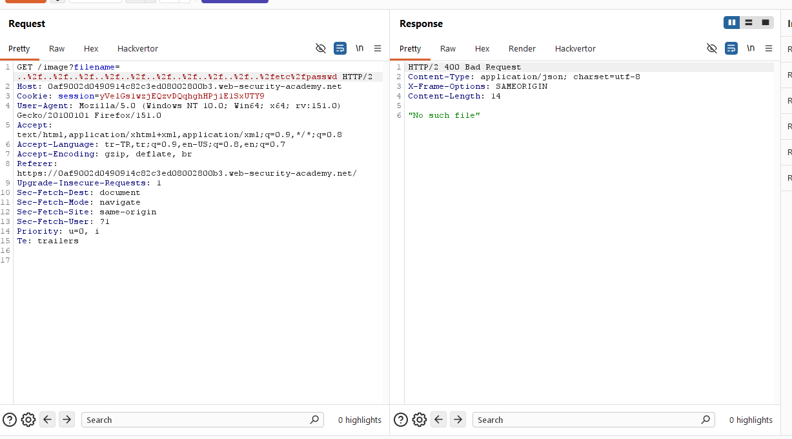
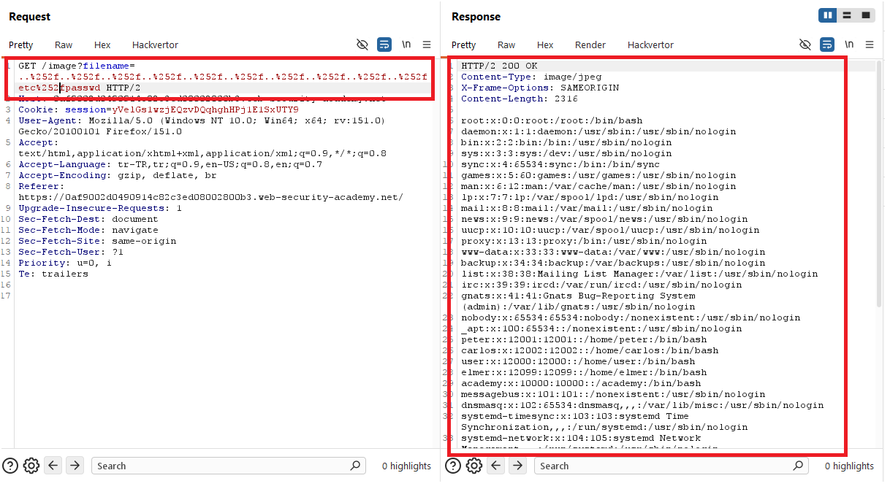
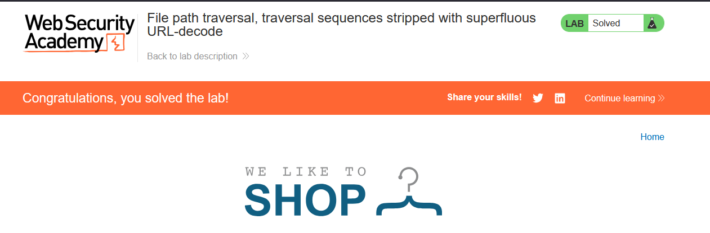

# File path traversal, traversal sequences stripped with superfluous URL-decode

## 1. Lab Bilgisi

**Difficulty:** Practitioner

## 2. Vulnerability Özeti

Bu labda uygulama ürün görsellerini `filename` parametresiyle getiriyordu. Uygulama traversal dizilerini temizlemeye çalışıyordu fakat dosya yolunu işlerken fazladan URL-decode yaptığı için double URL-encoded payload ile filtreyi atlatabildim. `%252f` değeri önce `%2f`, sonra `/` karakterine dönüştü ve `/etc/passwd` dosyasını okuyabildim.

## 3. Exploitation Steps

1. İlk olarak ana sayfadaki ürün görsellerinden birini yeni sekmede açtım.


2. Görsel isteğinde dosya adının `filename` parametresiyle gönderildiğini gördüm.

```http
GET /image?filename=54.jpg HTTP/2
```


3. Normal traversal payload'ı denediğimde uygulama dosyayı bulamadı ve `No such file` hatası döndü. Bu, traversal dizilerinin filtreleniyor olabileceğini gösterdi.



4. Bunun üzerine slash karakterlerini double URL-encoded şekilde gönderdim. Buradaki amaç, uygulamanın filtreleme aşamasından sonra yaptığı ekstra URL-decode işlemini kullanmaktı.

```http
GET /image?filename=..%252f..%252f..%252f..%252f..%252f..%252f..%252f..%252fetc%252fpasswd HTTP/2
```



5. Double URL-encoded payload ile istek başarılı oldu. Sunucu `200 OK` döndü ve response body içinde `/etc/passwd` içeriği görüntülendi.



6. `/etc/passwd` dosyası okunduğu için lab başarıyla çözüldü.



## 4. Impact

Saldırgan, uygulamanın decode ve filtreleme sırasındaki hatayı kullanarak path traversal kontrollerini atlatabilir. Bu sayede uygulamanın dosya sistemi üzerinde erişebildiği hassas dosyalar okunabilir ve sistem bilgileri, konfigürasyonlar veya credential verileri sızabilir.

## 5. Remediation

Uygulama dosya yolunu işlerken decode, normalize ve doğrulama adımlarını doğru sırada yapmalıdır. Kullanıcıdan gelen veri tamamen decode edildikten sonra normalize edilmeli ve hedef yolun beklenen base directory içinde kaldığı doğrulanmalıdır. Sadece belirli string'leri silmek yerine allowlist tabanlı dosya seçimi tercih edilmelidir.
