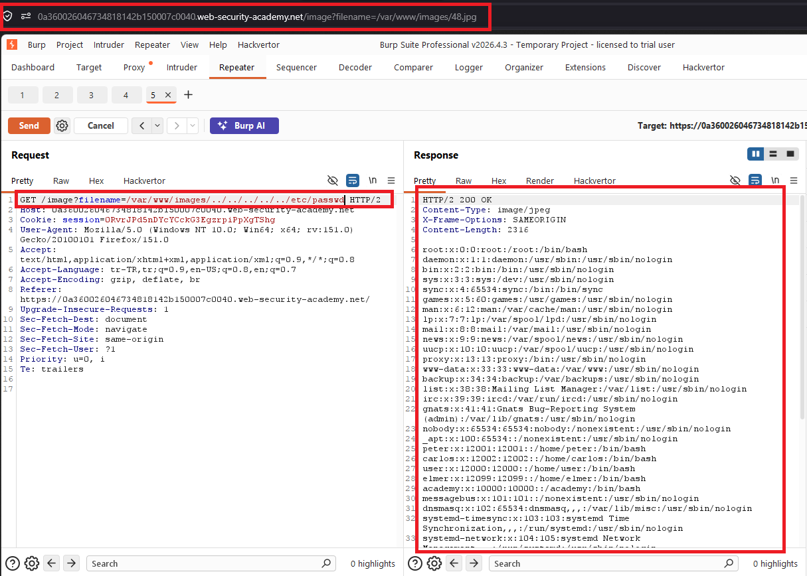

# File path traversal, validation of start of path

## 1. Lab Bilgisi

**Difficulty:** Practitioner

## 2. Vulnerability Özeti

Bu labda uygulama ürün görsellerini `filename` parametresiyle getiriyordu ve bu kez parametreye dosyanın tam yolu gönderiliyordu. Uygulama gönderilen path'in `/var/www/images` ile başladığını kontrol ediyordu fakat path'i normalize ettikten sonra gerçekten bu dizin içinde kalıp kalmadığını doğrulamıyordu. Bu yüzden `/var/www/images` prefix'ini koruyup devamına traversal dizileri ekleyerek `/etc/passwd` dosyasını okuyabildim.

## 3. Exploitation Steps

1. İlk olarak ana sayfadaki ürün görsellerinden birini yeni sekmede açtım.


2. Görsel isteğinde `filename` parametresinin sadece dosya adı değil, tam dosya yolu aldığını gördüm.

```http
GET /image?filename=/var/www/images/48.jpg HTTP/2
```

3. Uygulamanın path başlangıcını kontrol ettiğini düşünerek `/var/www/images` prefix'ini korudum ve ardından traversal dizileriyle üst dizinlere çıktım.

```http
GET /image?filename=/var/www/images/../../../etc/passwd HTTP/2
```

4. Sunucu isteğe `200 OK` döndü ve response body içinde `/etc/passwd` içeriği görüntülendi.



5. `/etc/passwd` dosyası okunduğu için lab başarıyla çözüldü.


## 4. Impact

Saldırgan, uygulamanın sadece path başlangıcını kontrol etmesini kullanarak beklenen dizinin dışına çıkabilir. Bu sayede uygulamanın dosya sistemi üzerinde erişebildiği hassas dosyalar okunabilir; sistem kullanıcıları, konfigürasyon dosyaları, kaynak kod veya credential bilgileri sızabilir.

## 5. Remediation

Uygulama yalnızca path'in belirli bir string ile başlayıp başlamadığını kontrol etmemelidir. Dosya yolu önce normalize edilmeli veya canonical path'e çevrilmeli, ardından hedef dosyanın gerçekten beklenen base directory içinde kaldığı doğrulanmalıdır. Mümkünse kullanıcıdan tam path almak yerine allowlist tabanlı dosya adları kullanılmalıdır.
