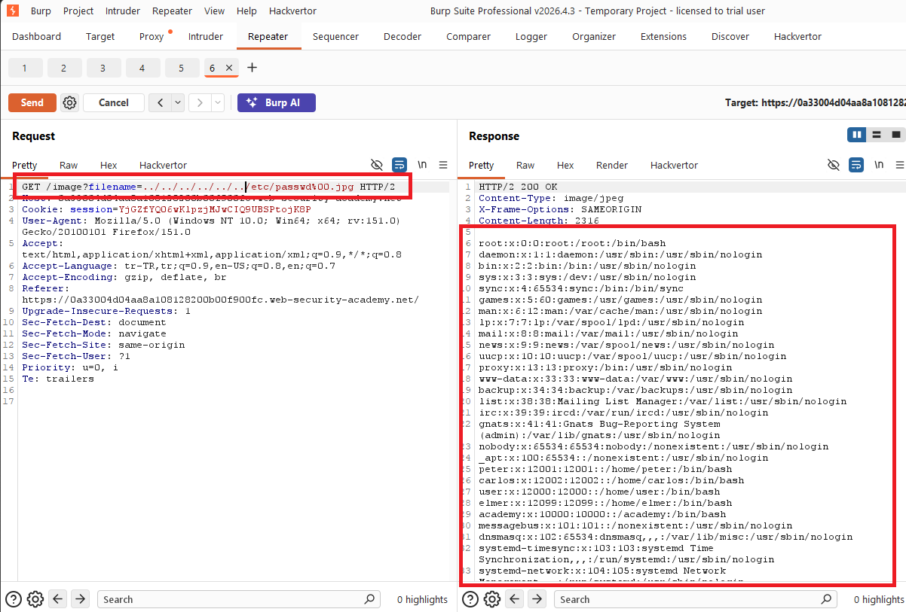

# File path traversal, validation of file extension with null byte bypass

## 1. Lab Bilgisi

**Difficulty:** Practitioner

## 2. Vulnerability Özeti

Bu labda uygulama ürün görsellerini `filename` parametresiyle getiriyordu ve gönderilen dosya adının beklenen görsel uzantısıyla bitmesini kontrol ediyordu. Bu kontrolü geçmek için path traversal payload'ının sonuna null byte ve `.jpg` uzantısı ekledim. Uygulama uzantı kontrolünde `.jpg` değerini gördü fakat dosya sistemi tarafında null byte sonrası yok sayıldığı için `/etc/passwd` dosyasını okuyabildim.

## 3. Exploitation Steps

1. İlk olarak ana sayfadaki ürün görsellerinden birini yeni sekmede açtım.


2. Görsel isteğinde dosya adının `filename` parametresiyle gönderildiğini gördüm. Bu labda uygulama dosya adının `.jpg` gibi beklenen bir görsel uzantısıyla bitmesini doğruluyordu.

3. Uzantı kontrolünü geçmek için traversal payload'ının sonuna URL-encoded null byte ve `.jpg` ekledim:

```http
GET /image?filename=../../../etc/passwd%00.jpg HTTP/2
```

4. Sunucu isteğe `200 OK` döndü ve response body içinde `/etc/passwd` içeriği görüntülendi.



5. `/etc/passwd` dosyası okunduğu için lab başarıyla çözüldü.


## 4. Impact

Saldırgan, dosya uzantısı kontrolünü null byte ile atlatıp uygulamanın dosya sistemi üzerinde erişebildiği hassas dosyaları okuyabilir. Bu durum sistem kullanıcılarının, konfigürasyon dosyalarının, kaynak kodun veya credential bilgilerinin sızmasına yol açabilir.

## 5. Remediation

Uygulama sadece dosya adının belirli bir uzantıyla bitip bitmediğini kontrol etmemelidir. Null byte gibi özel karakterler reddedilmeli, dosya yolu normalize edilmeli ve hedef dosyanın beklenen base directory içinde kaldığı doğrulanmalıdır. Mümkünse kullanıcıdan dosya yolu almak yerine allowlist tabanlı dosya seçimi kullanılmalıdır.
