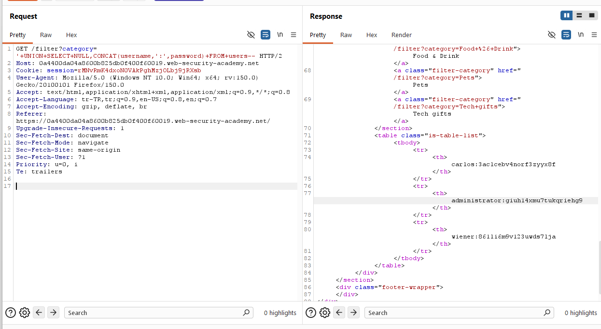
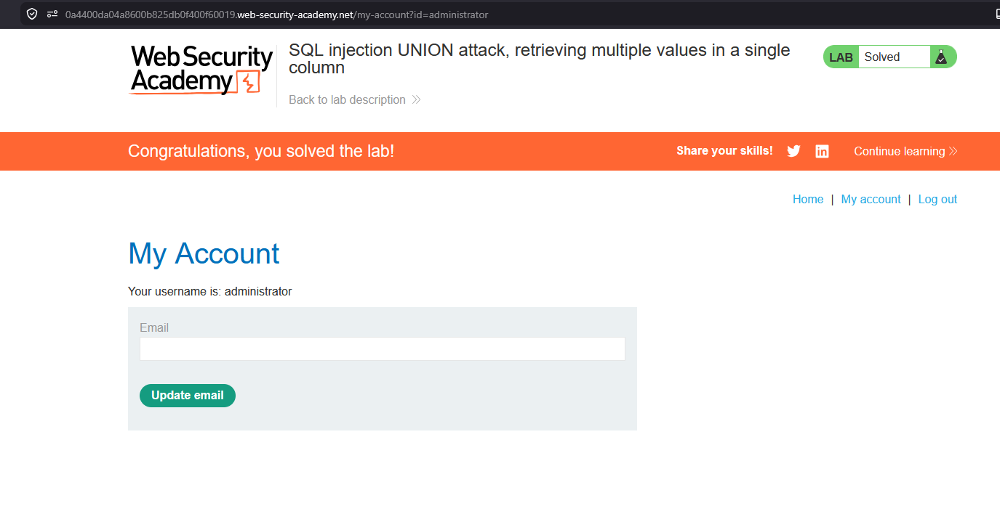

# SQL injection UNION attack, retrieving multiple values in a single column

## 1. Lab Bilgisi

**Difficulty:** Practitioner

## 2. Vulnerability Özeti

Bu labda `category` parametresi SQL sorgusuna güvenli şekilde eklenmediği için `UNION SELECT` payload'larıyla sorguya müdahale edilebiliyordu. Amaç, yalnızca tek bir string kolon kullanılabildiği durumda `username` ve `password` değerlerini aynı kolon içinde birleştirerek `administrator` kullanıcısının parolasını elde etmekti.

## 3. Exploitation Steps

1. Burp Suite ile kategori filtresini ayarlayan isteği yakaladım.
2. Sorguya `UNION SELECT` ekleyerek iki kolonlu bir sonuç döndürdüm.
3. İlk kolona `NULL`, ikinci kolona ise `username` ve `password` değerlerini birleştiren `CONCAT` ifadesini yerleştirdim:

```sql
' UNION SELECT NULL,CONCAT(username,':',password) FROM users--
```

4. Response içinde kullanıcı adı ve parola değerleri `username:password` formatında tek kolonda döndü.
5. `administrator` kullanıcısının parolasını tespit ettim:

```text
administrator:giuhl4xmu7tukqriehgs
```



6. Elde ettiğim parola ile `administrator` hesabına giriş yaptım ve labı tamamladım.



## 4. Kullanılan Payloadlar

- Kullanıcı adı ve parola değerlerini tek kolonda birleştirmek için:

```http
GET /filter?category=' UNION SELECT NULL,CONCAT(username,':',password) FROM users-- HTTP/2
```

## 5. Sonuç

- Sorguda iki kolon kullanılabildiğini tespit ettim.
- String veri döndüren kolonda `CONCAT` kullanarak `username` ve `password` değerlerini birleştirdim.
- `administrator` kullanıcısının parolasını elde ederek hesaba giriş yaptım ve labı tamamladım.

## 6. Etki

Bu zafiyet saldırganın veritabanındaki hassas bilgileri uygulama yanıtına taşımasına neden olabilir. Birden fazla değerin tek kolon içinde birleştirilebilmesi, sınırlı sayıda görüntülenebilir kolon olsa bile kullanıcı adı ve parola gibi kritik bilgilerin sızdırılmasını mümkün hale getirir.

## 7. Çözüm

- SQL sorgularında parametreli/prepared statement kullan.
- Kullanıcı girdilerini SQL sorgusuna doğrudan ekleme.
- Veritabanı kullanıcısına yalnızca ihtiyaç duyduğu minimum yetkileri ver.
- Parolaları düz metin olarak saklama; güçlü, yavaş ve tuzlu hash algoritmaları kullan.
