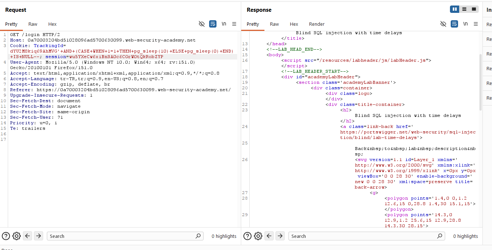
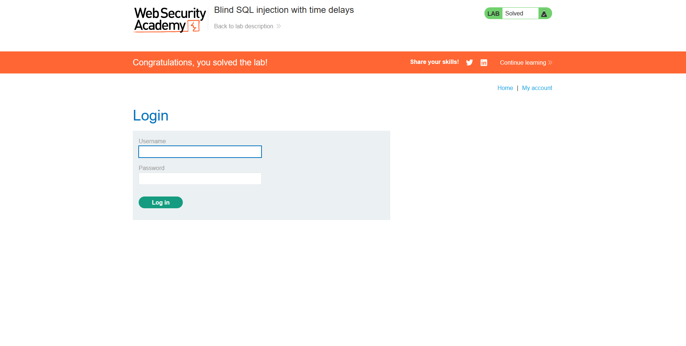

# Blind SQL injection with time delays

## 1. Lab Bilgisi

**Difficulty:** Practitioner

## 2. Vulnerability Özeti

Bu labda `TrackingId` cookie değeri SQL sorgusuna güvenli şekilde eklenmediği için blind SQL injection yapılabiliyordu. Uygulama veritabanı çıktısını veya hata mesajlarını response içinde göstermiyordu; ancak SQL sorgusuna eklenen zaman geciktirme fonksiyonu response süresini etkiliyordu.

Amaç, `TrackingId` cookie değeri üzerinden PostgreSQL `pg_sleep()` fonksiyonunu koşullu olarak çalıştırarak zaman tabanlı SQL injection zafiyetini doğrulamak ve labı tamamlamaktı.

## 3. Exploitation Steps

1. Burp Suite ile `/login` isteğini yakaladım ve `TrackingId` cookie değerini test etmek için Repeater'a gönderdim.

2. Cookie değerine PostgreSQL üzerinde koşullu gecikme oluşturacak `CASE WHEN` ve `pg_sleep(10)` payload'ını ekledim:

```sql
'+AND+(CASE+WHEN+1=1+THEN+pg_sleep(10)+ELSE+pg_sleep(0)+END)+IS+NULL--
```

3. Koşul `1=1` olduğu için veritabanı `pg_sleep(10)` fonksiyonunu çalıştırdı. İsteği gönderdiğimde response normal `200 OK` olarak döndü; ancak yanıt yaklaşık 10 saniye gecikmeli geldi. Bu davranış, sorgunun veritabanında çalıştığını ve `TrackingId` cookie değerinin SQL sorgusuna enjekte edilebildiğini gösterdi.



4. Zaman gecikmesi başarıyla tetiklendiği için lab çözüldü.



## 4. Kullanılan Payloadlar

- PostgreSQL üzerinde koşul doğru olduğunda 10 saniyelik gecikme oluşturmak için:

```http
GET /login HTTP/2
Cookie: TrackingId=<tracking-id>'+AND+(CASE+WHEN+1=1+THEN+pg_sleep(10)+ELSE+pg_sleep(0)+END)+IS+NULL--; session=<session-id>
```

## 5. Sonuç

- `TrackingId` cookie değerinin SQL sorgusuna dahil edildiğini tespit ettim.
- Uygulama response içeriğinde veri veya hata mesajı göstermese bile response süresinin değiştirilebildiğini doğruladım.
- PostgreSQL `CASE WHEN` ve `pg_sleep(10)` fonksiyonları ile koşullu olarak yaklaşık 10 saniyelik gecikme oluşturdum.
- Zaman tabanlı blind SQL injection zafiyetini kanıtlayarak labı tamamladım.

## 6. Etki

Bu zafiyet, saldırganın veritabanı çıktısını doğrudan göremediği durumlarda bile response sürelerini oracle olarak kullanmasına neden olabilir. Zaman tabanlı tekniklerle veritabanı yapısı ve hassas veriler karakter karakter çıkarılabilir; bu da kullanıcı parolalarının sızdırılmasına ve hesap devralmaya yol açabilir.

## 7. Çözüm

- SQL sorgularında parametreli/prepared statement kullan.
- Cookie ve header değerleri dahil tüm kullanıcı girdilerini güvenilmeyen veri olarak ele al.
- Kullanıcı girdilerini SQL sorgusuna doğrudan ekleme.
- Veritabanı fonksiyonlarının kullanıcı girdisiyle kontrol edilebilir hale gelmesini engelle.
- Response sürelerindeki anormal gecikmeleri izleyip alarm üret.
- Veritabanı kullanıcısına minimum yetki ver.
