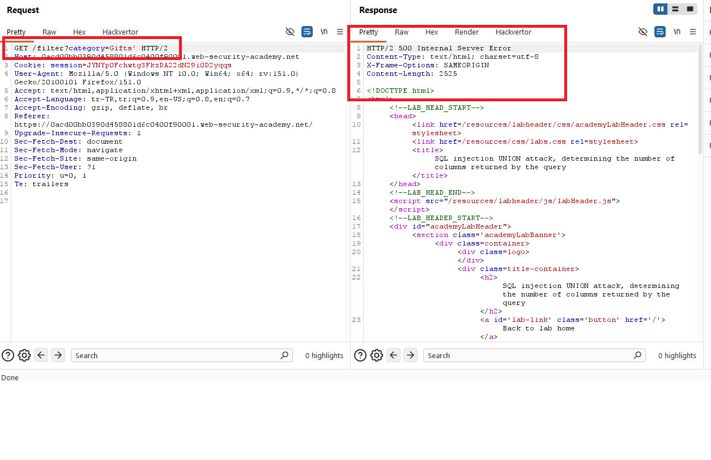
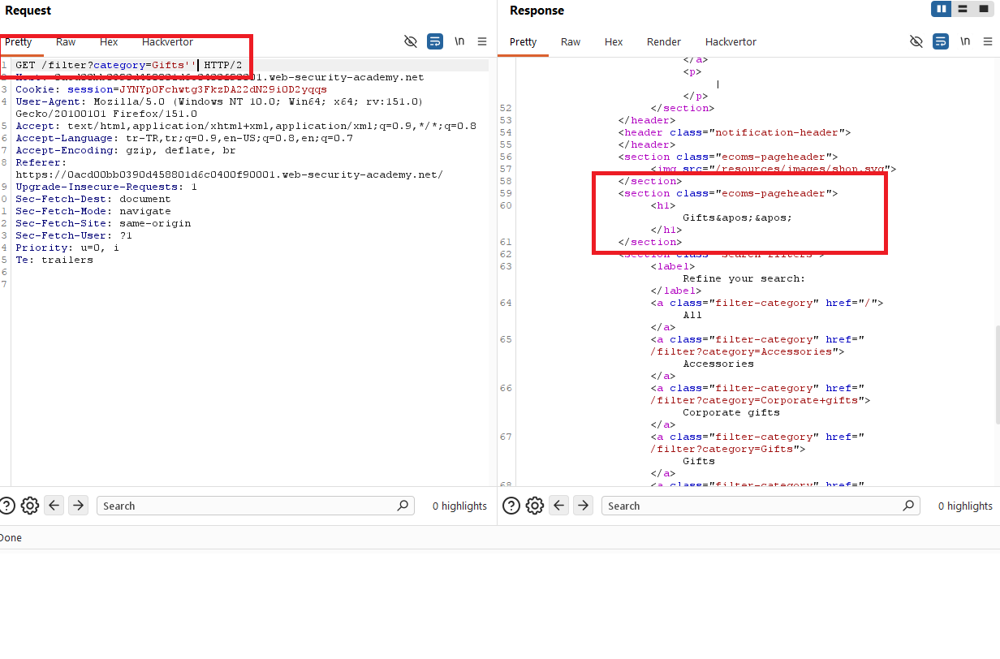
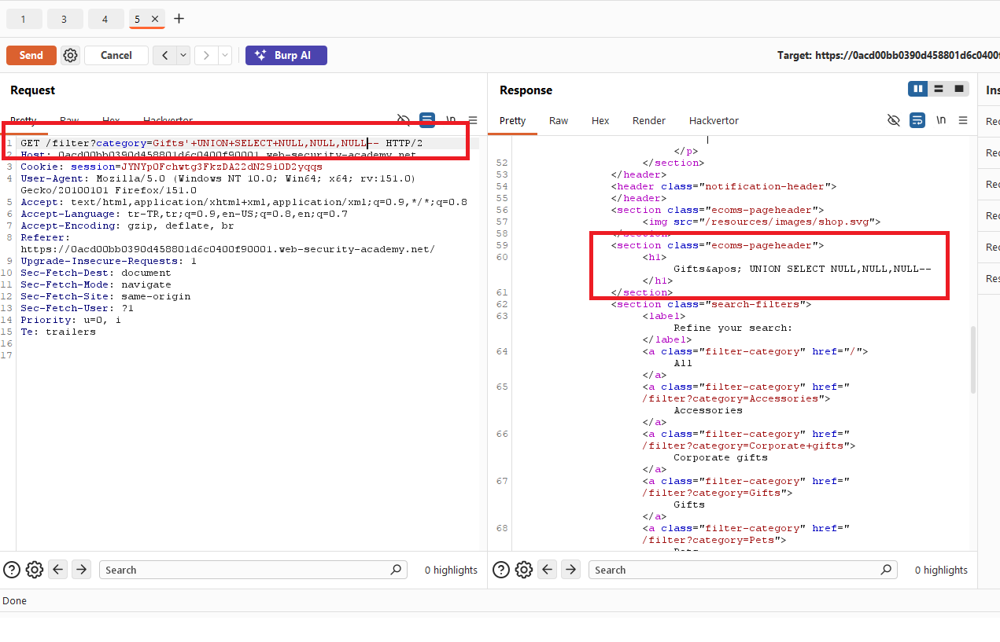
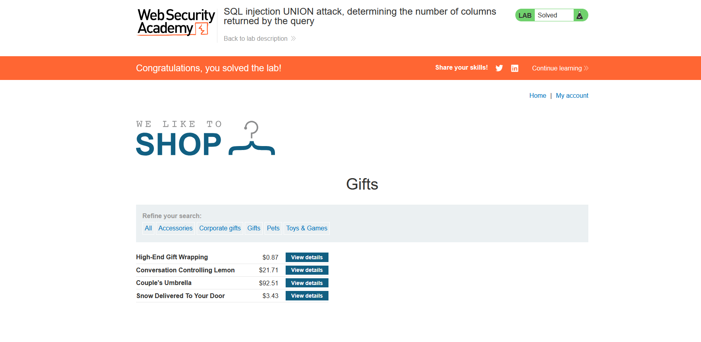

# SQL injection UNION attack, determining the number of columns returned by the query

## 1. Lab Bilgisi

**Difficulty:** Practitioner

## 2. Vulnerability Özeti

Bu labda `category` parametresi SQL sorgusuna güvenli şekilde eklenmediği için `UNION SELECT` payload'larıyla sorguya müdahale edilebiliyordu. Amaç, orijinal sorgunun kaç kolon döndürdüğünü tespit etmekti.

## 3. Exploitation Steps

1. Burp Suite ile kategori filtresini ayarlayan isteği yakaladım.
2. `category` parametresine tek tırnak ekleyerek SQL injection davranışını kontrol ettim.





3. `UNION SELECT` ile farklı sayıda `NULL` değeri göndererek kolon sayısını test ettim.
4. Üç adet `NULL` değeri gönderdiğimde uygulama hatasız cevap verdi:

```sql
' UNION SELECT NULL,NULL,NULL--
```



5. Cevapta ürün listesi düzgün döndüğü için sorgunun üç kolon döndürdüğünü doğruladım ve lab tamamlandı.



## 4. Kullanılan Payloadlar

- Kolon sayısını tespit etmek için:

```http
GET /filter?category=' UNION SELECT NULL,NULL,NULL-- HTTP/2
```

## 5. Sonuç

- Sorgunun üç kolon döndürdüğünü tespit ettim.
- `UNION SELECT NULL,NULL,NULL--` payload'ı hata üretmediği için doğru kolon sayısına ulaştım.

## 6. Etki

Bu zafiyet saldırganın SQL sorgusunun yapısını anlamasına yardımcı olur. Kolon sayısı belirlendikten sonra `UNION SELECT` saldırılarıyla sorguya farklı veriler eklemek ve uygulama yanıtında göstermek mümkün hale gelebilir.

## 7. Çözüm

- SQL sorgularında parametreli/prepared statement kullan.
- Kullanıcı girdilerini SQL sorgusuna doğrudan ekleme.
- Uygulama hata mesajlarında sorgu yapısı hakkında bilgi sızdırmamaya dikkat et.
