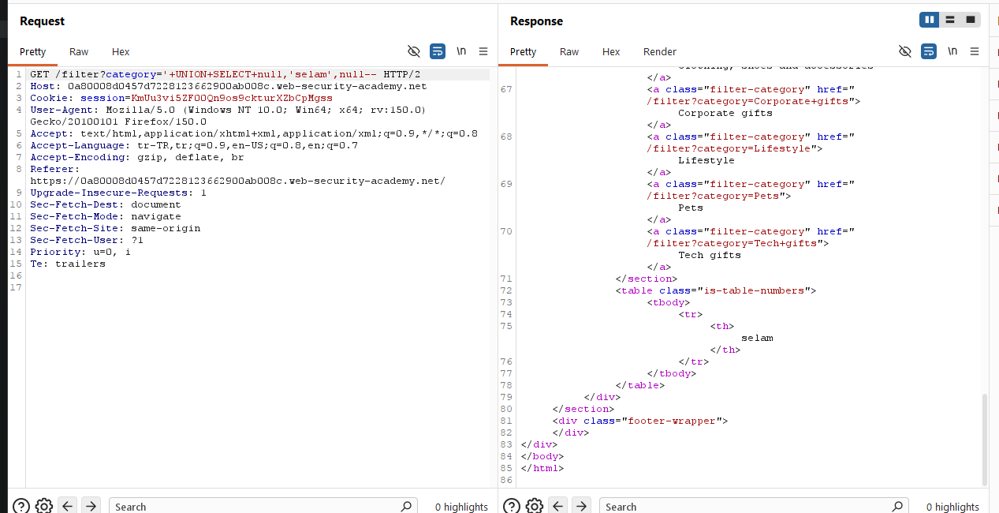
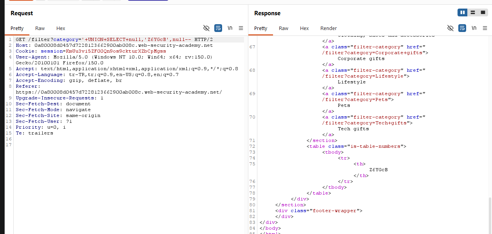
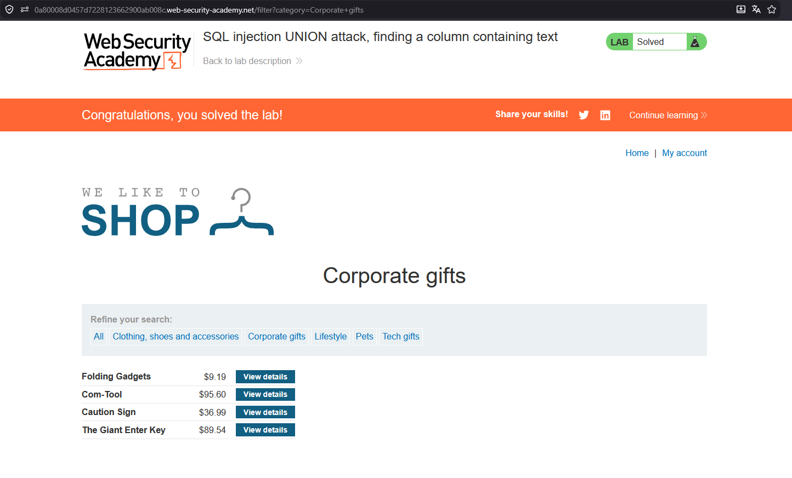

# SQL injection UNION attack, finding a column containing text

## 1. Lab Bilgisi

**Difficulty:** Practitioner

## 2. Vulnerability Özeti

Bu labda `category` parametresi SQL sorgusuna güvenli şekilde eklenmediği için `UNION SELECT` payload'larıyla sorguya müdahale edilebiliyordu. Amaç, sorgunun döndürdüğü kolonlardan hangisinin string veri kabul ettiğini bulmaktı.

## 3. Exploitation Steps

1. Burp Suite ile kategori filtresini ayarlayan isteği yakaladım.
2. Önceki labda sorgunun üç kolon döndürdüğünü bildiğim için `UNION SELECT` içinde üç değer kullandım.
3. String veri kabul eden kolonu bulmak için ikinci kolona test amaçlı `selam` değerini yerleştirdim:

```sql
' UNION SELECT NULL,'selam',NULL--
```

4. Response içinde `selam` değerinin döndüğünü gördüm. Bu yüzden ikinci kolonun string veri kabul ettiğini anladım.



5. Daha sonra labın istediği random string değerini ikinci kolona yerleştirdim. Bu labda istenen değer `Z6YGcB` idi:

```sql
' UNION SELECT NULL,'Z6YGcB',NULL--
```

6. Response içinde `Z6YGcB` değeri döndüğü için payload'ın doğru kolonda çalıştığını doğruladım.



7. İstenen string response içinde döndüğü için lab başarıyla tamamlandı.



## 4. Kullanılan Payloadlar

- String kabul eden kolonu bulmak için:

```http
GET /filter?category=' UNION SELECT NULL,'selam',NULL-- HTTP/2
```

- Labın istediği string değerini döndürmek için:

```http
GET /filter?category=' UNION SELECT NULL,'Z6YGcB',NULL-- HTTP/2
```

## 5. Sonuç

- Sorgunun üç kolon döndürdüğünü kullandım.
- İkinci kolonun string veri kabul ettiğini tespit ettim.
- Labın verdiği `Z6YGcB` değerini ikinci kolonda döndürerek labı tamamladım.

## 6. Etki

Bu zafiyet saldırganın `UNION SELECT` ile uygulama yanıtına kendi verisini ekleyebilmesine neden olur. String veri döndüren kolon tespit edildikten sonra veritabanından alınan metin tabanlı bilgiler uygulama ekranında gösterilebilir.

## 7. Çözüm

- SQL sorgularında parametreli/prepared statement kullan.
- Kullanıcı girdilerini SQL sorgusuna doğrudan ekleme.
- Uygulama cevaplarında sorgu sonucu olarak hassas veya kontrolsüz veri göstermemeye dikkat et.
