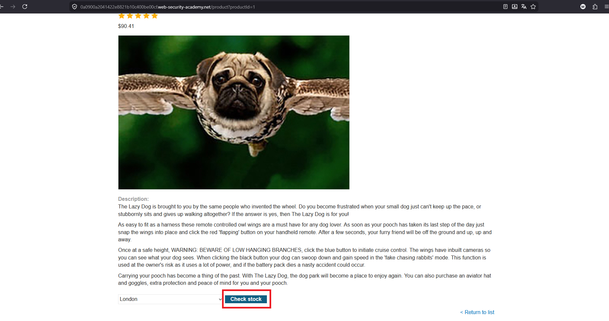
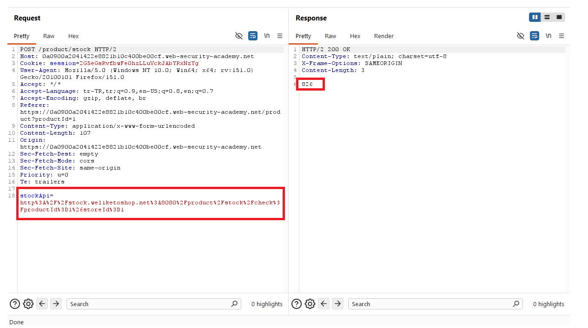
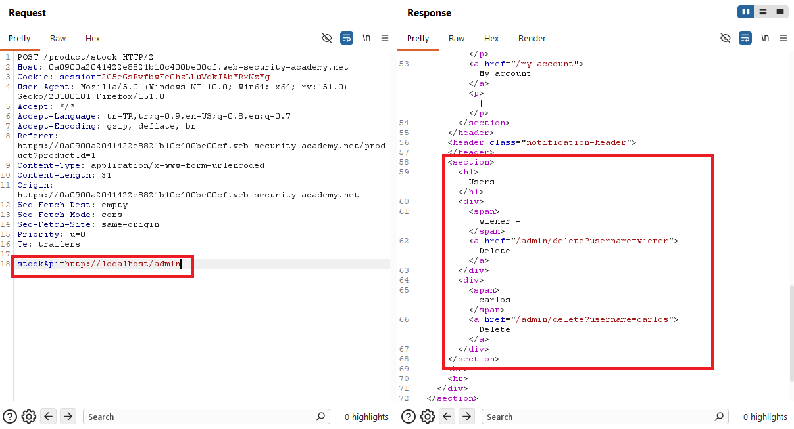
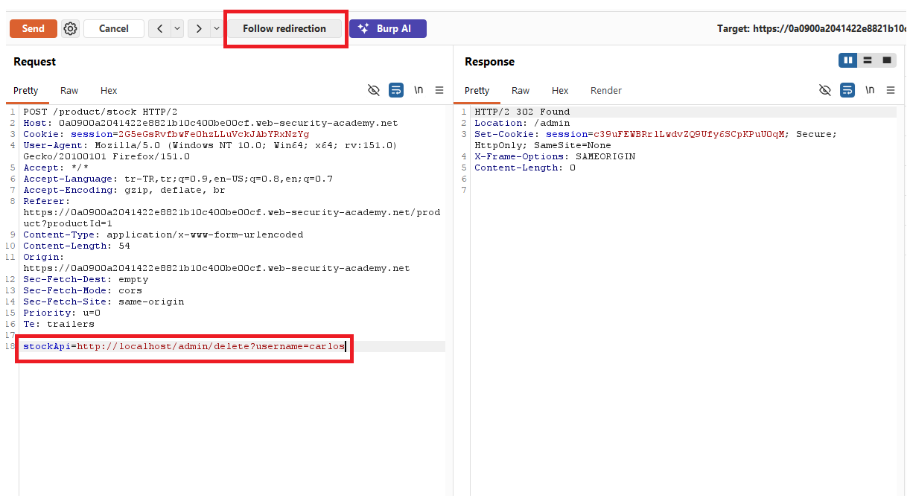
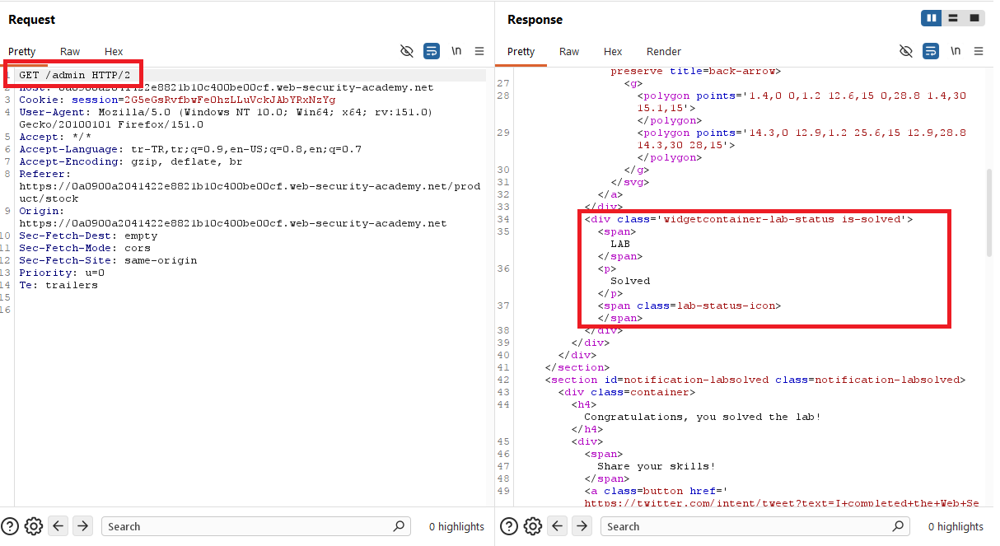
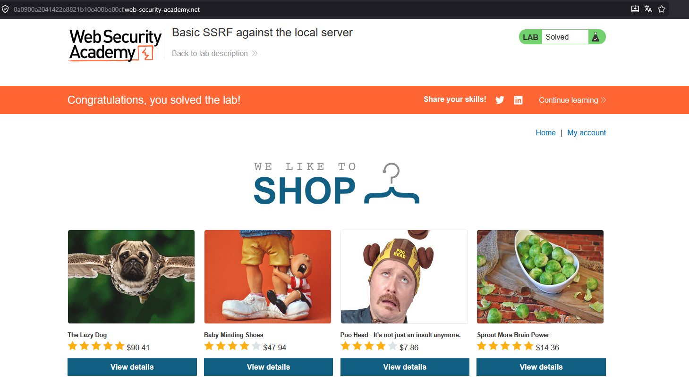

# Basic SSRF against the local server

## 1. Lab Bilgisi

**Difficulty:** Apprentice

## 2. Vulnerability Özeti

Bu labda ürün stok kontrolü için kullanılan `stockApi` parametresi, sunucu tarafında verilen URL'e istek atıyor. Uygulama bu parametreyi yeterli şekilde doğrulamadığı için isteği dış bir stok servisi yerine local server üzerindeki admin paneline yönlendirebildim. `http://localhost/admin` üzerinden admin paneline erişip `carlos` kullanıcısını silerek labı çözdüm.

## 3. Kullanılan Payload

```http
stockApi=http://localhost/admin
```

Carlos kullanıcısını silmek için kullanılan endpoint:

```http
stockApi=http://localhost/admin/delete?username=carlos
```

## 4. Exploitation Steps

1. İlk olarak ürün detay sayfasında stok kontrolü fonksiyonunu tespit ettim.



2. `Check stock` isteğini Burp Suite ile yakaladım. İstek içinde `stockApi` parametresinin backend tarafından çağrılan URL'i taşıdığını gördüm.



3. `stockApi` değerini local server üzerindeki admin panelini gösterecek şekilde değiştirdim.

```http
stockApi=http://localhost/admin
```



4. İsteği gönderdiğimde response içinde local server üzerindeki admin paneli döndü. Bu sayede SSRF ile normalde dışarıdan erişilemeyen admin paneline sunucu üzerinden erişmiş oldum.



5. Admin panelindeki delete endpoint'ini kullanarak `carlos` kullanıcısını silmek için `stockApi` parametresini aşağıdaki şekilde güncelledim.

```http
stockApi=http://localhost/admin/delete?username=carlos
```



6. İstek gönderildikten sonra `carlos` kullanıcısı silindi ve lab başarıyla çözüldü.



## 5. Impact

SSRF zafiyeti sayesinde saldırgan, uygulama sunucusunu kendi adına istek yapan bir aracı gibi kullanabilir. Bu durumda dışarıdan erişilemeyen internal servisler, local admin panelleri veya metadata servisleri hedeflenebilir. Yetki kontrolü zayıf olan internal endpoint'ler üzerinden kullanıcı silme gibi kritik işlemler yapılabilir.

## 6. Remediation

Sunucu tarafında kullanıcıdan gelen URL'ler doğrudan çağrılmamalıdır. `stockApi` gibi parametrelerde allowlist yaklaşımı uygulanmalı, yalnızca beklenen host ve path değerlerine izin verilmelidir. `localhost`, private IP aralıkları, link-local adresler ve internal domain'lere giden istekler engellenmelidir. Ayrıca admin endpoint'leri yalnızca network konumuna güvenmemeli; her istekte güçlü authentication ve authorization kontrolleri yapmalıdır.
