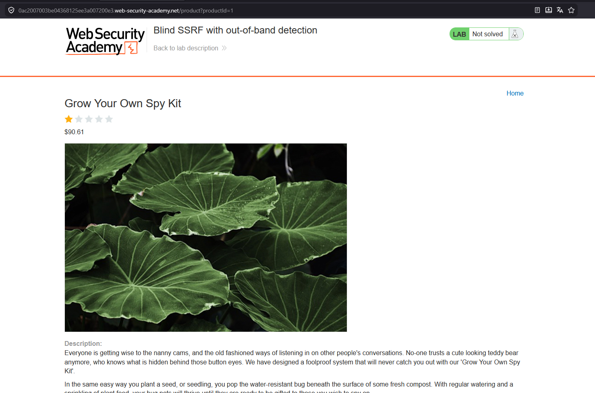
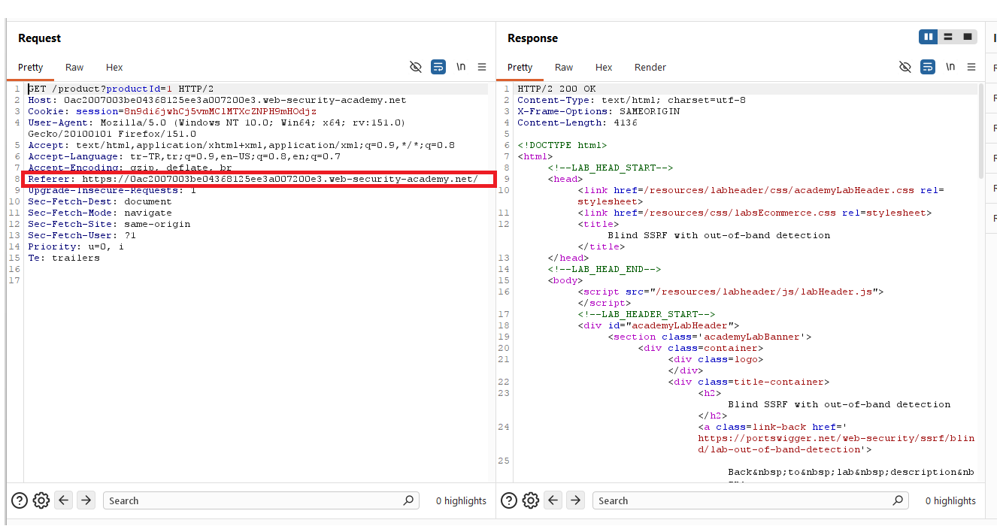
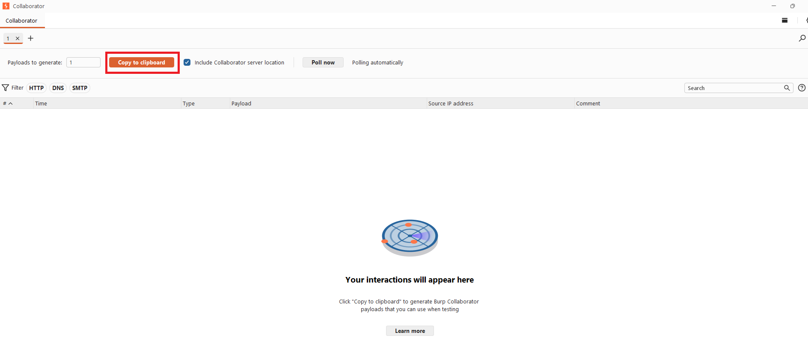
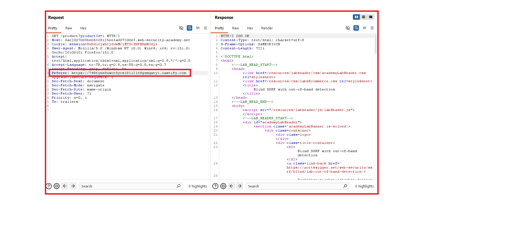
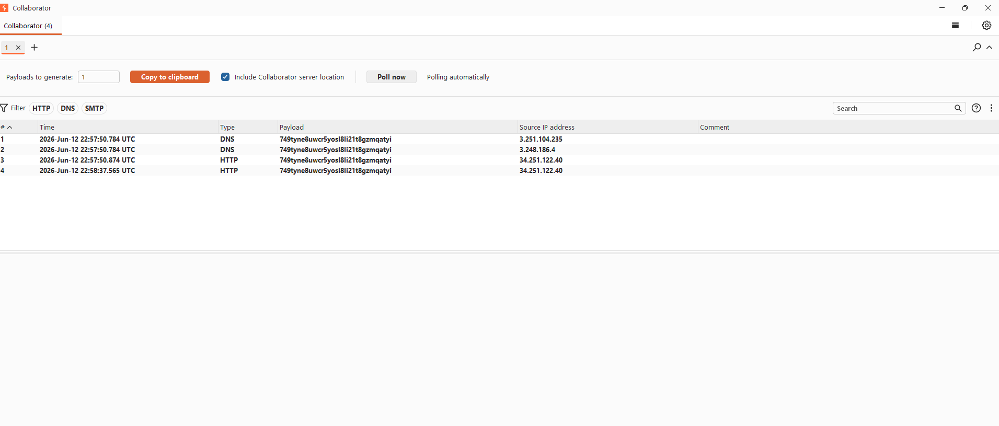
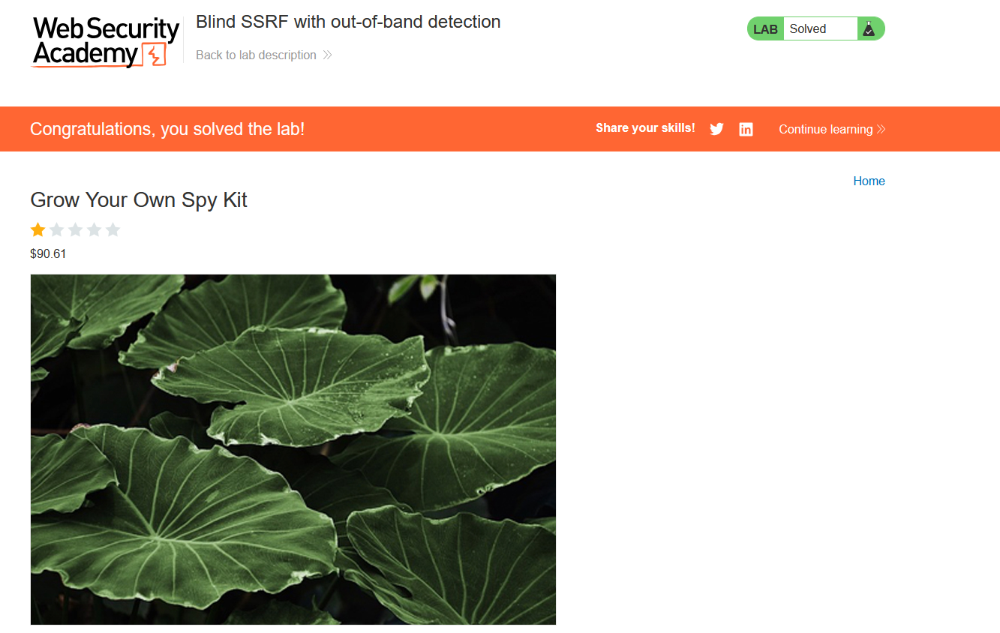

# Blind SSRF with out-of-band detection

## 1. Lab Bilgisi

**Difficulty:** Practitioner

## 2. Vulnerability Özeti

Bu labda uygulama, ürün sayfası ziyaretlerinde `Referer` header değerini sunucu tarafında işliyor ve bu değere arka planda istek atıyor. Response içinde doğrudan bir veri dönmediği için zafiyet blind SSRF olarak ilerliyor. Burp Collaborator/OAST adresimi `Referer` header içine yerleştirerek uygulama sunucusunun dışarıya DNS/HTTP isteği yaptığını doğruladım ve labı çözdüm.

## 3. Kullanılan Payload

`Referer` header değeri Burp Collaborator/OAST adresiyle değiştirildi:

```http
Referer: http://<collaborator-domain>
```

## 4. Exploitation Steps

1. İlk olarak lab uygulamasında bir ürün detay sayfasını açtım.



2. Ürün sayfasına yapılan isteği Burp Suite ile yakaladım. İstek içinde `Referer` header değerinin bulunduğunu gördüm.



3. Burp Collaborator/OAST üzerinden yeni bir domain oluşturdum.



4. Yakalanan istekteki `Referer` header değerini Collaborator/OAST domainini gösterecek şekilde değiştirdim.

```http
Referer: http://<collaborator-domain>
```



5. İsteği gönderdikten sonra Burp Collaborator/OAST ekranında interaction kontrolü yaptım. Uygulama sunucusundan gelen DNS/HTTP etkileşimi göründü.



6. Out-of-band etkileşim doğrulandığı için blind SSRF zafiyeti kanıtlandı ve lab başarıyla çözüldü.



## 5. Impact

Blind SSRF zafiyetinde saldırgan, uygulama sunucusunun response içinde veri döndürmemesine rağmen sunucuyu harici veya internal adreslere istek göndermeye zorlayabilir. Bu durum internal servislerin keşfedilmesine, metadata servislerinin hedeflenmesine veya dış sistemlere kontrollü istek gönderilerek hassas ağ davranışlarının tespit edilmesine yol açabilir.

## 6. Remediation

Uygulama, kullanıcı kontrolündeki header veya parametre değerlerine dayanarak sunucu tarafında istek yapmamalıdır. `Referer` gibi header değerleri güvenilir kabul edilmemeli ve arka plan isteklerinde doğrudan kullanılmamalıdır. Gerekli outbound istekler için sıkı allowlist uygulanmalı; loopback, private IP, link-local ve internal domain hedefleri engellenmelidir. Ayrıca outbound trafik izlenmeli, beklenmeyen DNS/HTTP istekleri loglanmalı ve alarm üretecek şekilde takip edilmelidir.
