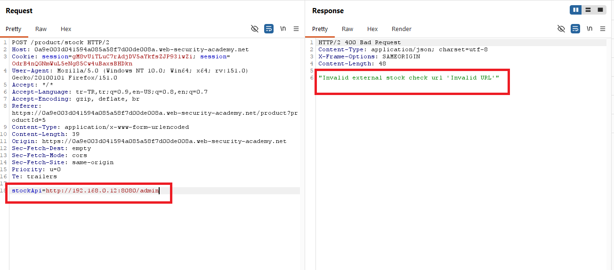
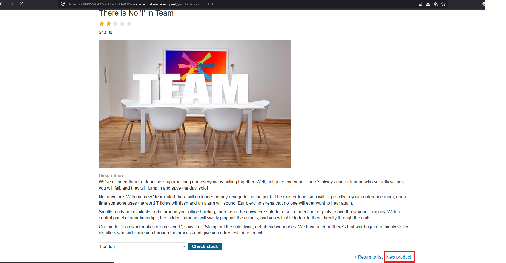
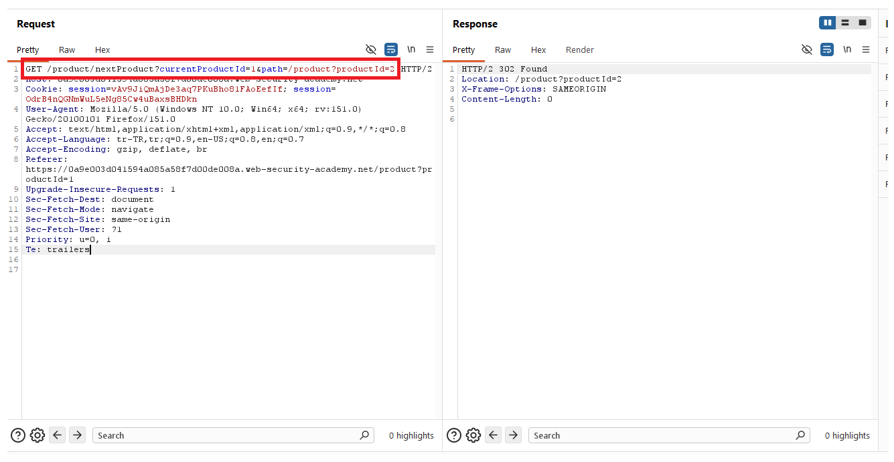
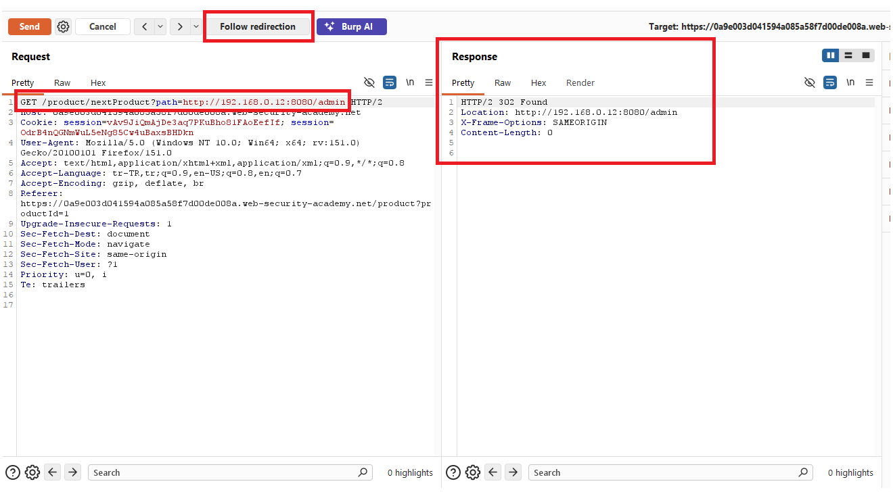
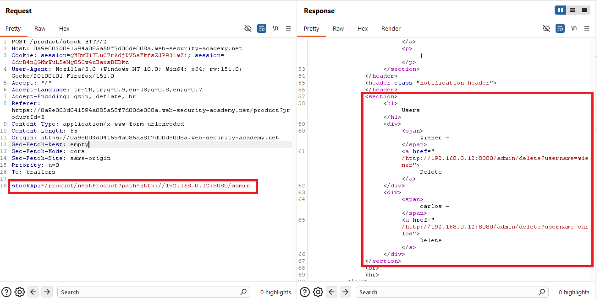
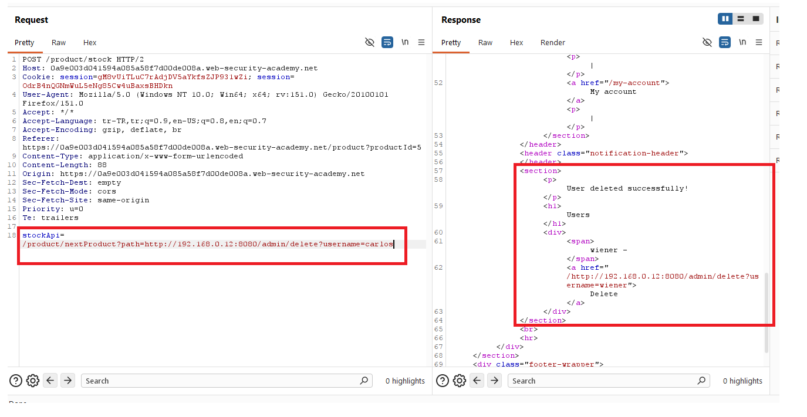
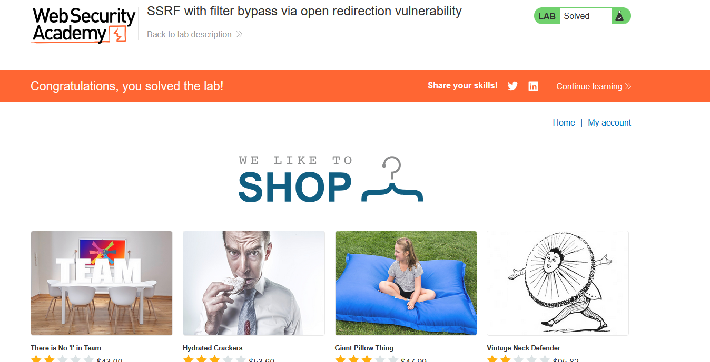

# SSRF with filter bypass via open redirection vulnerability

## 1. Lab Bilgisi

**Difficulty:** Practitioner

## 2. Vulnerability Özeti

Bu labda ürün stok kontrolü için kullanılan `stockApi` parametresi sunucu tarafında URL çağırıyor. Uygulama, `stockApi` değerini sadece izin verilen stock servisine yönlenecek şekilde filtreliyor. Ancak aynı uygulamada bulunan open redirection zafiyeti sayesinde bu filtre bypass edilebiliyor. İzin verilen host üzerindeki redirect endpoint'ini kullanarak isteği internal back-end sistemindeki admin paneline yönlendirdim ve `carlos` kullanıcısını silerek labı çözdüm.

## 3. Kullanılan Payload

Open redirect endpoint'i:

```http
/product/nextProduct?path=http://192.168.0.12:8080/admin
```

`stockApi` içinde kullanılan SSRF payload:

```http
stockApi=/product/nextProduct?path=http://192.168.0.12:8080/admin
```

Carlos kullanıcısını silmek için kullanılan endpoint:

```http
stockApi=/product/nextProduct?path=http://192.168.0.12:8080/admin/delete?username=carlos
```

## 4. Exploitation Steps

1. İlk olarak ürün detay sayfasındaki stok kontrolü fonksiyonunu kullandım.



2. `Check stock` isteğini Burp Suite ile yakaladım. İstek içinde `stockApi` parametresinin backend tarafından çağrılan URL'i taşıdığını gördüm.



3. `stockApi` değerini doğrudan internal admin paneline yönlendirmeyi denedim.

```http
stockApi=http://192.168.0.12:8080/admin
```



4. Doğrudan internal host'a gitmek filtreye takıldığı için uygulamada redirect davranışı olan `nextProduct` endpoint'ini inceledim. Bu endpoint, `path` parametresindeki adrese yönlendirme yapıyordu.



5. `stockApi` parametresinde izin verilen uygulama path'ini kullanıp, `path` parametresini internal admin paneline yönlendirdim.

```http
stockApi=/product/nextProduct?path=http://192.168.0.12:8080/admin
```



6. Redirect takip edildiğinde response içinde internal back-end sistemindeki admin paneli görüntülendi. Ardından `carlos` kullanıcısını silen endpoint'i aynı open redirect tekniğiyle hedefledim.

```http
stockApi=/product/nextProduct?path=http://192.168.0.12:8080/admin/delete?username=carlos
```



7. Delete isteği başarılı olduktan sonra `carlos` kullanıcısı silindi ve lab başarıyla çözüldü.



## 5. Impact

SSRF filtreleri yalnızca ilk URL'i kontrol edip redirect sonrası hedefi doğrulamazsa saldırgan izin verilen bir host üzerinden internal sistemlere ulaşabilir. Open redirection zafiyeti ile birleştiğinde bu durum internal admin panellerinin, back-end servislerinin veya metadata endpoint'lerinin hedeflenmesine yol açabilir. Yetki kontrolü zayıf olan internal endpoint'lerde kritik işlemler gerçekleştirilebilir.

## 6. Remediation

SSRF korumasında sadece ilk URL doğrulanmamalı, redirect zincirindeki her hedef yeniden parse edilip doğrulanmalıdır. Uygulama yalnızca beklenen host, port ve path değerlerine izin veren allowlist kullanmalıdır. Open redirection zafiyetleri giderilmeli; redirect hedefleri kullanıcıdan serbest URL olarak alınmamalı, gerekiyorsa yalnızca relative path veya sunucu tarafında tanımlı güvenli hedefler kabul edilmelidir. Private IP, loopback, link-local ve internal domain hedeflerine giden outbound istekler engellenmelidir.
