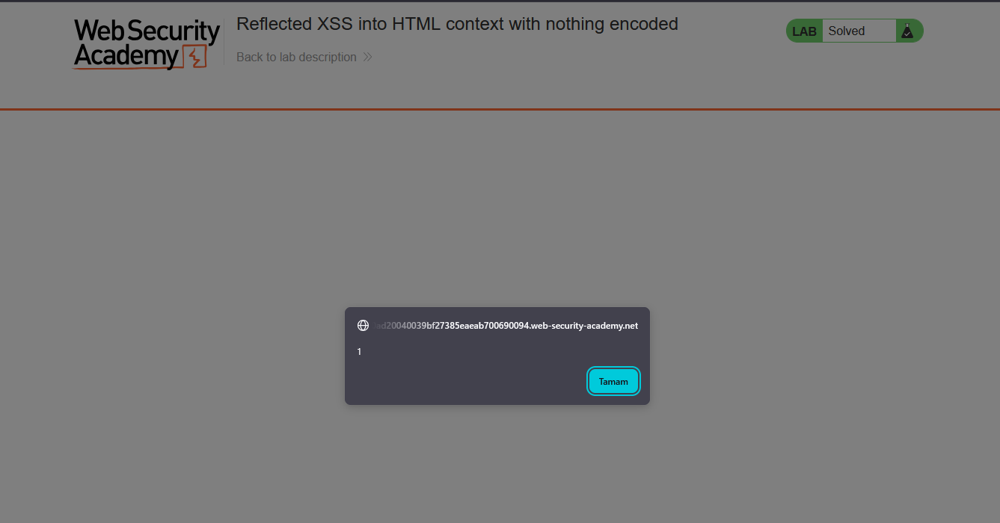
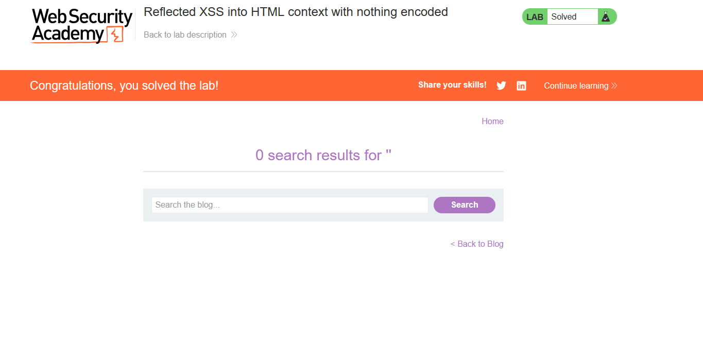

# Reflected XSS into HTML context with nothing encoded

## 1. Lab Bilgisi

**Difficulty:** Apprentice

## 2. Vulnerability Özeti

Bu labda arama kutusuna yazdığım değerin sayfaya olduğu gibi geri basıldığını gördüm. Uygulama bu değeri temizlemiyor ya da güvenli hale getirmiyor. Bu yüzden arama alanına yazdığım JavaScript tarayıcıda çalıştı ve reflected XSS açığını doğrulamış oldum.

## 3. Exploitation Steps

1. Blog sayfasındaki arama alanına şu payload'ı yazdım:

```html
<script>
  alert(1);
</script>
```


2. Search butonuna bastıktan sonra girdiğim değer sayfaya aynen yansıdı.

Payload sonrasında HTML şu yapıya dönüştü:

```html
<h1>0 search results for '<script>alert(1)</script>'</h1>
```

Sayfa bu değeri encode etmediği için `<script>` tag'i gerçek HTML/JavaScript olarak yorumlandı.

3. Tarayıcı `alert(1)` penceresini gösterdi. Yani uygulama arama değerini güvenli şekilde ele almıyordu; yazdığım kod direkt çalışıyordu.



4. Alert çalışınca lab çözüldü.



## 4. Impact

Saldırgan, kurbana özel hazırlanmış bir link göndererek onun tarayıcısında JavaScript çalıştırabilir. Bu da kullanıcı adına işlem yaptırma, sayfa içeriğini değiştirme, sahte form gösterme veya oturum bilgilerini hedef alma gibi saldırılara kapı açabilir.

## 5. Remediation

Kullanıcıdan gelen veri sayfaya basılmadan önce bulunduğu yere göre güvenli hale getirilmelidir. Özellikle `<`, `>`, `"`, `'` ve `&` gibi karakterler HTML içinde çalışmayacak şekilde encode edilmelidir. Ek olarak input validation yapılmalı ve mümkünse Content Security Policy ile beklenmeyen JavaScript çalıştırılması sınırlandırılmalıdır.
