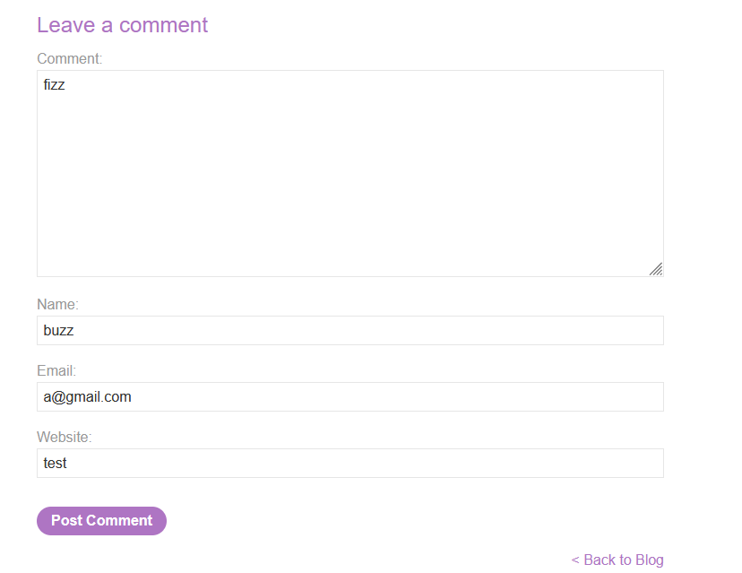
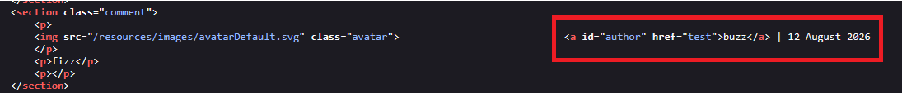
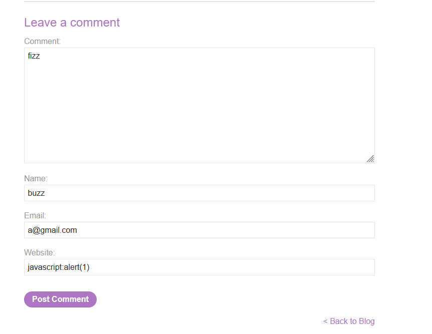
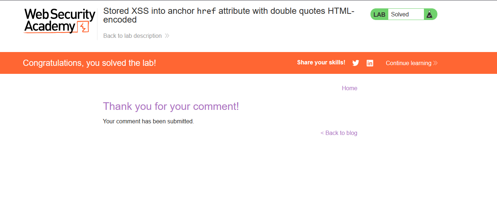

# Stored XSS into anchor href attribute with double quotes HTML-encoded

## 1. Lab Bilgisi

**Difficulty:** Apprentice

## 2. Vulnerability Özeti

Bu labda blog yorum formundaki `Website` alanı, yorum yayınlandıktan sonra kullanıcı adının bulunduğu anchor elementinin `href` attribute'una yazılıyordu. Uygulama çift tırnak gibi attribute bağlamından çıkmayı sağlayabilecek karakterleri HTML encode ettiği için doğrudan yeni bir attribute veya element enjekte edilemedi. Ancak `href` değeri URL scheme açısından doğrulanmadığı için `javascript:` scheme'i kullanılabildi. Böylece kullanıcı adı linkine tıklandığında tarayıcı `href` içindeki JavaScript kodunu çalıştırdı ve stored XSS tetiklendi.

## 3. Exploitation Steps

1. Blog gönderisinin yorum formunda normal bir yorum oluşturdum. `Comment`, `Name`, `Email` ve `Website` alanlarını doldurarak formun çıktıda nasıl işlendiğini inceledim.



2. Yorum yayınlandıktan sonra response içeriğini incelediğimde `Website` alanındaki değerin kullanıcı adını saran anchor elementinin `href` attribute'una yerleştirildiğini gördüm.

```html
<a id="author" href="test">buzz</a>
```

Burada kullanıcı kontrollü `Website` değeri doğrudan link hedefi olarak kullanılıyordu. Çift tırnak karakterleri HTML encode edildiği için attribute dışına çıkmak mümkün değildi, fakat `href` içinde tehlikeli URL scheme'leri engellenmiyordu.



3. XSS'i tetiklemek için `Website` alanına aşağıdaki payload'ı verdim:

```text
javascript:alert(1)
```

Formu bu payload ile tekrar gönderdim. Böylece yorumdaki kullanıcı adı linkinin `href` değeri `javascript:alert(1)` olarak kaydedildi.



4. Yorum yayınlandıktan sonra kullanıcı adı linkine tıklandığında tarayıcı link hedefini normal bir URL olarak değil, JavaScript URL'si olarak yorumladı ve `alert(1)` çalıştı. Payload başarıyla tetiklenince lab solved durumuna geçti.



## 4. Impact

Saldırgan, yorum formu üzerinden kalıcı olarak zararlı bir `href` değeri kaydedebilir. Sayfayı ziyaret eden ve yorumdaki kullanıcı adı linkine tıklayan kullanıcıların tarayıcısında saldırganın belirlediği JavaScript kodu çalışır. Stored XSS olduğu için payload uygulama içinde saklanır ve ilgili yorumu görüntüleyen farklı kullanıcıları da etkileyebilir.

## 5. Remediation

Kullanıcı kontrollü değerler doğrudan `href` attribute'una yazılmamalıdır. Link hedefi olarak kullanılacak değerler allowlist yaklaşımıyla doğrulanmalı ve yalnızca `http://`, `https://` gibi beklenen güvenli scheme'lere izin verilmelidir. `javascript:`, `data:` ve benzeri tehlikeli scheme'ler engellenmelidir. Attribute bağlamında HTML encoding yapılması gerekli olsa da tek başına yeterli değildir; URL bağlamına uygun doğrulama ve normalizasyon da uygulanmalıdır.
