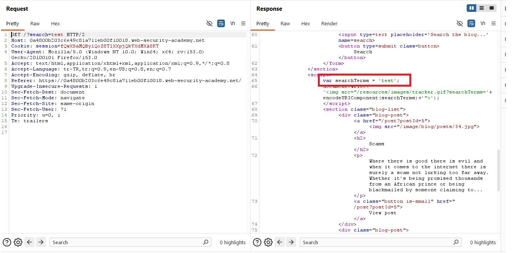
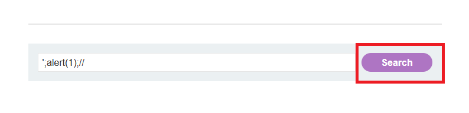
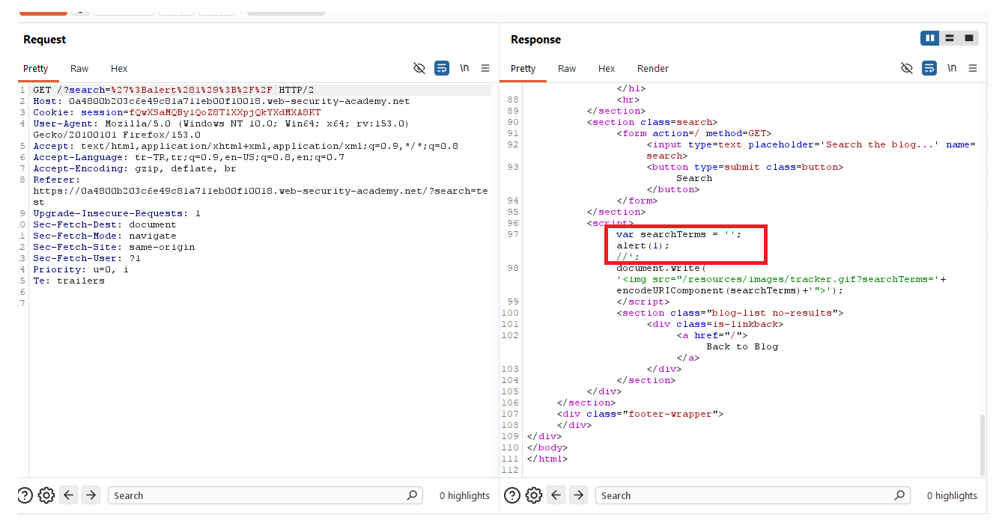
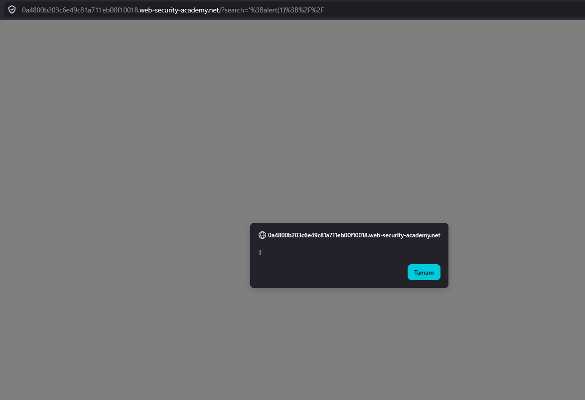
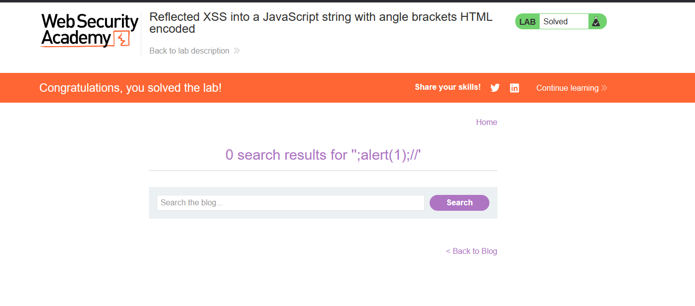

# Reflected XSS into a JavaScript string with angle brackets HTML encoded

## 1. Lab Bilgisi

**Difficulty:** Apprentice

## 2. Vulnerability Özeti

Bu labda `search` parametresindeki değer, response içinde bir JavaScript string değişkenine yerleştiriliyordu. Uygulama angle bracket karakterlerini (`<` ve `>`) HTML encode ettiği için doğrudan HTML tag enjekte etmek mümkün değildi. Ancak kullanıcı girdisi JavaScript string bağlamında yeterli şekilde escape edilmediği için tek tırnak kullanılarak string dışına çıkılabildi. Bu sayede JavaScript kodu enjekte edilerek reflected XSS tetiklendi.

## 3. Exploitation Steps

1. Ana sayfadaki arama alanına normal bir değer girerek uygulamanın arama parametresini nasıl işlediğini kontrol ettim.

```text
test
```


2. Request ve response'u incelediğimde `search` parametresinin response içindeki JavaScript bloğunda `searchTerms` değişkenine atandığını gördüm.

```javascript
var searchTerms = 'test';
document.write('');
```

Burada kaynak `search` parametresi, sink ise kullanıcının kontrol ettiği değerin doğrudan JavaScript string literal içine yazılmasıydı.



3. HTML tag enjekte etmek yerine JavaScript string bağlamından çıkmak için aşağıdaki payload'ı kullandım:

```text
';alert(1);//
```

Bu payload ile tek tırnak karakteri mevcut string'i kapattı, ardından `alert(1)` çalıştırıldı. Sondaki `//` ise devam eden JavaScript kodunun kalan kısmını yorum satırına aldı.



4. Payload gönderildikten sonra response içindeki JavaScript şu hale geldi:

```javascript
var searchTerms = '';
alert(1);
//';
document.write('');
```

Bu yapı geçerli JavaScript olarak yorumlandı ve `alert(1)` çalıştırıldı.



5. Sayfa tarayıcıda yüklendiğinde enjekte edilen JavaScript çalıştı ve alert tetiklendi.



6. Payload başarılı şekilde çalıştıktan sonra lab solved durumuna geçti.



## 4. Impact

Saldırgan, kurbana özel hazırlanmış bir arama URL'si göndererek kullanıcının tarayıcısında JavaScript çalıştırabilir. Reflected XSS olduğu için payload URL üzerinden taşınır ve kullanıcı bağlantıyı açtığında tetiklenir. Başarılı bir saldırı session bilgilerini hedef alma, kullanıcı adına işlem yaptırma veya sayfa içeriğini değiştirme gibi sonuçlara yol açabilir.

## 5. Remediation

Kullanıcı kontrollü veriler JavaScript string bağlamına doğrudan yerleştirilmemelidir. Bu tür değerler bağlama uygun şekilde JavaScript string escaping ile encode edilmeli veya mümkünse script bloğu içine inline olarak yazılmamalıdır. HTML encoding tek başına yeterli değildir; her çıktı noktası kendi bağlamına göre encode edilmelidir. Ayrıca kullanıcı girdisi doğrulanmalı ve Content Security Policy ile inline JavaScript çalıştırılması sınırlandırılmalıdır.
