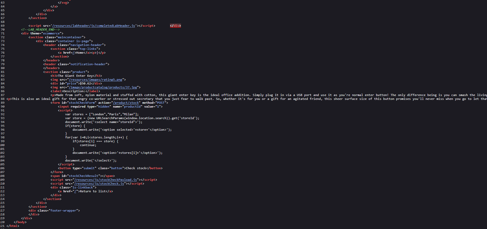
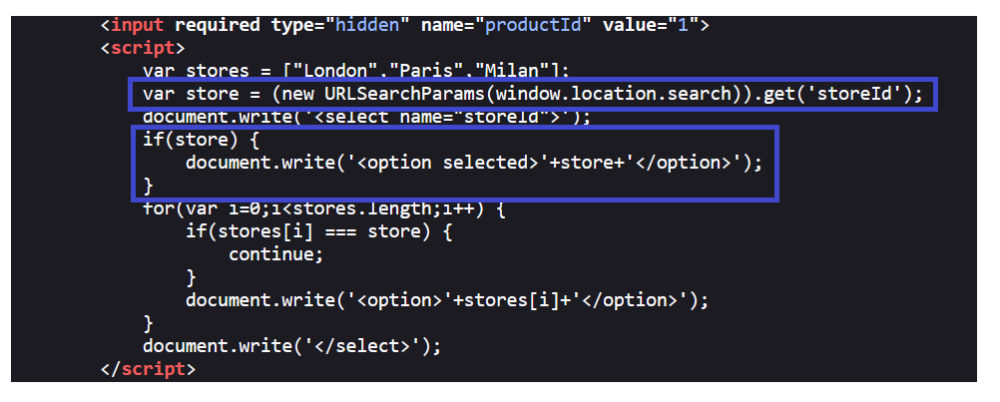
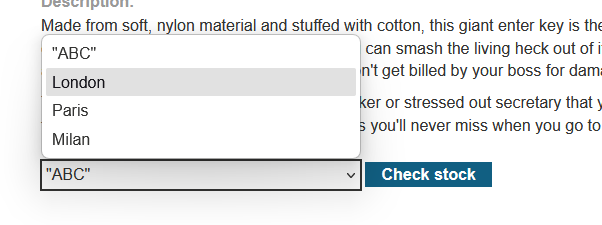
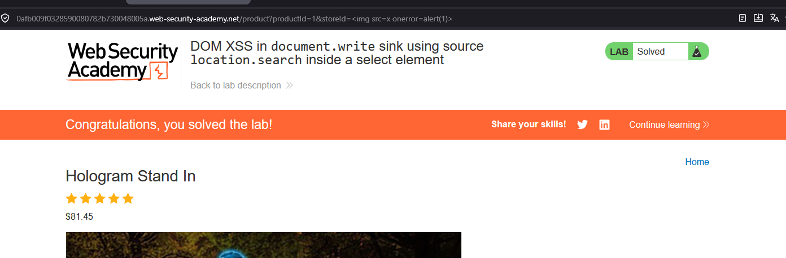

# DOM XSS in document.write sink using source location.search inside a select element

## 1. Lab Bilgisi

**Difficulty:** Practitioner

## 2. Vulnerability Özeti

Bu labda ürün sayfasındaki `storeId` parametresi, client-side JavaScript tarafından `window.location.search` üzerinden alınıyor ve `document.write()` sink'i ile doğrudan `select` elementi içine yazılıyordu. Uygulama URL parametresinden gelen değeri güvenli şekilde encode etmediği için saldırgan, `option` bağlamından çıkıp yeni bir HTML elementi enjekte edebildi. Geçersiz kaynaklı bir `img` elementi ve `onerror` event handler'ı kullanılarak DOM tabanlı XSS tetiklendi.

## 3. Exploitation Steps

1. Ürün detay sayfasının kaynak kodunu incelediğimde stok kontrol formunun `select` elementini JavaScript ile oluşturduğunu gördüm.

```javascript
var stores = ["London","Paris","Milan"];
var store = (new URLSearchParams(window.location.search)).get('storeId');
document.write('<select name="storeId">');
if(store) {
    document.write('<option selected>'+store+'</option>');
}
for(var i=0;i<stores.length;i++) {
    if(stores[i] === store) {
        continue;
    }
    document.write('<option>'+stores[i]+'</option>');
}
document.write('</select>');
```

Burada kaynak `window.location.search`, sink ise kullanıcı kontrollü `storeId` değerinin `document.write()` ile HTML içine yazılmasıydı.



2. Kodun kritik kısmında `storeId` parametresinden gelen değerin herhangi bir HTML encoding uygulanmadan `option selected` elementi içine yerleştirildiği görülüyordu.

```javascript
var store = (new URLSearchParams(window.location.search)).get('storeId');
document.write('<select name="storeId">');
if(store) {
    document.write('<option selected>'+store+'</option>');
}
```

Bu nedenle `storeId` değeri `option` içeriğini kapatacak veya yeni bir HTML elementi oluşturacak şekilde manipüle edilebilirdi.



3. Önce `storeId` parametresine basit bir test değeri vererek bu değerin sayfada nasıl işlendiğini kontrol ettim.

```text
"ABC"
```


4. Test değeri sayfadaki mağaza seçim listesinin içinde yeni seçili değer olarak görüntülendi. Bu davranış, parametrenin DOM üzerinde doğrudan HTML çıktısına dönüştüğünü doğruladı.



5. XSS'i tetiklemek için `storeId` parametresine aşağıdaki payload'ı verdim:

```html

```

Tam URL'de parametre şu şekilde kullanıldı:

```text
?productId=1&storeId=
```

`document.write()` bu değeri HTML olarak yorumladığı için tarayıcı bir `img` elementi oluşturdu. `src=x` geçersiz olduğu için `onerror` event'i tetiklendi ve `alert(1)` çalıştı.



6. Payload tarayıcıda çalıştığında JavaScript alert'i tetiklendi ve DOM XSS başarıyla doğrulandı.


## 4. Impact

Saldırgan, kurbana özel hazırlanmış bir URL göndererek kullanıcının tarayıcısında JavaScript çalıştırabilir. Açık client-side tarafta oluştuğu için payload URL parametresi üzerinden taşınır ve sayfa yüklendiğinde DOM üzerinde çalışır. Başarılı bir saldırı, kullanıcının oturum bağlamında işlem yaptırma, sayfa içeriğini değiştirme veya hassas bilgileri hedef alma gibi sonuçlara yol açabilir.

## 5. Remediation

Kullanıcı kontrollü veriler `document.write()` gibi HTML yorumlayan sink'lere doğrudan verilmemelidir. URL parametrelerinden gelen değerler güvenli DOM API'leriyle metin olarak işlenmeli, örneğin `textContent` veya güvenli element oluşturma yöntemleri kullanılmalıdır. HTML içine çıktı verilmesi gerekiyorsa bağlama uygun encoding uygulanmalı ve beklenen mağaza değerleri allowlist ile doğrulanmalıdır. Ayrıca `document.write()` kullanımından kaçınılmalı ve Content Security Policy ile inline JavaScript çalıştırılması sınırlandırılmalıdır.
