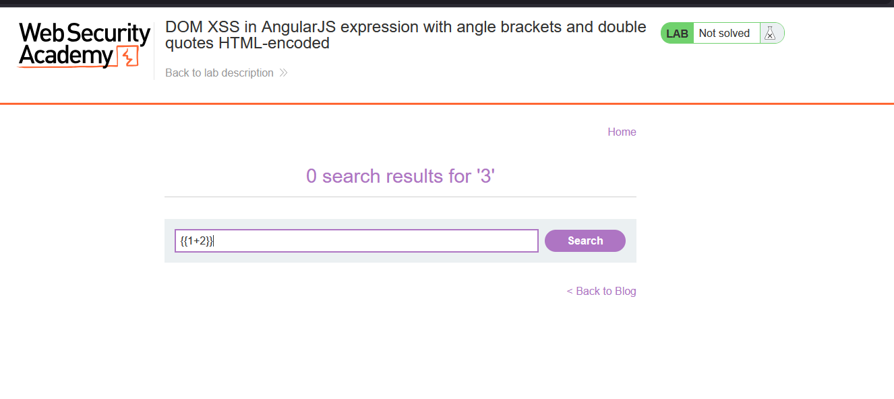
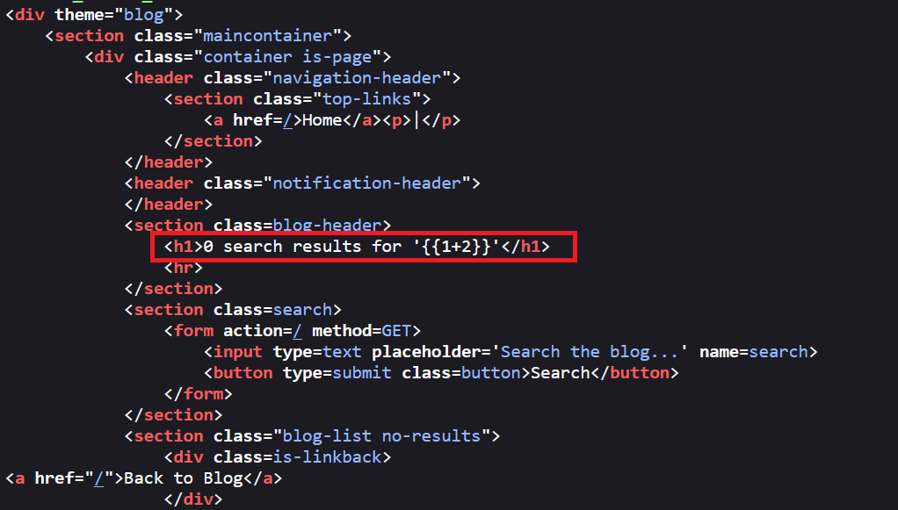
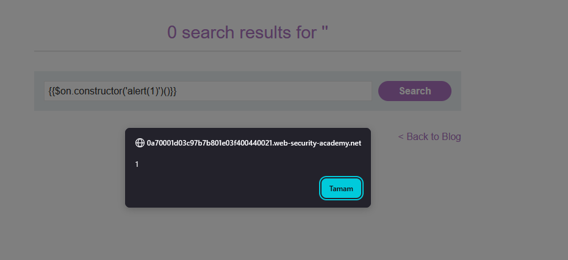
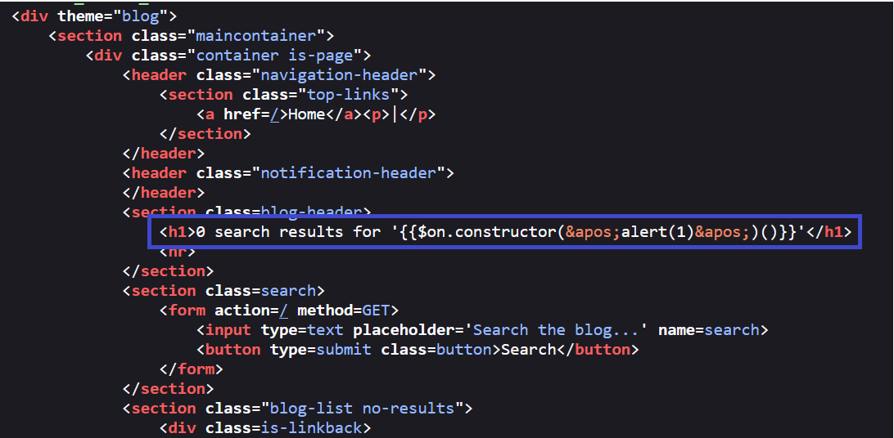
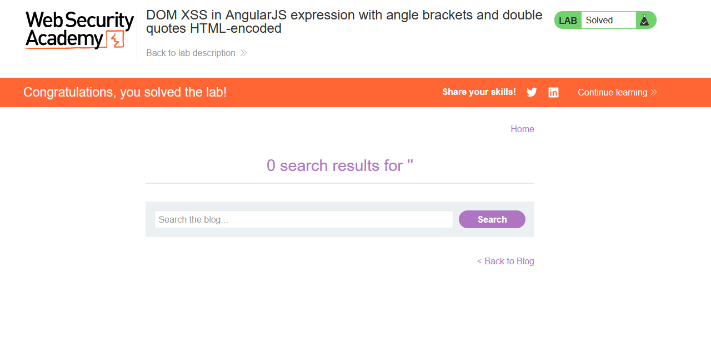

# DOM XSS in AngularJS expression with angle brackets and double quotes HTML-encoded

## 1. Lab Bilgisi

**Difficulty:** Practitioner

## 2. Vulnerability Özeti

Bu labda arama parametresindeki değer, AngularJS tarafından işlenen bir sayfa içinde HTML'e yansıtılıyordu. Uygulama angle bracket karakterlerini (`<` ve `>`) ve çift tırnakları HTML encode ettiği için klasik HTML tag veya attribute enjeksiyonu yapılamıyordu. Ancak sayfa AngularJS context'inde çalıştığı için kullanıcı girdisi içindeki `{{ }}` expression yapısı AngularJS tarafından değerlendirildi. Bu sayede HTML tag kullanmadan AngularJS expression injection üzerinden DOM XSS tetiklendi.

## 3. Exploitation Steps

1. Arama alanına önce basit bir AngularJS expression değeri girerek sayfanın expression'ları değerlendirip değerlendirmediğini test ettim.

```text
{{1+2}}
```

Bu değer arama sonucunda sayfaya yansıtıldı ve AngularJS tarafından expression olarak işlenebilecek bir bağlam olduğunu gösterdi.



2. Response içeriğini incelediğimde arama parametresinin `h1` elementi içinde yansıtıldığını gördüm.

```html
<h1>0 search results for '{{1+2}}'</h1>
```

Burada kullanıcı kontrollü `search` değeri HTML içinde görünüyordu. `<`, `>` ve çift tırnak gibi karakterler encode edilse bile AngularJS expression sözdizimi için gerekli olan çift süslü parantezler kullanılabildiği için bu bağlam exploitable durumdaydı.



3. XSS'i tetiklemek için AngularJS sandbox bypass tekniğiyle aşağıdaki payload'ı kullandım:

```text
{{$on.constructor('alert(1)')()}}
```

Bu payload içinde `$on.constructor` üzerinden JavaScript `Function` constructor'a ulaşıldı ve `alert(1)` çalıştırıldı.



4. Response tarafında payload'ın tek tırnaklarının HTML entity olarak encode edildiğini gördüm.

```html
<h1>0 search results for '{{$on.constructor(&apos;alert(1)&apos;)()}}'</h1>
```

Tek tırnakların HTML encode edilmesi payload'ı engellemedi; tarayıcı DOM'u oluştururken entity'leri çözdü ve AngularJS expression'ı değerlendirdi.



5. Payload çalıştıktan sonra `alert(1)` tetiklendi ve lab solved durumuna geçti.



## 4. Impact

Saldırgan, kurbana özel hazırlanmış bir arama URL'si göndererek kullanıcının tarayıcısında JavaScript çalıştırabilir. Bu açık HTML tag enjeksiyonuna ihtiyaç duymadan AngularJS expression evaluation üzerinden tetiklendiği için klasik karakter bazlı filtreler veya yalnızca HTML encoding kontrolleri yeterli olmayabilir. Başarılı bir saldırı kullanıcının oturum bağlamında işlem yaptırma, sayfa içeriğini değiştirme veya hassas verileri hedef alma gibi sonuçlara yol açabilir.

## 5. Remediation

Kullanıcı kontrollü veriler AngularJS tarafından değerlendirilen template context'lerine doğrudan yerleştirilmemelidir. Dinamik içerikler expression olarak değil, güvenli metin olarak render edilmelidir. AngularJS template interpolation gereken yerlerde kullanıcı girdisi bağlama uygun şekilde encode edilmeli, güvenilmeyen veriler AngularJS expression parser'a ulaşmamalıdır. Ayrıca eski AngularJS sürümlerindeki sandbox bypass riskleri nedeniyle framework güncel tutulmalı ve mümkünse Content Security Policy ile inline JavaScript çalıştırılması sınırlandırılmalıdır.
