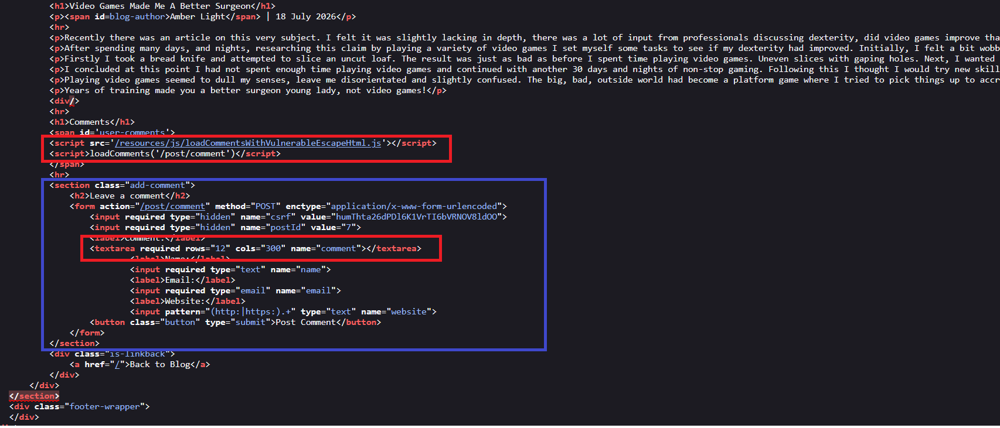
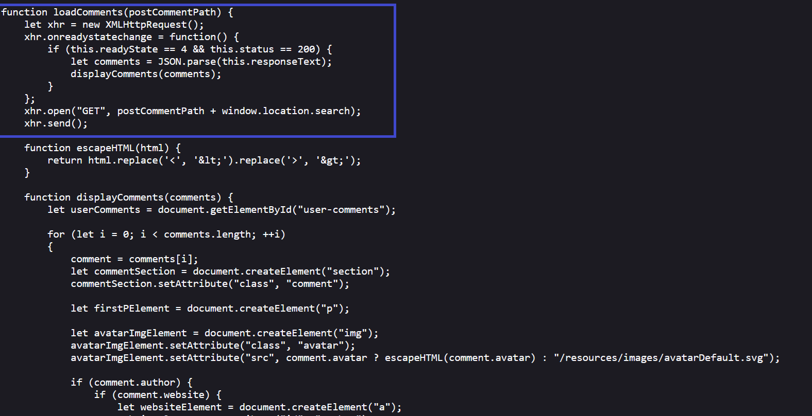
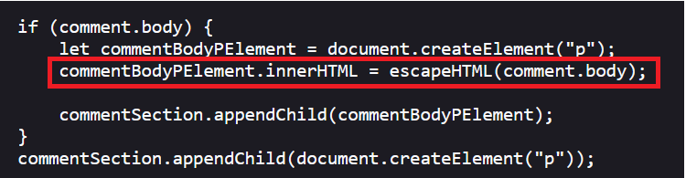
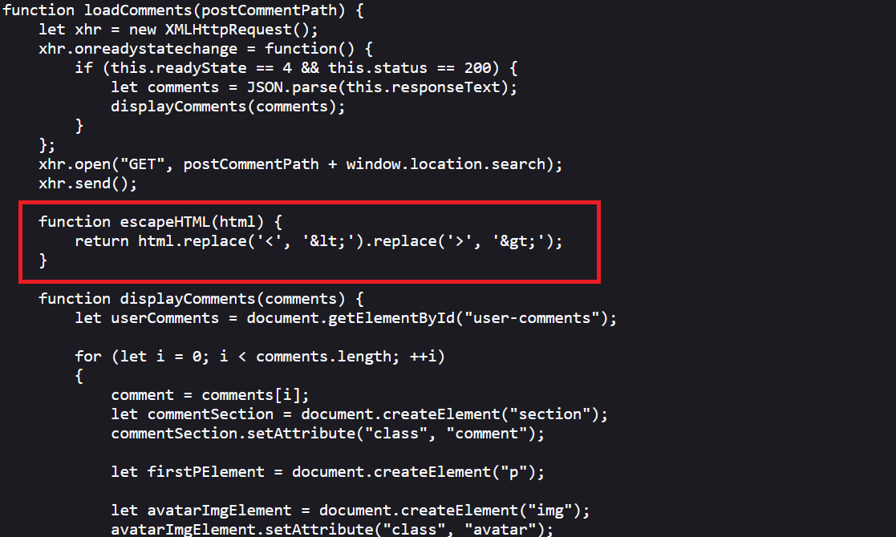
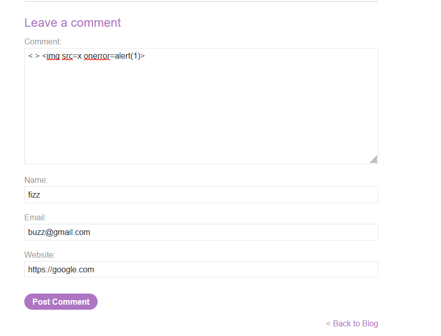
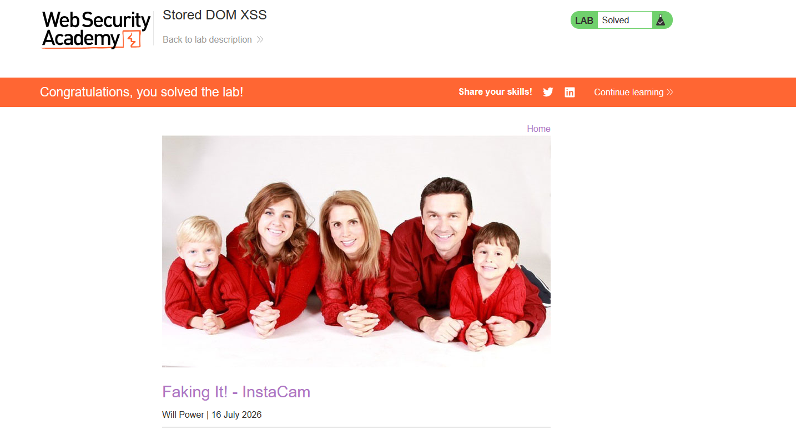

# Stored DOM XSS

## 1. Lab Bilgisi

**Difficulty:** Practitioner

## 2. Vulnerability Özeti

Bu labda blog yorumları sunucuda saklanıyor ve sayfa yüklendiğinde client-side JavaScript tarafından `/post/comment` endpoint'inden JSON olarak çekiliyordu. Yorum gövdesi DOM'a eklenirken `innerHTML` sink'i kullanılıyordu. Uygulama yorum içeriğini `escapeHTML()` fonksiyonundan geçiriyordu, ancak bu fonksiyon yalnızca ilk `<` ve ilk `>` karakterini replace ettiği için eksik escaping uygulanıyordu. Saldırgan, ilk karakterleri filtreye harcatıp sonraki HTML payload'ını çalışır durumda bırakarak stored DOM XSS tetikleyebildi.

## 3. Exploitation Steps

1. Blog gönderisinin kaynak kodunu incelediğimde yorumların ayrı bir JavaScript dosyası ile yüklendiğini ve sayfada yorum formunun bulunduğunu gördüm.

```html
<script src="/resources/js/loadCommentsWithVulnerableEscapeHtml.js"></script>
<script>loadComments('/post/comment')</script>
```

Yorum formunda kullanıcı kontrollü `comment`, `name`, `email` ve `website` alanları bulunuyordu.



2. `loadComments()` fonksiyonu yorumları XMLHttpRequest ile JSON olarak çekiyor ve ardından `displayComments()` fonksiyonuna gönderiyordu.

```javascript
function loadComments(postCommentPath) {
    let xhr = new XMLHttpRequest();
    xhr.onreadystatechange = function() {
        if (this.readyState == 4 && this.status == 200) {
            let comments = JSON.parse(this.responseText);
            displayComments(comments);
        }
    };
    xhr.open("GET", postCommentPath + window.location.search);
    xhr.send();
}
```

Bu yapı nedeniyle saklanan yorumlar daha sonra client-side kod tarafından DOM'a basılıyordu.



3. Yorum gövdesinin DOM'a eklenme kısmında `innerHTML` kullanıldığını gördüm.

```javascript
if (comment.body) {
    let commentBodyPElement = document.createElement("p");
    commentBodyPElement.innerHTML = escapeHTML(comment.body);
    commentSection.appendChild(commentBodyPElement);
}
```

Burada kullanıcı kontrollü `comment.body` değeri `innerHTML` sink'ine ulaşıyordu.



4. `escapeHTML()` fonksiyonunu incelediğimde yalnızca ilk `<` ve ilk `>` karakterini encode ettiğini fark ettim.

```javascript
function escapeHTML(html) {
    return html.replace('<', '&lt;').replace('>', '&gt;');
}
```

JavaScript `replace()` metodu global flag kullanılmadığında sadece ilk eşleşmeyi değiştirdiği için payload içinde sonraki `<` ve `>` karakterleri encode edilmeden kalıyordu.



5. Bu eksik escaping'i bypass etmek için yorum alanına aşağıdaki payload'ı girdim:

```html
< > 
```

Payload'daki ilk `<` ve ilk `>` karakterleri `escapeHTML()` tarafından encode edildi. Ancak ikinci HTML parçasındaki `` etiketi encode edilmeden kaldı.



6. Yorum kaydedilip blog gönderisi tekrar görüntülendiğinde saklanan yorum client-side kod tarafından `innerHTML` ile DOM'a eklendi. Geçersiz `src=x` değeri nedeniyle `img` elementinin `onerror` event'i tetiklendi ve `alert(1)` çalıştı.


7. Payload başarıyla çalıştıktan sonra lab solved durumuna geçti.



## 4. Impact

Saldırgan, blog yorumuna kalıcı bir JavaScript payload'ı kaydedebilir. Bu yorumu görüntüleyen kullanıcıların tarayıcısında payload otomatik olarak çalışır. Stored DOM XSS olduğu için saldırı yalnızca saldırganın kendi oturumunu değil, ilgili blog gönderisini ziyaret eden diğer kullanıcıları da etkileyebilir. Başarılı bir saldırı kullanıcı adına işlem yapma, sayfa içeriğini değiştirme veya hassas bilgileri hedef alma gibi sonuçlara yol açabilir.

## 5. Remediation

Kullanıcı kontrollü içerikler `innerHTML` ile DOM'a eklenmemelidir. Yorum gibi düz metin alanları için `textContent` kullanılmalı veya güvenilir, kapsamlı bir HTML sanitizer tercih edilmelidir. Manuel escaping yapılacaksa tüm eşleşmeleri kapsayan güvenli encode mekanizmaları kullanılmalı ve yalnızca ilk karakterleri replace eden yaklaşımlardan kaçınılmalıdır. Ayrıca saklanan kullanıcı girdileri hem sunucu tarafında doğrulanmalı hem de çıktı verildiği bağlama uygun şekilde encode edilmelidir.
