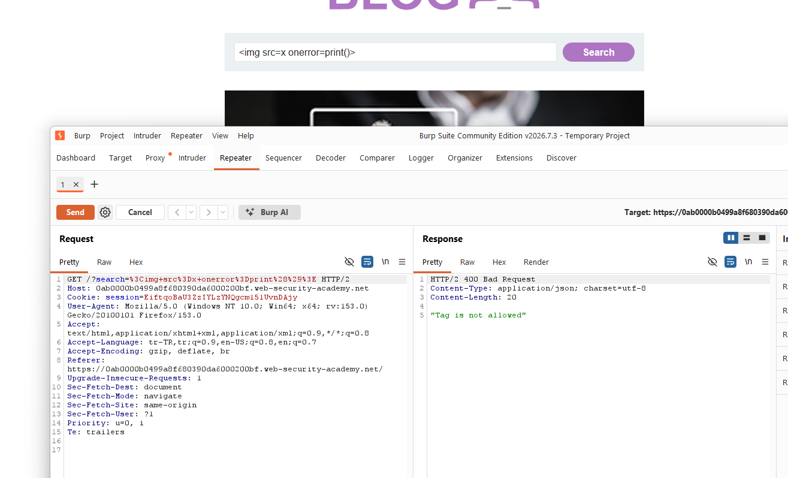
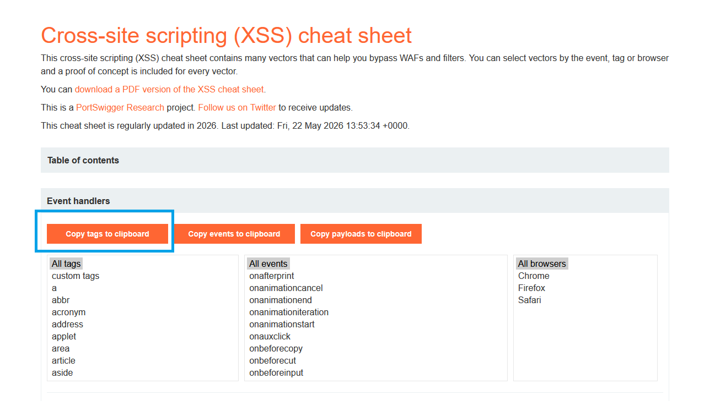
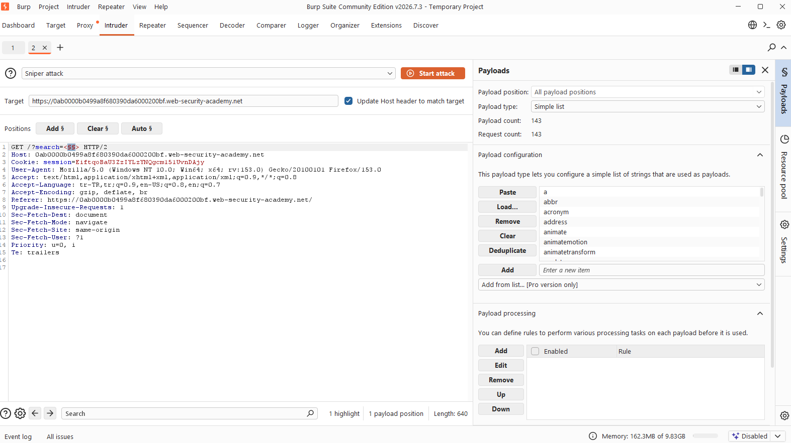
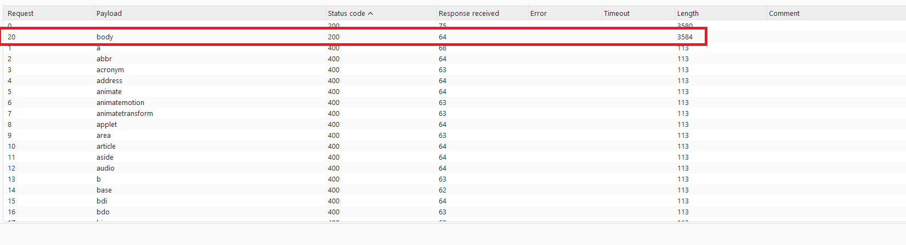
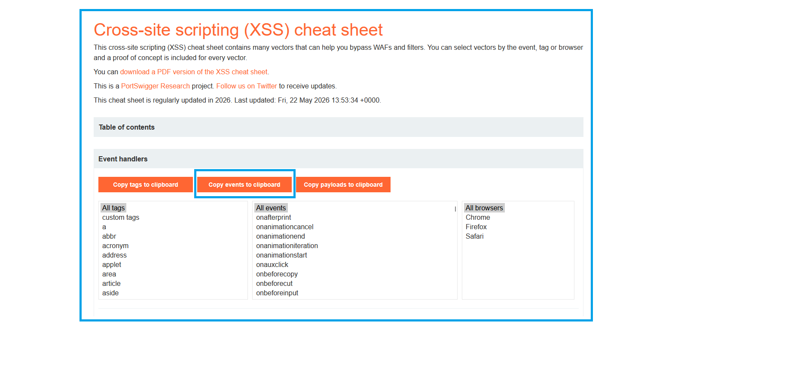
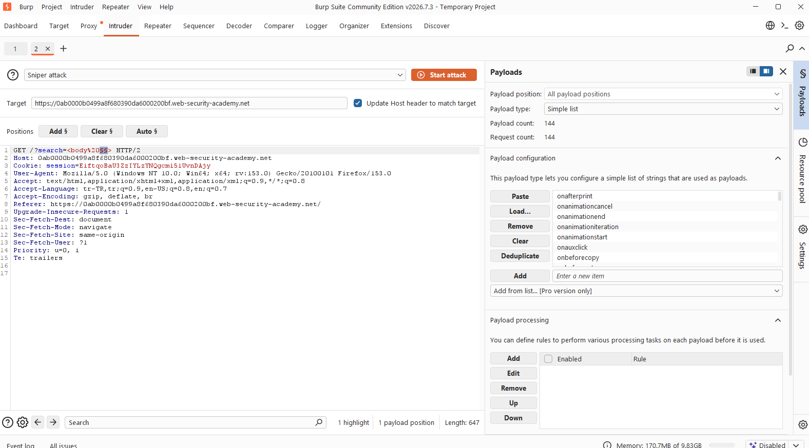
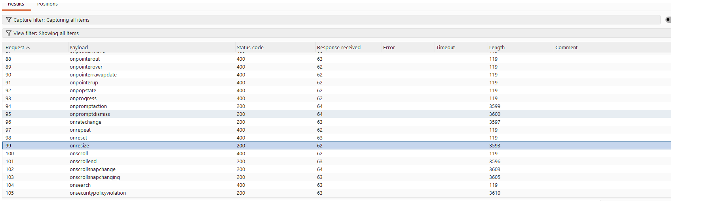
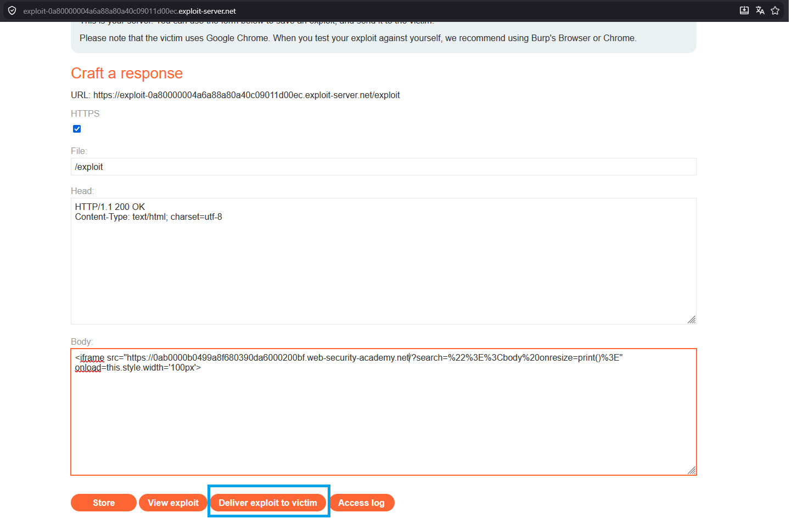
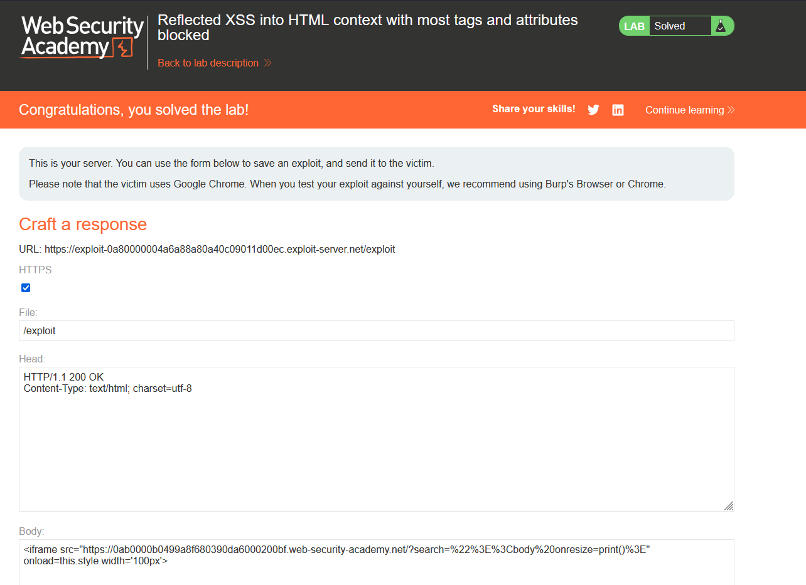

# Reflected XSS into HTML context with most tags and attributes blocked

## 1. Lab Bilgisi

**Difficulty:** Practitioner

## 2. Vulnerability Özeti

Bu labda arama parametresi HTML context içinde sayfaya yansıtılıyordu. Uygulama çoğu HTML tag'ini ve event attribute'unu blocklist ile engelliyordu. Klasik `` gibi payload'lar "Tag is not allowed" hatasıyla reddedildi. Ancak blocklist yaklaşımı eksik olduğu için izin verilen bir tag ve event handler kombinasyonu bulunabildi. `body` tag'i ve `onresize` event'i kullanılarak, kurban sayfayı exploit server üzerinden iframe içinde açtığında iframe'in genişliği değiştirilip `print()` fonksiyonu tetiklendi.

## 3. Exploitation Steps

1. Arama alanında klasik XSS payload'ı test ettim.

```html

```

İstek Burp Repeater'a gönderildiğinde uygulama bu payload'ı `400 Bad Request` ile reddetti ve response içinde `"Tag is not allowed"` mesajını döndürdü. Bu durum uygulamanın tag bazlı bir filtre kullandığını gösterdi.



2. İzin verilen tag'leri bulmak için PortSwigger XSS cheat sheet üzerinden tag listesini kopyaladım.



3. Burp Intruder'da arama parametresindeki tag adını payload position olarak işaretledim ve cheat sheet'ten alınan tag listesini Simple list payload olarak ekledim.

```http
GET /?search=<§tag§> HTTP/2
```



4. Intruder sonuçlarında çoğu tag'in `400` döndürdüğünü, ancak `body` payload'ının `200 OK` response verdiğini gördüm. Bu sonuç `body` tag'inin blocklist tarafından engellenmediğini gösterdi.



5. Bir sonraki aşamada izin verilen event handler'ı bulmak için XSS cheat sheet üzerinden event listesini kopyaladım.



6. Intruder'da bu kez `body` tag'i üzerinde event attribute alanını payload position olarak işaretledim.

```http
GET /?search=<body%20§event§> HTTP/2
```

Event listesi payload olarak eklendi ve hangi event handler'ların filtreyi geçtiği test edildi.



7. Intruder sonuçlarında bazı event handler'ların `200 OK` döndürdüğünü gördüm. Özellikle `onresize` event'i izinliydi ve bu event, iframe boyutu değiştirildiğinde tetiklenebileceği için exploit için uygundu.



8. Exploit server üzerinde kurbanın lab sayfasını iframe içinde açacak bir payload hazırladım. Arama parametresine URL encoded olarak `<body onresize=print()>` değeri verildi. Iframe yüklendikten sonra `onload` ile iframe genişliği değiştirildi ve böylece iç sayfadaki `onresize` event'i tetiklendi.

```html
<iframe src="https://0ab0000b0499a8f680390da6000200bf.web-security-academy.net/?search=%22%3E%3Cbody%20onresize=print()%3E" onload=this.style.width='100px'>
```

Buradaki `%22%3E` karakterleri mevcut HTML context'ten çıkmak için `">` değerini temsil eder. Ardından `<body onresize=print()>` enjekte edilir.



9. Exploit kurbana gönderildikten sonra iframe yüklendi, genişlik değişikliği `onresize` event'ini tetikledi ve `print()` fonksiyonu çalıştı. Böylece lab solved durumuna geçti.



## 4. Impact

Saldırgan, kurbana özel hazırlanmış bir URL veya exploit server sayfası göndererek kullanıcının tarayıcısında JavaScript çalıştırabilir. Bu labda hedef fonksiyon `print()` olsa da aynı zafiyet farklı bağlamlarda kullanıcı oturumu içinde işlem yaptırma, sayfa içeriğini değiştirme veya hassas verileri hedef alma gibi sonuçlara yol açabilir. Blocklist tabanlı filtreler eksik kalabildiği için izinli unutulan tag ve event handler kombinasyonları XSS'e neden olabilir.

## 5. Remediation

Kullanıcı kontrollü veriler HTML içine doğrudan yerleştirilmemelidir. Çıktı, bulunduğu context'e uygun şekilde encode edilmeli ve mümkünse güvenilmeyen veri `textContent` gibi güvenli API'lerle render edilmelidir. XSS koruması için tag veya attribute blocklist kullanmak yerine allowlist tabanlı, güvenilir ve kapsamlı bir HTML sanitizer tercih edilmelidir. Ayrıca Content Security Policy ile inline script ve event handler çalıştırılması sınırlandırılmalıdır.
