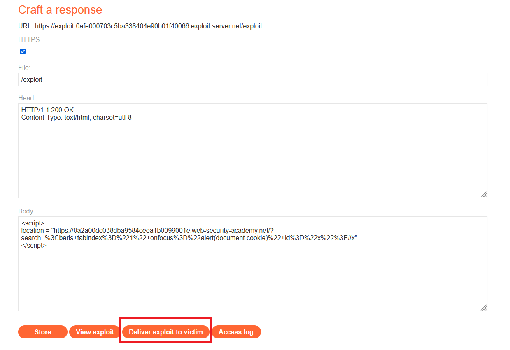
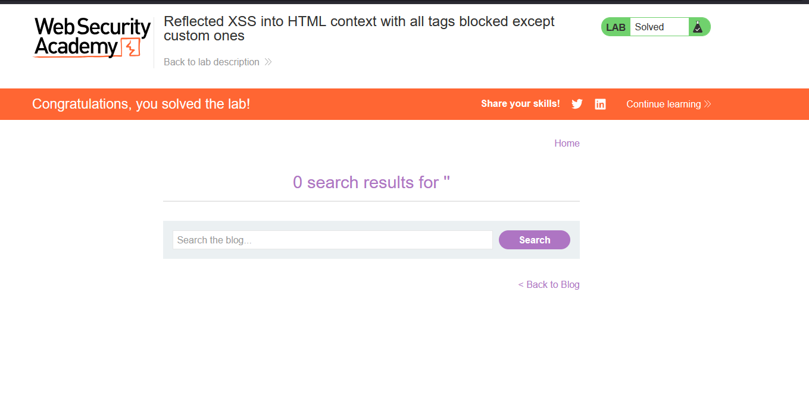

# Reflected XSS into HTML context with all tags blocked except custom ones

## 1. Lab Bilgisi

**Difficulty:** Practitioner

## 2. Vulnerability Özeti

Bu labda arama parametresi HTML context içinde sayfaya yansıtılıyordu. Uygulama standart HTML tag'lerinin tamamına yakınını blocklist ile engelliyordu. Örneğin klasik `` payload'ı "Tag is not allowed" hatasıyla reddedildi. Ancak uygulama custom HTML tag'lerini engellemediği için saldırgan kendi tag adını kullanarak HTML enjeksiyonu yapabildi. Custom tag'e `tabindex` verilerek odaklanabilir hale getirildi ve URL fragment ile element otomatik focus edildiğinde `onfocus` event'i üzerinden JavaScript çalıştırıldı.

## 3. Exploitation Steps

1. Arama alanında önce klasik bir XSS payload'ı test ettim.

```html

```

İstek Burp Repeater üzerinden gönderildiğinde uygulama `400 Bad Request` döndürdü ve response içinde `"Tag is not allowed"` mesajı göründü. Bu sonuç, standart HTML tag'lerinin filtrelendiğini gösterdi.


2. Standart tag'ler engellendiği için custom tag yaklaşımını kullandım. Exploit server üzerinde kurbanı lab sayfasına yönlendiren bir script hazırladım. Payload içinde custom `<xss>` tag'i kullanıldı, element `tabindex=1` ile focus edilebilir hale getirildi ve `onfocus` event handler'ına `alert(document.cookie)` yerleştirildi.

```html
<script>
location = "https://0a2a00dc038dba9584ceea1b0099001e.web-security-academy.net/?search=%3Cxss+tabindex%3D%221%22+onfocus%3D%22alert(document.cookie)%22+id%3D%22x%22%3E#x"
</script>
```

Burada URL encoded payload şu HTML'i üretir:

```html
<xss tabindex="1" onfocus="alert(document.cookie)" id="x">
```

URL sonundaki `#x` fragment değeri, tarayıcının `id="x"` olan custom elemente odaklanmasını sağlar. Element focus aldığında `onfocus` event'i tetiklenir.



3. Exploit kurbana gönderildikten sonra kurban exploit server sayfasını ziyaret etti. Script, kurbanı payload içeren arama URL'sine yönlendirdi. Fragment ile custom element focus edildi ve `alert(document.cookie)` çalıştı. Böylece lab solved durumuna geçti.



## 4. Impact

Saldırgan, kurbana özel hazırlanmış bir exploit server sayfası veya URL göndererek kullanıcının tarayıcısında JavaScript çalıştırabilir. Payload `document.cookie` değerine erişecek şekilde çalıştırıldığı için başarılı bir saldırı oturum bilgilerini hedef alma, kullanıcı adına işlem yapma veya sayfa içeriğini değiştirme gibi sonuçlara yol açabilir. Standart tag'lerin engellenmesi tek başına yeterli değildir; custom tag'ler ve event handler'lar da exploitable bir HTML context oluşturabilir.

## 5. Remediation

Kullanıcı kontrollü veriler HTML context içine doğrudan yerleştirilmemelidir. Çıktı, bulunduğu context'e uygun şekilde encode edilmeli ve güvenilmeyen içerikler mümkün olduğunca düz metin olarak render edilmelidir. Tag blocklist yaklaşımı yerine güvenilir, allowlist tabanlı bir sanitizer kullanılmalı; custom tag'ler, event handler attribute'ları ve focus tetikleyebilen attribute'lar engellenmelidir. Ek olarak Content Security Policy ile inline event handler ve script çalıştırılması sınırlandırılmalıdır.
