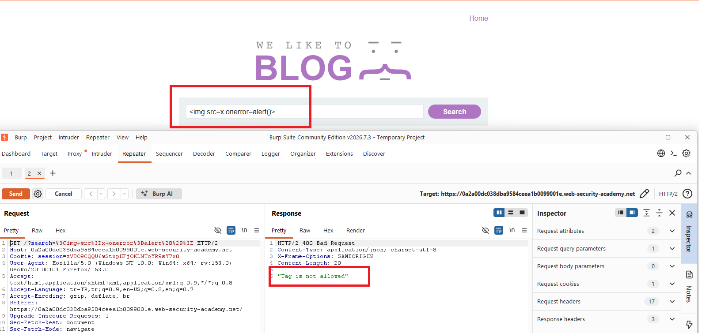
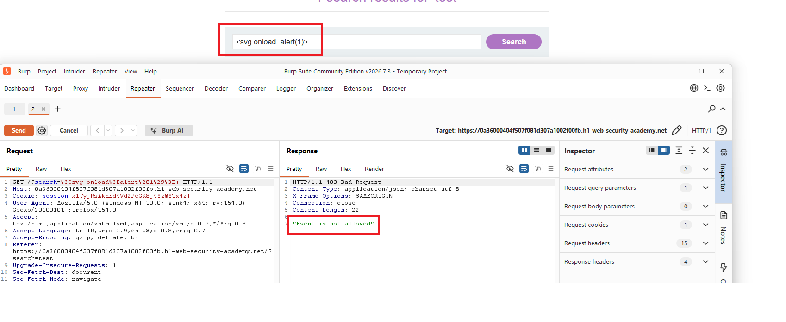
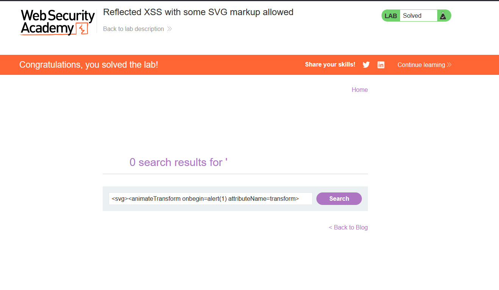
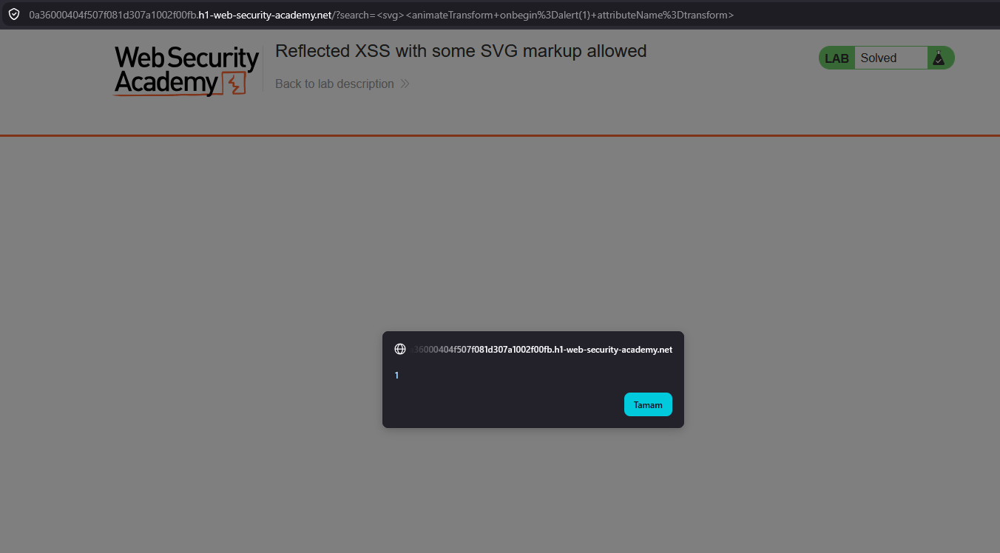

# Reflected XSS with some SVG markup allowed

## 1. Lab Bilgisi

**Difficulty:** Practitioner

## 2. Vulnerability Özeti

Bu labda arama parametresi HTML context içinde sayfaya yansıtılıyordu. Uygulama tag ve event handler bazlı bir filtre kullanıyordu; klasik HTML tag'leri ve bazı event attribute'ları engelleniyordu. Bu nedenle standart `` payload'ı `"Tag is not allowed"` hatasıyla, `<svg onload=alert(1)>` payload'ı ise `"Event is not allowed"` hatasıyla reddedildi.

Lab15'teki yaklaşıma benzer şekilde normalde izin verilen tag ve event handler kombinasyonlarını bulmak için Burp Intruder ile brute force yapılabilir. Bu labda önemli fark, payload'ın SVG markup üzerinden kurulmasıdır. `svg` tag'i altında `animateTransform` elementi ve `onbegin` event'i kullanılarak filtre bypass edildi ve `alert(1)` tetiklendi.

## 3. Exploitation Steps

1. Arama alanında önce klasik bir XSS payload'ı test ettim.

```html

```

İstek Burp Repeater'a gönderildiğinde uygulama `400 Bad Request` döndürdü ve response içinde `"Tag is not allowed"` mesajı görüldü. Bu sonuç uygulamanın tag bazlı bir filtre kullandığını gösterdi.



2. Daha sonra SVG tag'i ile `onload` event handler'ını test ettim.

```html
<svg onload=alert(1)>
```

Bu kez tag kabul edilse de response içinde `"Event is not allowed"` mesajı döndü. Böylece filtrelemenin yalnızca tag seviyesinde değil, event attribute seviyesinde de yapıldığı anlaşıldı.



3. Bu noktada Lab15'teki gibi brute force mantığı uygulanabilir. Önce PortSwigger XSS cheat sheet üzerinden SVG ile ilişkili tag'ler denenir, ardından izin verilen tag üzerinde event handler listesi test edilir.

Örnek Intruder payload pozisyonları şu şekilde kurulabilir:

```http
GET /?search=<§tag§> HTTP/2
```

ve event handler testleri için:

```http
GET /?search=<svg><animateTransform §event§=alert(1)> HTTP/2
```

Bu brute force sonucunda `animateTransform` elementinin ve `onbegin` event handler'ının filtreyi geçtiği tespit edilebilir.

4. İzin verilen SVG markup ve event kombinasyonu kullanılarak final payload hazırlandı.

```html
<svg><animateTransform onbegin=alert(1) attributeName=transform>
```

Burada `animateTransform` SVG animasyon elementidir. Element render edildiğinde animasyon başlangıcı oluşur ve `onbegin` event'i tetiklenir. Event handler içinde yer alan `alert(1)` çalıştığı için reflected XSS başarıyla tetiklenir.



5. Payload URL üzerinden çalıştırıldığında tarayıcı `alert(1)` pop-up'ını gösterdi.

```http
/?search=<svg><animateTransform+onbegin%3Dalert(1)+attributeName%3Dtransform>
```

Bu tetikleme sonrasında lab solved durumuna geçti.



## 4. Impact

Saldırgan, kurbana özel hazırlanmış bir URL göndererek kullanıcının tarayıcısında JavaScript çalıştırabilir. Bu labda hedef fonksiyon `alert(1)` olsa da aynı zafiyet farklı senaryolarda kullanıcı oturumu içinde işlem yaptırma, sayfa içeriğini değiştirme veya hassas bilgileri hedef alma gibi sonuçlara yol açabilir. Tag ve event blocklist yaklaşımı eksik kaldığında SVG gibi daha az kullanılan markup alanları XSS için kullanılabilir.

## 5. Remediation

Kullanıcı kontrollü veriler HTML context içine doğrudan yerleştirilmemelidir. Çıktı, bulunduğu context'e uygun şekilde encode edilmeli ve güvenilmeyen veri mümkün olduğunca düz metin olarak render edilmelidir. Blocklist tabanlı tag ve event filtreleri yerine güvenilir, allowlist tabanlı bir HTML sanitizer kullanılmalıdır. SVG markup, animasyon elementleri ve inline event handler attribute'ları özellikle dikkatle sınırlandırılmalı; ayrıca Content Security Policy ile inline script ve event handler çalıştırılması kısıtlanmalıdır.
