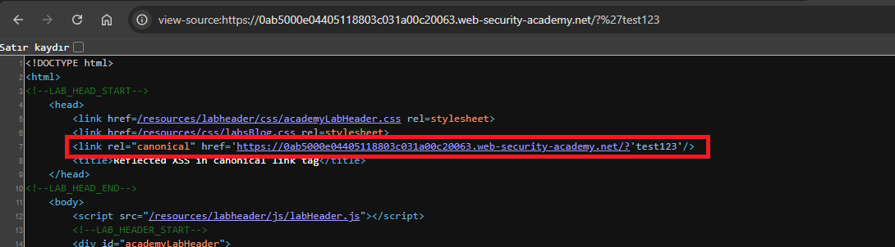
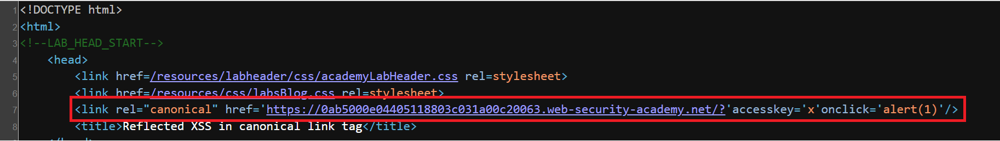
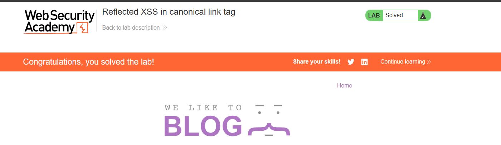

# Reflected XSS in canonical link tag

## 1. Lab Bilgisi

**Difficulty:** Practitioner

## 2. Vulnerability Özeti

Bu labda kullanıcı kontrollü URL query string değeri, sayfanın `<head>` bölümündeki canonical link tag'inin `href` attribute'u içine yansıtılıyordu. Uygulama angle bracket karakterlerini encode ettiği için yeni bir HTML tag enjekte etmek mümkün değildi. Ancak değer tek tırnakla çevrili `href` attribute'u içinde bulunduğundan, tek tırnak kullanılarak mevcut attribute kırılabildi.

Canonical link tag'i sayfada görünür bir element olmadığı için klasik mouse event'leri pratik şekilde tetiklenemez. Bu nedenle payload, `accesskey` attribute'u ile klavye kısayolu tanımlayıp aynı elemente `onclick` event handler ekleyerek kuruldu. Kullanıcı ilgili access key kombinasyonunu kullandığında element üzerinde click davranışı tetiklendi ve `alert(1)` çalıştı.

## 3. Exploitation Steps

1. Önce URL sonuna rastgele bir query string ekleyip sayfa kaynağını inceledim.

```http
/?%27test123
```

Kaynak kodda query string değerinin canonical link tag'inin `href` attribute'u içine yansıtıldığını gördüm.

```html
<link rel="canonical" href='https://0ab5000e04405118803c031a00c20063.web-security-academy.net/?'test123'/>
```

Bu çıktı, tek tırnak karakterinin attribute context'ten çıkmak için kullanılabileceğini gösterdi.



2. Attribute context'ten çıkmak için tek tırnak kullandım ve aynı tag içine `accesskey` ile `onclick` attribute'larını enjekte ettim.

```text
?'accesskey='x'onclick='alert(1)
```

Payload response içinde şu şekilde canonical link tag'ine yerleşti:

```html
<link rel="canonical" href='https://0ab5000e04405118803c031a00c20063.web-security-academy.net/?'accesskey='x'onclick='alert(1)'/>
```

Burada `accesskey='x'`, element için `x` tuşunu kısayol olarak tanımlar. `onclick='alert(1)'` ise access key tetiklendiğinde çalışacak JavaScript'i içerir.



3. Final payload URL üzerinde şu şekilde kullanıldı:

```http
/?%27accesskey=%27x%27onclick=%27alert(1)
```

Chrome üzerinde Windows için `ALT+SHIFT+X` kombinasyonu kullanıldığında access key tetiklendi ve `onclick` handler çalıştı. Böylece `alert(1)` çağrıldı ve lab solved durumuna geçti. PortSwigger bu lab için platforma göre `ALT+SHIFT+X`, `CTRL+ALT+X` veya `Alt+X` kombinasyonlarının kullanılabileceğini belirtir.



## 4. Impact

Saldırgan, kullanıcının ziyaret edeceği özel hazırlanmış bir URL ile canonical link tag'i içine yeni attribute'lar enjekte edebilir. Bu labda JavaScript'in çalışması için kullanıcı etkileşimi, yani access key kombinasyonunun tetiklenmesi gerekir. Başarılı bir saldırı sonucunda saldırgan kullanıcının tarayıcısında, ilgili uygulama origin'i altında JavaScript çalıştırabilir. Bu durum kullanıcı adına işlem yaptırma, sayfa içeriğini değiştirme veya hassas bilgileri hedef alma gibi sonuçlara yol açabilir.

## 5. Remediation

Kullanıcı kontrollü veriler HTML attribute context'lerine doğrudan yerleştirilmemelidir. Canonical URL gibi değerler sunucu tarafında güvenilir şekilde oluşturulmalı, kullanıcı girdisi gerekiyorsa bulunduğu context'e uygun olarak encode edilmelidir. Özellikle quote karakterleri attribute context'ten çıkışı engelleyecek şekilde encode edilmeli veya filtrelenmelidir. Ayrıca link tag'leri dahil tüm HTML çıktılarında event handler attribute'larının enjekte edilmesini önleyecek allowlist tabanlı çıktı üretimi tercih edilmeli ve Content Security Policy ile inline event handler çalıştırılması sınırlandırılmalıdır.
