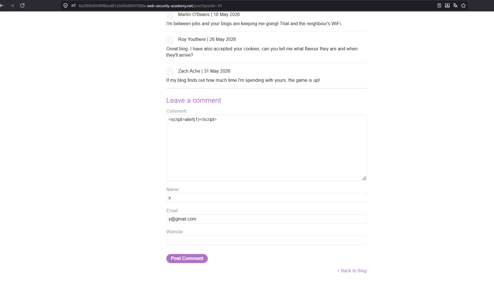
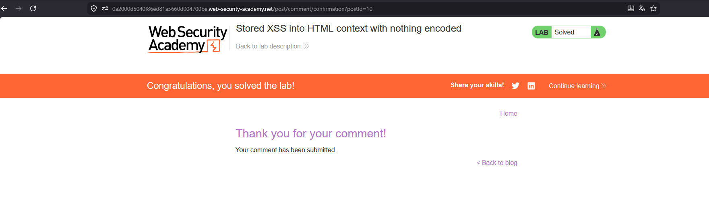
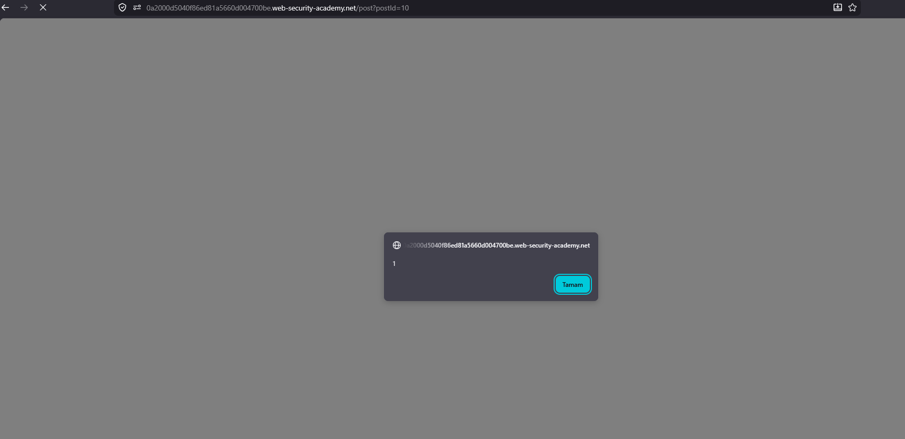

# Stored XSS into HTML context with nothing encoded

## 1. Lab Bilgisi

**Difficulty:** Apprentice

## 2. Vulnerability Özeti

Bu labda yorum alanına yazdığım değerin kaydedilip blog postunun altında olduğu gibi gösterildiğini gördüm. Uygulama yorumu temizlemediği için yazdığım JavaScript sayfayı açan herkesin tarayıcısında çalışabilecek hale geldi. Reflected XSS'ten farklı olarak burada payload tek seferlik URL'de kalmıyor; yorum olarak içeride saklanıyor.

## 3. Exploitation Steps

1. Blog postundaki yorum formuna geldim ve Comment alanına şu payload'ı yazdım:

```html
<script>alert(1)</script>
```

2. Name ve Email alanlarını da doldurup yorumu gönderdim.



3. Yorum gönderildikten sonra uygulama yorumun başarıyla kaydedildiğini gösterdi ve lab solved durumuna geçti.



4. Blog postuna tekrar dönünce kaydedilen yorum sayfaya basıldı ve `alert(1)` çalıştı.

Payload kaydedildikten sonra yorum alanındaki HTML şu yapıya dönüştü:

```html
<section class="comment">
  <p>
    <script>alert(1)</script>
  </p>
</section>
```

Yorum içeriği encode edilmediği için `<script>` tag'i sayfayı açan kullanıcının tarayıcısında çalıştı.



## 4. Impact

Saldırgan yorum alanına zararlı JavaScript koyarsa, o blog postunu açan diğer kullanıcıların tarayıcısında da aynı kod çalışır. Bu yüzden stored XSS daha tehlikeli olabilir; çünkü saldırganın her kullanıcıya ayrı ayrı özel link göndermesine gerek kalmaz. Sayfayı ziyaret eden herkes hedef olabilir.

## 5. Remediation

Yorum gibi kullanıcıdan gelen içerikler kaydedilmeden veya sayfaya basılmadan önce güvenli hale getirilmelidir. HTML içinde gösterilecek veriler mutlaka encode edilmeli, izin verilmeyen HTML/JavaScript temizlenmeli ve mümkünse güvenli bir HTML sanitizer kullanılmalıdır. Ek olarak Content Security Policy ile beklenmeyen JavaScript çalıştırılması sınırlandırılabilir.
