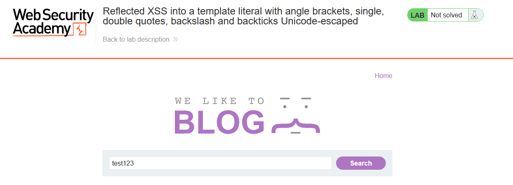
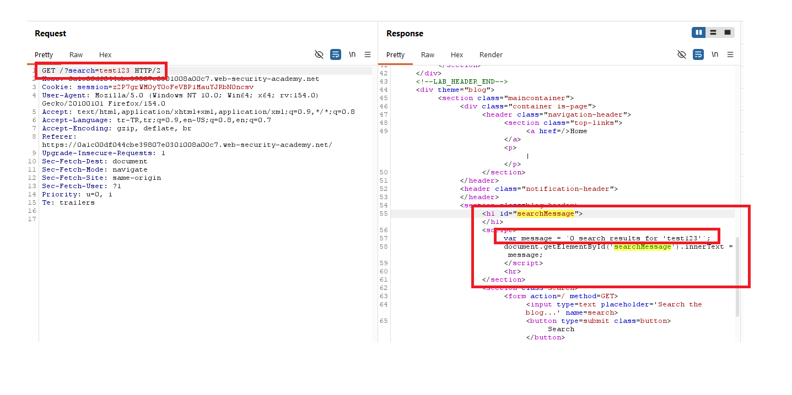
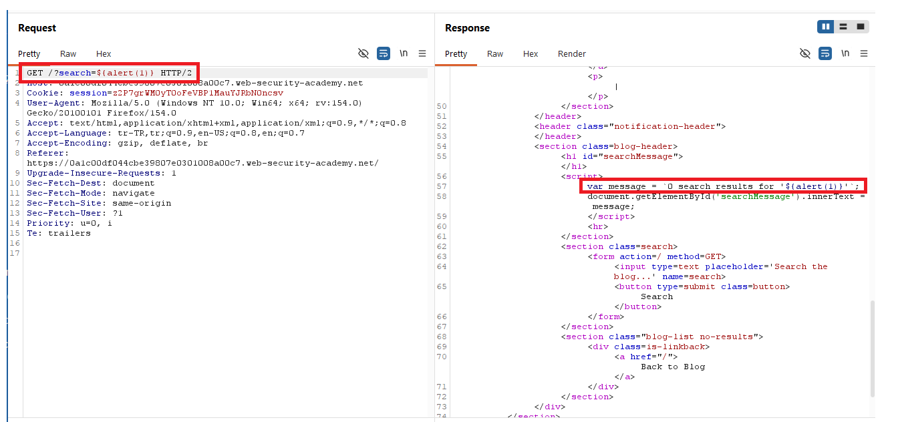

# Reflected XSS into a template literal with angle brackets, single, double quotes, backslash and backticks Unicode-escaped

## 1. Lab Bilgisi

**Difficulty:** Practitioner

## 2. Vulnerability Özeti

Bu labda `search` parametresi sayfadaki `<script>` bloğu içinde bir JavaScript template literal içerisine yansıtılıyordu. Uygulama angle bracket, tek tırnak, çift tırnak, backslash ve backtick karakterlerini Unicode escape formatına dönüştürüyordu. Bu nedenle klasik HTML tag injection denemeleri veya template literal'i backtick ile kapatma yöntemi doğrudan kullanılamıyordu.

Zafiyet, değerin hâlâ template literal context'i içinde değerlendirilmesinden kaynaklanıyordu. Template literal içinde `${...}` sözdizimi JavaScript expression interpolation için kullanılır. Bu nedenle payload olarak `${alert(1)}` gönderildiğinde, template literal kapatılmadan doğrudan expression çalıştırıldı ve reflected XSS tetiklendi.

## 3. Exploitation Steps

1. Lab sayfasında arama alanına test değeri girildi.

```text
test123
```

Bu adım, inputun sayfada arama sonucu mesajı olarak kullanıldığını doğrulamak için yapıldı.



2. Request Burp Repeater'da incelendi ve `search` parametresinin response içinde `<script>` bloğundaki template literal'e yansıtıldığı görüldü.

```http
/?search=test123
```

Response içindeki ilgili JavaScript kodu şu şekildeydi:

```html
<script>
    var message = `0 search results for 'test123'`;
    document.getElementById('searchMessage').innerText = message;
</script>
```

Bu çıktı, payload'ın HTML context'te değil JavaScript template literal context'inde çalıştırılması gerektiğini gösterdi.



3. Template literal interpolation özelliği kullanılarak `${alert(1)}` payload'ı gönderildi.

```http
/?search=${alert(1)}
```

Response içinde payload template literal içinde şu şekilde yer aldı:

```javascript
var message = `0 search results for '${alert(1)}'`;
```

Template literal parse edilirken `${alert(1)}` bir string parçası olarak değil, JavaScript expression olarak değerlendirildi. Böylece `alert(1)` çalıştı.



4. Payload çalıştırıldığında lab solved durumuna geçti.


## 4. Impact

Saldırgan, kurbana özel hazırlanmış bir URL göndererek hedef kullanıcının tarayıcısında uygulama origin'i altında JavaScript çalıştırabilir. Bu labda etki `alert(1)` ile gösterilmiştir; gerçek senaryolarda aynı zafiyet kullanıcı oturumu içinde işlem yaptırma, sayfa içeriğini değiştirme veya hassas bilgileri hedef alma gibi sonuçlara yol açabilir.

## 5. Remediation

Kullanıcı kontrollü veriler JavaScript template literal context'ine doğrudan yerleştirilmemelidir. Dinamik veri gerekiyorsa güvenli JSON serialization kullanılmalı ve çıktı bulunduğu context'e uygun şekilde encode edilmelidir. Template literal içinde özellikle `${` ve `}` karakterleri expression interpolation başlatabileceği için güvenli biçimde ele alınmalıdır. Kullanıcı girdisi mümkün olduğunca script bloğu içinde değil, DOM API'leri üzerinden `textContent` gibi güvenli yöntemlerle kullanılmalıdır. Ayrıca Content Security Policy ile inline script çalıştırılması sınırlandırılarak bu tür açıkların etkisi azaltılabilir.
