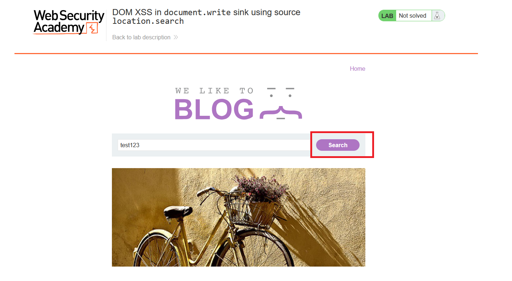
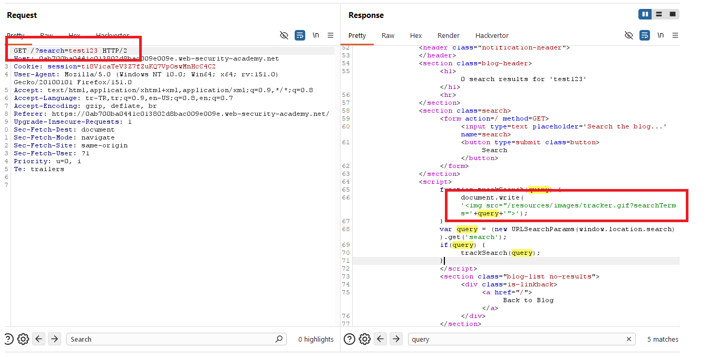
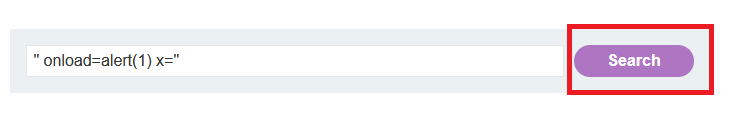
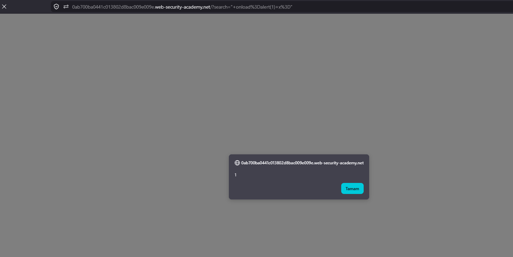
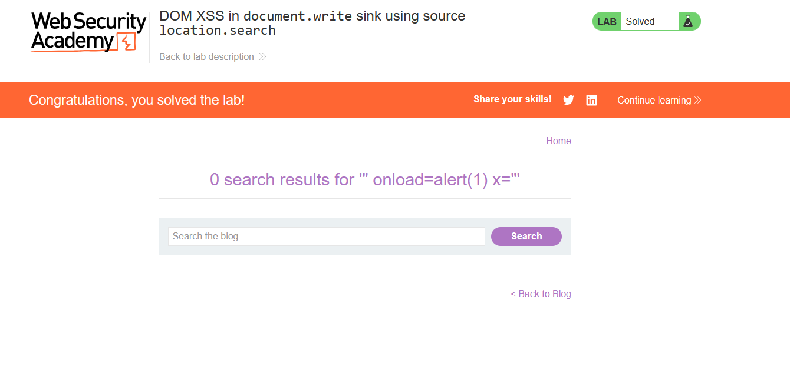

# DOM XSS in document.write sink using source location.search

## 1. Lab Bilgisi

**Difficulty:** Apprentice

## 2. Vulnerability Özeti

Bu labda arama parametresindeki değer client-side JavaScript tarafından `window.location.search` üzerinden alınıyordu. Uygulama bu değeri `document.write()` ile sayfaya yazılan bir `` tag'inin `src` attribute'u içine ekliyordu. Girdi güvenli şekilde encode edilmediği için çift tırnak karakteriyle attribute dışına çıkıp yeni bir event handler ekleyerek DOM XSS açığını tetikledim.

## 3. Exploitation Steps

1. Blog sayfasındaki arama alanına normal bir değer girip arama isteğini oluşturdum.



2. Burp Suite üzerinde response'u incelediğimde, sayfadaki script'in `window.location.search` içinden `search` parametresini aldığını ve `document.write()` ile bir tracker görselinin URL'sine eklediğini gördüm.

```javascript
document.write('');
```



3. Değer `img` tag'inin `src` attribute'u içine yazıldığı için çift tırnakla attribute dışına çıkıp `onload` event handler'ı ekleyen şu payload'ı kullandım:

```html
" onload=alert(1) x="
```



4. Payload URL üzerinden `search` parametresine taşındı. `document.write()` çalıştıktan sonra oluşturulan HTML şu yapıya dönüştü:

```html

```

Tarayıcı bu HTML'i işlerken enjekte edilen `onload` attribute'unu çalıştırdı ve `alert(1)` tetiklendi.



5. Alert çalıştıktan sonra lab solved durumuna geçti.



## 4. Impact

Saldırgan, kurbana özel hazırlanmış bir URL göndererek kullanıcının tarayıcısında JavaScript çalıştırabilir. Bu açık DOM tarafında oluştuğu için zararlı veri sunucu response'unda doğrudan görünmeyebilir; kod, tarayıcıda `location.search` okunup `document.write()` ile DOM'a yazıldığı anda çalışır. Başarılı bir saldırı sayfa içeriğini değiştirme, kullanıcı adına işlem yaptırma veya hassas bilgileri hedef alma gibi sonuçlara yol açabilir.

## 5. Remediation

Kullanıcı kontrollü veriler `document.write()` gibi HTML üreten sink'lere doğrudan verilmemelidir. URL parametreleri DOM'a yazılmadan önce bağlama uygun şekilde encode edilmeli ve mümkünse `textContent`, güvenli DOM API'leri veya güvenli template mekanizmaları kullanılmalıdır. Attribute içine veri yerleştirilecekse çift tırnak, tek tırnak, `<`, `>`, `&` gibi karakterler güvenli hale getirilmelidir. Ek olarak Content Security Policy ile beklenmeyen JavaScript çalıştırılması sınırlandırılabilir.
