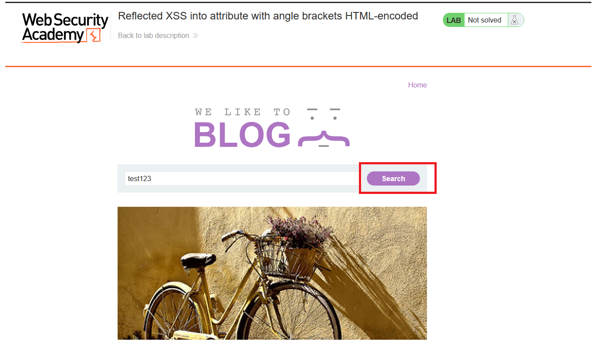
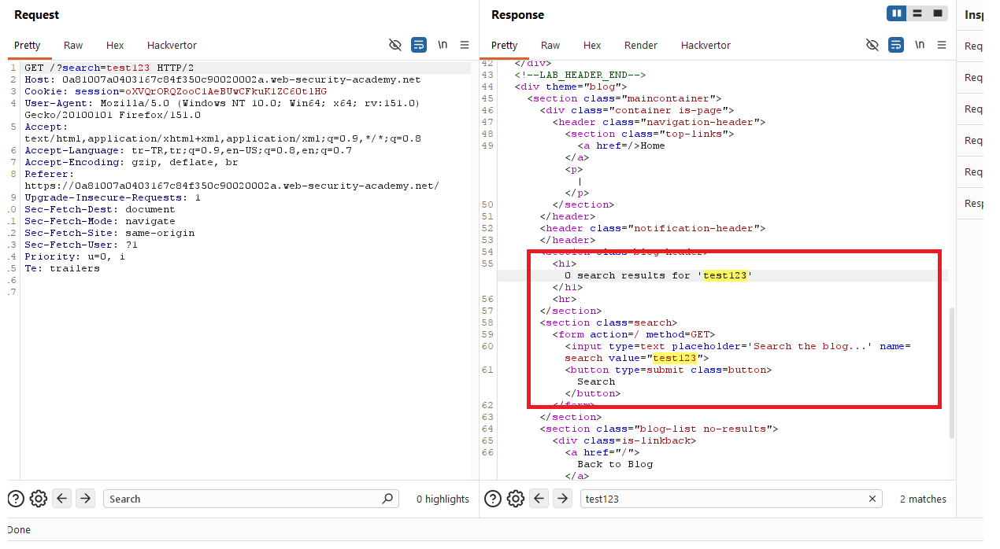
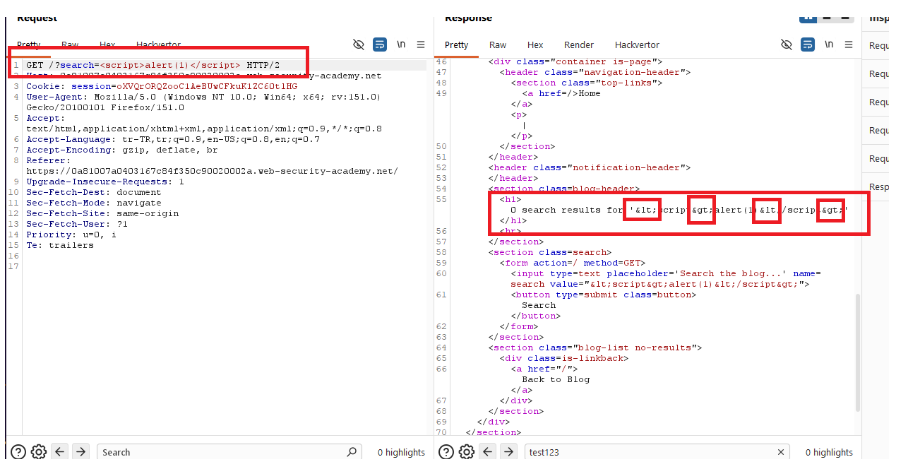
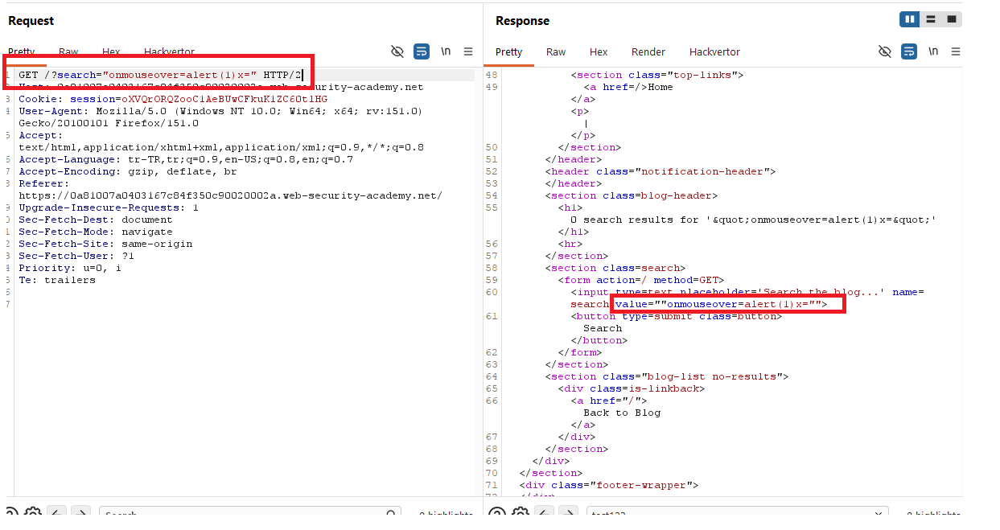
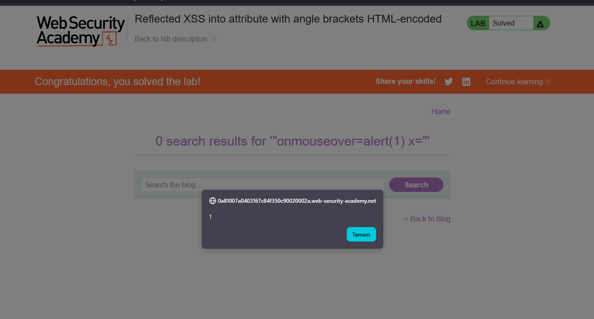

# Reflected XSS into attribute with angle brackets HTML-encoded

## 1. Lab Bilgisi

**Difficulty:** Apprentice

## 2. Vulnerability Özeti

Bu labda arama parametresine verdiğim değerin sayfada iki farklı yere yansıdığını gördüm. Başlık kısmında `<` ve `>` karakterleri HTML encode edildiği için klasik `<script>` payload'ı çalışmadı. Ancak aynı değer arama formundaki `input` elementinin `value` attribute'u içine de yazılıyordu. Bu yüzden çift tırnak karakteriyle attribute dışına çıkıp yeni bir event handler ekleyerek JavaScript çalıştırabildim.

## 3. Exploitation Steps

1. Blog sayfasındaki arama alanına normal bir değer girip isteğin ve cevabın nasıl işlendiğini kontrol ettim.



2. Burp Suite üzerinde response'u incelediğimde `search` parametresindeki değerin hem başlıkta hem de `input` elementinin `value` attribute'u içinde yansıdığını gördüm.



3. Önce klasik script payload'ını denedim:

```html
<script>alert(1)</script>
```

Uygulama `<` ve `>` karakterlerini encode ettiği için payload response içinde şu hale dönüştü:

```html
<h1>0 search results for '&lt;script&gt;alert(1)&lt;/script&gt;'</h1>
<input type="text" name="search" value="&lt;script&gt;alert(1)&lt;/script&gt;">
```

Bu yüzden payload HTML tag olarak yorumlanmadı ve JavaScript çalışmadı.



4. Değerin `value` attribute'u içinde yansıdığını görünce çift tırnakla attribute dışına çıkıp `onmouseover` event handler'ı ekledim:

```html
"onmouseover=alert(1) x="
```

Bu payload response içinde şu şekilde attribute'a enjekte edildi:

```html
<input ... value=""onmouseover=alert(1) x="">
```

Yani ilk çift tırnak `value` attribute'unu kapattı, `onmouseover` yeni bir attribute olarak eklendi ve `x="` kısmı kalan çift tırnağı dengeledi.



5. Sayfada arama kutusunun üzerine geldiğimde `onmouseover` tetiklendi, `alert(1)` çalıştı ve lab çözüldü.



## 4. Impact

Saldırgan, kurbana özel hazırlanmış bir URL göndererek kullanıcının tarayıcısında JavaScript çalıştırabilir. Bu açık sayesinde sayfa içeriği değiştirilebilir, kullanıcı adına işlem yaptırılabilir veya kullanıcının etkileşime girdiği alanlar hedef alınabilir. Bu labda payload'ın çalışması için kullanıcının enjekte edilen elementin üzerine gelmesi yeterlidir.

## 5. Remediation

Kullanıcıdan gelen veriler HTML attribute içinde kullanılmadan önce bağlama uygun şekilde encode edilmelidir. Özellikle çift tırnak, tek tırnak, `<`, `>`, `&` gibi karakterler attribute bağlamında güvenli hale getirilmelidir. Ayrıca kullanıcı girdisi HTML içine doğrudan yerleştirilmemeli, güvenli template mekanizmaları kullanılmalı ve Content Security Policy ile beklenmeyen JavaScript çalıştırılması sınırlandırılmalıdır.
