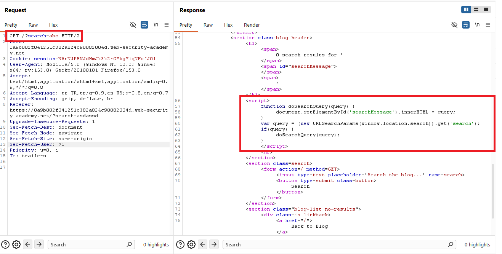
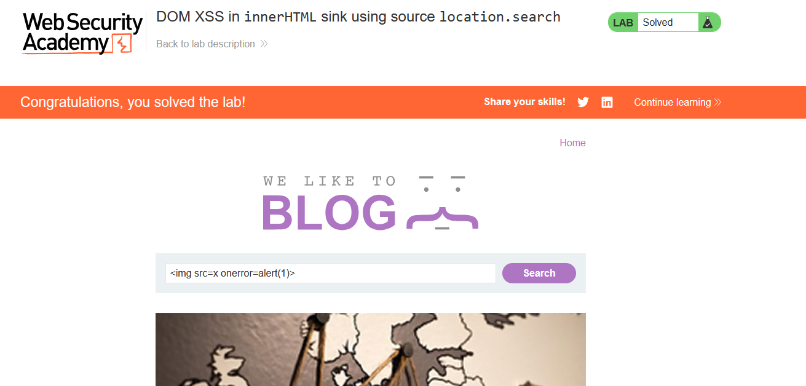
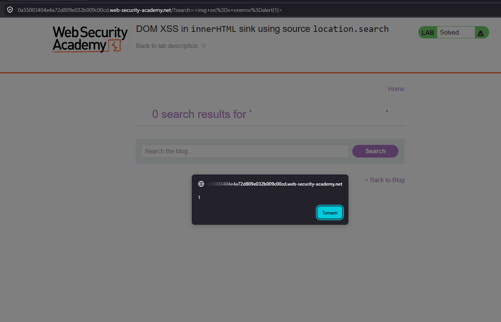

# DOM XSS in innerHTML sink using source location.search

## 1. Lab Bilgisi

**Difficulty:** Apprentice

## 2. Vulnerability Özeti

Bu labda `search` parametresindeki değer, client-side JavaScript tarafından `window.location.search` üzerinden alınıyor ve `doSearchQuery()` fonksiyonuna gönderiliyordu. Fonksiyon bu kullanıcı kontrollü değeri `searchMessage` elementinin `innerHTML` özelliğine doğrudan yazdığı için tarayıcı girdiyi düz metin yerine HTML olarak yorumladı. Bu nedenle HTML tag'i enjekte ederek DOM tabanlı XSS açığını tetikleyebildim.

## 3. Exploitation Steps

1. Blog sayfasında normal bir arama değeriyle istek oluşturdum ve response içindeki JavaScript kodunu inceledim. Kodda `search` parametresinin `URLSearchParams(window.location.search)` ile URL'den alındığını ve `doSearchQuery(query)` fonksiyonuna verildiğini gördüm.

```javascript
function doSearchQuery(query) {
    document.getElementById('searchMessage').innerHTML = query;
}

var query = (new URLSearchParams(window.location.search)).get('search');
if (query) {
    doSearchQuery(query);
}
```

Burada kaynak `location.search`, tehlikeli sink ise `innerHTML` idi. Kullanıcı girdisi HTML encode edilmeden DOM'a yazıldığı için enjekte edilen tag'ler tarayıcı tarafından gerçek HTML olarak işlendi.



2. Arama alanına aşağıdaki payload'ı girdim:

```html

```

Bu payload'da `src=x` geçersiz bir resim kaynağı olduğu için görsel yüklenemediğinde `onerror` event'i tetiklenir ve `alert(1)` çalışır.



3. Payload URL'de encode edilmiş şekilde `search` parametresine taşındı:

```text
/?search=%3Cimg+src%3Dx+onerror%3Dalert(1)%3E
```

Sayfa yüklendiğinde JavaScript bu değeri URL'den aldı ve `innerHTML` ile `searchMessage` elementine yazdı. Tarayıcı enjekte edilen `img` elementini oluşturdu, hatalı `src` nedeniyle `onerror` çalıştı ve `alert(1)` tetiklendi.



## 4. Impact

Saldırgan, kurbana özel hazırlanmış bir URL göndererek kullanıcının tarayıcısında JavaScript çalıştırabilir. Açık tamamen client-side koddan kaynaklandığı için sunucu response'u güvenli görünse bile sayfa yüklendikten sonra DOM üzerinde zararlı HTML oluşturulabilir. Başarılı bir saldırı sayfa içeriğini değiştirme, kullanıcı adına işlem yaptırma veya hassas bilgileri hedef alma gibi sonuçlara yol açabilir.

## 5. Remediation

Kullanıcı kontrollü değerler DOM'a `innerHTML` ile yazılmamalıdır. Bu senaryoda arama mesajı yalnızca metin olarak gösterileceği için `textContent` veya güvenli DOM API'leri kullanılmalıdır. HTML yazılması gerçekten gerekiyorsa girdi güvenilir bir HTML sanitizer ile temizlenmeli ve bağlama uygun output encoding uygulanmalıdır. Ek olarak Content Security Policy ile inline event handler ve beklenmeyen script çalıştırılması sınırlandırılabilir.
