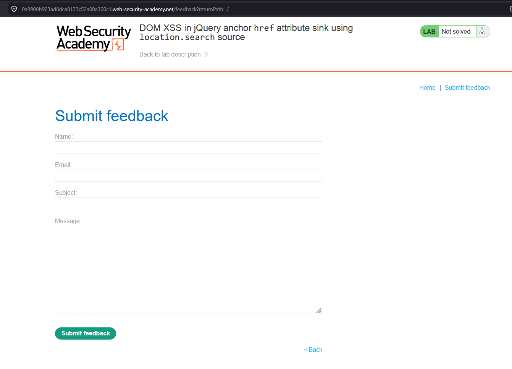
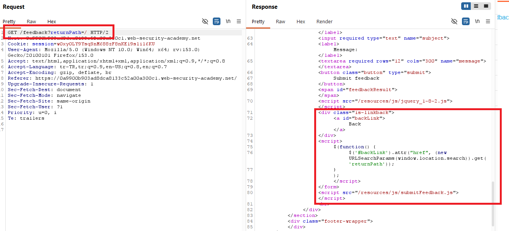
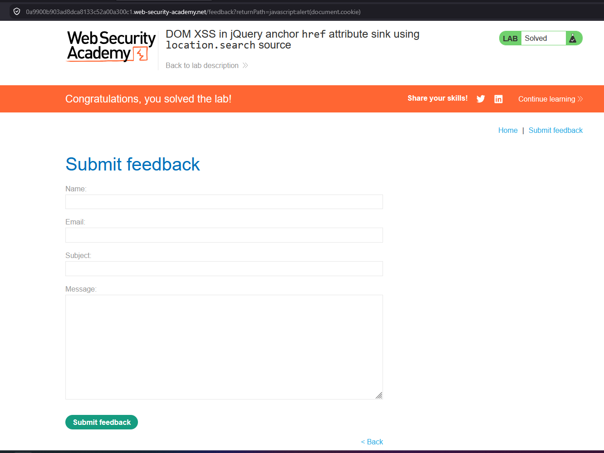

# DOM XSS in jQuery anchor href attribute sink using location.search source

## 1. Lab Bilgisi

**Difficulty:** Apprentice

## 2. Vulnerability Özeti

Bu labda `returnPath` parametresindeki değer, client-side JavaScript tarafından `window.location.search` üzerinden alınıyor ve jQuery `.attr()` fonksiyonu ile `Back` linkinin `href` attribute'una yazılıyordu. Uygulama bu değerin güvenli bir path olup olmadığını kontrol etmediği için `javascript:` scheme'i kullanılabildi. Böylece linke tıklandığında tarayıcı `href` içindeki JavaScript kodunu çalıştırdı ve DOM tabanlı XSS açığı tetiklendi.

## 3. Exploitation Steps

1. Feedback sayfasına normal `returnPath` değeriyle gittim:

```text
/feedback?returnPath=/
```

Sayfada `Back` linkinin bulunduğunu ve parametrenin bu linkin hedefini belirlemek için kullanıldığını gördüm.



2. Response içindeki JavaScript kodunu incelediğimde `returnPath` parametresinin `URLSearchParams(window.location.search)` ile URL'den alındığını ve jQuery `.attr("href", ...)` sink'ine verildiğini gördüm.

```javascript
$(function() {
    $('#backLink').attr("href", (new URLSearchParams(window.location.search)).get('returnPath'));
});
```

Burada kaynak `location.search`, tehlikeli sink ise anchor elementinin `href` attribute'una yazan jQuery `.attr()` fonksiyonuydu. Kullanıcı kontrollü değer URL scheme kontrolü yapılmadan link hedefi olarak kullanıldığı için `javascript:` URL'si enjekte edilebildi.



3. `returnPath` parametresine aşağıdaki payload'ı verdim:

```text
javascript:alert(document.cookie)
```

Payload ile oluşan URL şu şekildeydi:

```text
/feedback?returnPath=javascript:alert(document.cookie)
```

Bu değer `Back` linkinin `href` attribute'una yazıldı. Kullanıcı bu linke tıkladığında tarayıcı link hedefini normal bir sayfa yolu olarak değil, JavaScript URL'si olarak yorumladı ve `alert(document.cookie)` çalıştı. Payload başarıyla tetiklenince lab solved durumuna geçti.



## 4. Impact

Saldırgan, kurbana özel hazırlanmış bir URL göndererek sayfadaki link hedefini JavaScript çalıştıracak şekilde değiştirebilir. Kullanıcı manipüle edilen linke tıkladığında saldırganın belirlediği kod kullanıcının tarayıcısında çalışır. Başarılı bir saldırı session bilgilerini hedef alma, kullanıcı adına işlem yaptırma veya sayfa içeriğini değiştirme gibi sonuçlara yol açabilir.

## 5. Remediation

Kullanıcı kontrollü değerler doğrudan `href` attribute'una yazılmamalıdır. Link hedefi olarak kullanılacak değerler allowlist yaklaşımıyla doğrulanmalı, yalnızca beklenen relative path'lere izin verilmelidir. `javascript:`, `data:` gibi tehlikeli URL scheme'leri engellenmeli ve URL parsing/normalization işlemi güvenli şekilde yapılmalıdır. Ayrıca DOM güncellemelerinde kullanıcı girdisi bağlama uygun şekilde encode edilmeli ve Content Security Policy ile inline JavaScript çalıştırılması sınırlandırılmalıdır.
