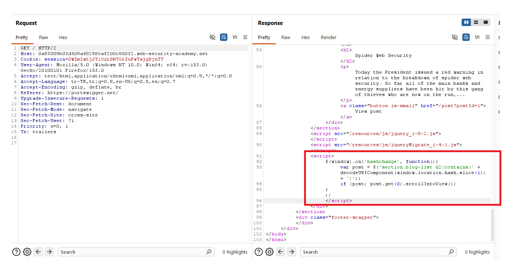
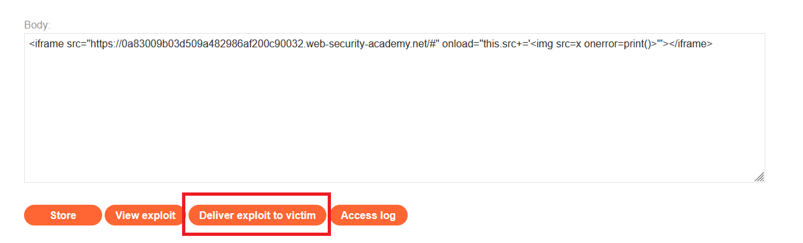
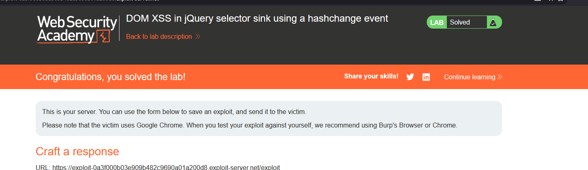

# DOM XSS in jQuery selector sink using a hashchange event

## 1. Lab Bilgisi

**Difficulty:** Apprentice

## 2. Vulnerability Özeti

Bu labda URL fragment değeri, client-side JavaScript tarafından `window.location.hash` üzerinden alınıyor ve jQuery selector içinde kullanılıyordu. Sayfa `hashchange` event'ini dinliyor, hash içindeki değeri `decodeURIComponent(window.location.hash.slice(1))` ile çözüyor ve bunu `:contains()` selector'ına yerleştiriyordu. Kullanıcı kontrollü hash değeri güvenli şekilde encode edilmediği için jQuery selector sink'i üzerinden DOM tabanlı XSS tetiklenebildi.

## 3. Exploitation Steps

1. Ana sayfa response'unu incelediğimde uygulamanın `hashchange` event'ini dinleyen bir JavaScript bloğu kullandığını gördüm.

```javascript
$(window).on('hashchange', function() {
    var post = $('section.blog-list h2:contains(' + decodeURIComponent(window.location.hash.slice(1)) + ')');
    if (post) post.get(0).scrollIntoView();
});
```

Burada kaynak `window.location.hash`, tehlikeli sink ise kullanıcı girdisinin doğrudan eklendiği jQuery selector ifadesiydi. Hash değeri `:contains()` içine kontrolsüz şekilde yerleştirildiği için özel hazırlanmış bir HTML payload'ı selector bağlamından DOM XSS'e dönüştürülebildi.



2. Exploit server üzerinde kurbanın sayfayı iframe içinde açmasını ve ardından hash değerinin payload ile değiştirilmesini sağlayan aşağıdaki HTML'i hazırladım:

```html
<iframe src="https://0a83009b03d509a482986af200c90032.web-security-academy.net/#" onload="this.src+=''"></iframe>
```

Iframe ilk yüklendiğinde hedef sayfa boş hash (`#`) ile açıldı. `onload` event'i çalışınca iframe'in `src` değerine `` payload'ı eklendi. Bu değişiklik hedef sayfada `hashchange` event'ini tetikledi.



3. Hash değiştiğinde uygulamadaki JavaScript bu değeri `window.location.hash.slice(1)` ile aldı ve jQuery selector içine yerleştirdi. Payload içindeki `img` elementinin `src=x` değeri geçersiz olduğu için `onerror` event'i tetiklendi ve `print()` çalıştı. Exploit kurbana gönderildikten sonra lab solved durumuna geçti.



## 4. Impact

Saldırgan, kurbana özel hazırlanmış bir URL veya exploit sayfası göndererek kullanıcının tarayıcısında JavaScript çalıştırabilir. Açık, URL fragment değerinin client-side kod tarafından güvenli şekilde işlenmeden jQuery selector içinde kullanılmasından kaynaklanır. Başarılı bir saldırı sayfa içeriğini değiştirme, kullanıcı adına işlem yaptırma veya hassas bilgileri hedef alma gibi sonuçlara yol açabilir.

## 5. Remediation

Kullanıcı kontrollü değerler jQuery selector ifadelerine doğrudan eklenmemelidir. Selector oluşturmak için string birleştirme kullanılmamalı, gerekiyorsa kullanıcı girdisi uygun şekilde escape edilmelidir. Bu senaryoda hash değeri yalnızca metin araması için kullanılacaksa güvenli DOM API'leri veya selector dışı karşılaştırma yöntemleri tercih edilmelidir. Ayrıca URL fragment gibi client-side kaynaklardan gelen veriler doğrulanmalı ve Content Security Policy ile beklenmeyen script çalıştırılması sınırlandırılmalıdır.
