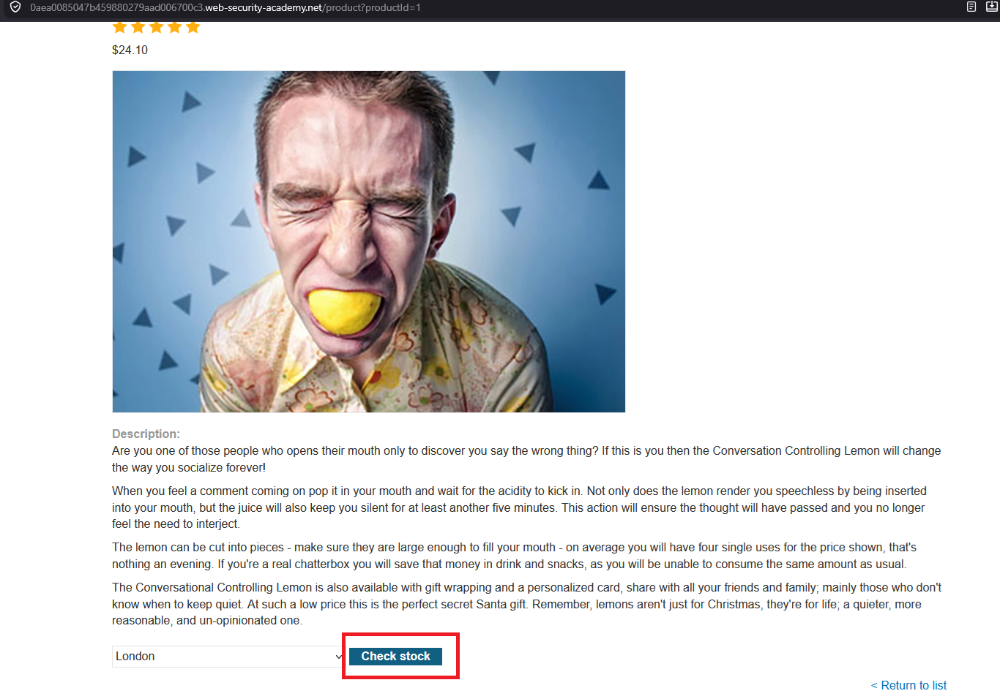
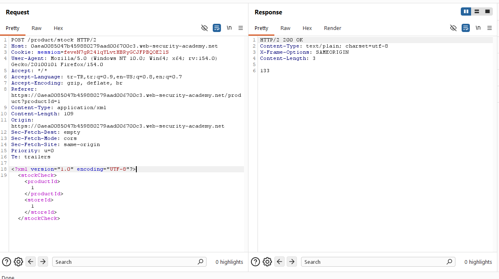
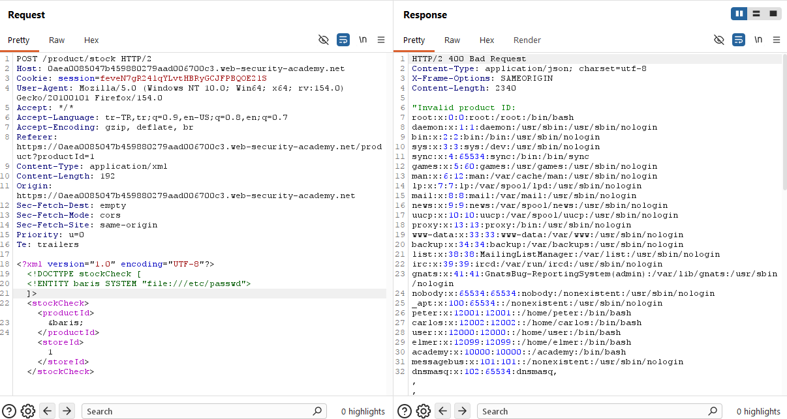
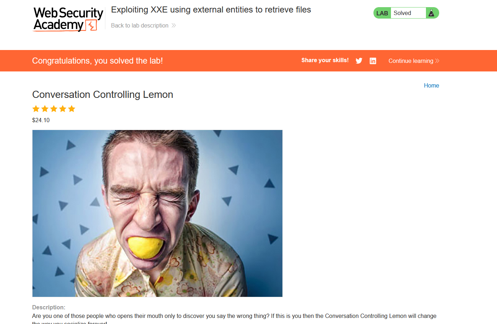

# Exploiting XXE using external entities to retrieve files

## 1. Lab Bilgisi

**Difficulty:** Apprentice

## 2. Vulnerability Özeti

Bu labda ürün stok kontrolü için gönderilen XML verisinin sunucu tarafında güvenli olmayan şekilde parse edildiğini gördüm. XML parser external entity tanımlarını işlediği için özel bir `DOCTYPE` tanımı ekleyerek sunucudaki `/etc/passwd` dosyasını okutabildim. Entity referansını `productId` alanına yerleştirdiğimde dosya içeriği response içinde döndü ve lab çözüldü.

## 3. Kullanılan Payload

```xml
<?xml version="1.0" encoding="UTF-8"?>
<!DOCTYPE foo [ <!ENTITY xxe SYSTEM "file:///etc/passwd"> ]>
<stockCheck>
  <productId>&xxe;</productId>
  <storeId>1</storeId>
</stockCheck>
```

## 4. Exploitation Steps

1. İlk olarak ürün detay sayfasında `Check stock` fonksiyonunu tespit ettim.



2. `Check stock` isteğini Burp Suite ile yakaladım. İstek body kısmında verinin XML formatında gönderildiğini ve `productId` ile `storeId` alanlarının kullanıldığını gördüm.



3. XML verisinin başına external entity tanımı içeren bir `DOCTYPE` ekledim. Bu entity, sunucu dosya sistemindeki `/etc/passwd` dosyasını hedefliyordu.

```xml
<!DOCTYPE foo [ <!ENTITY xxe SYSTEM "file:///etc/passwd"> ]>
```

4. Tanımladığım `xxe` entity'sini `productId` alanında çağırdım ve isteği tekrar gönderdim.

```xml
<productId>&xxe;</productId>
```



5. Response içinde `/etc/passwd` dosyasına ait içerik döndü. Bu çıktı, XML parser'ın external entity'leri işlediğini ve dosya okuma yapılabildiğini doğruladı.



## 5. Impact

XXE zafiyeti sayesinde saldırgan, uygulama sunucusunun erişebildiği yerel dosyaları okuyabilir. Bu durum sistem kullanıcıları, konfigürasyon dosyaları, secret değerleri veya uygulama kaynak kodları gibi hassas bilgilerin açığa çıkmasına yol açabilir. Bazı senaryolarda XXE, SSRF benzeri internal servis erişimi için de kullanılabilir.

## 6. Remediation

XML parser üzerinde external entity ve `DOCTYPE` desteği devre dışı bırakılmalıdır. Kullanılan XML kütüphanesinde secure processing ayarları etkinleştirilmeli, dış kaynak çözümleme kapatılmalı ve mümkünse XML yerine daha basit veri formatları tercih edilmelidir. Ayrıca kullanıcıdan gelen XML verisi güvenli schema doğrulamasından geçirilmeli ve parser konfigürasyonları production ortamında güvenli varsayılanlarla çalıştırılmalıdır.
